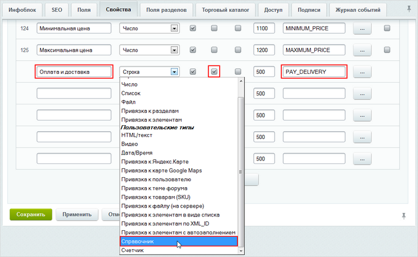
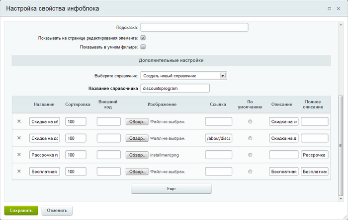
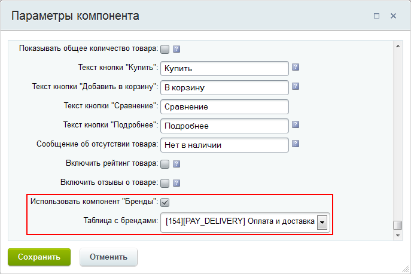
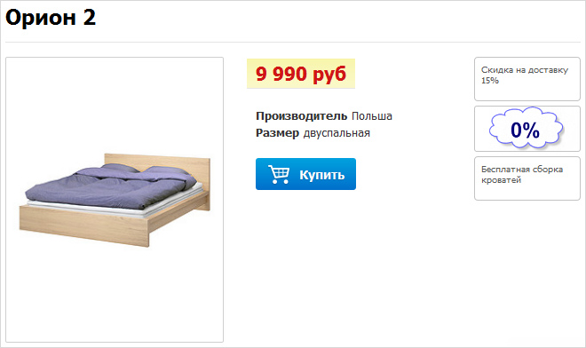

# Пример работы со свойством типа "Справочник"

**Навигация**
- [← Оглавление курса](index.md)
- [← Предыдущий: 5799 — Настройка Highload-блока](lesson_5799.md)
- [Следующий: 9065 — Экспорт Highload-блока за 3 шага →](lesson_9065.md)

Официальная страница урока: https://dev.1c-bitrix.ru/learning/course/index.php?COURSE_ID=41&LESSON_ID=5194

|  | Свойство типа **Справочник** доступно для элементов инфоблоков, начиная с версии 14.0.1 модуля **Highload-блоки**. Рассмотрим пример работы с этим свойством. |
| --- | --- |

Допустим, что у нас имеется мебельный каталог **Продукция**. Добавим в него свойство типа **Справочник**. Для этого в форме редактирования инфоблока **Продукция** переходим на закладку **Свойства**:

Вводим название нового свойства, например, **Оплата и доставка**, выбираем тип свойства **Справочник**, делаем свойство множественным, задаем символьный код и нажимаем кнопку […] для перехода к детальному редактированию свойства.

В секции **Дополнительные настройки** с помощью поля **Выберите справочник** можно указать некоторый существующий Highload-блок или создать новый, выбрав значение **Создать новый справочник**.

Мы создадим новый справочник, поэтому выбираем **Создать новый справочник**. В поле **Название справочника** задаём его название латинскими буквами, а чуть ниже задаём его элементы.

Рассмотрим подробно каждую колонку таблицы записей:

- **Название** – указывается название элемента справочника;
- **Сортировка** – задавая сортировку, вы сможете регулировать в какой последовательности выводить элементы;
- **Внешний код** – служит для создания связей и выгрузки в 1С (заполнять необязательно, оно будет автоматически сгенерировано в момент сохранения свойства);
- **Изображение** – картинка записи справочника, которая будет показана в публичном разделе (кнопка **Обзор...** служит для выбора файла);
- **Ссылка** – можно ввести ссылку на любую страницу, которая откроется при клике на элемент;
- **По умолчанию** – может быть выбрано только одно значение и запись, для которой отмечено это поле, всегда будет первой отображаться в публичном разделе;
- **Описание** – описание элемента (текст описания отображается в публичном разделе, если не задано изображение для элемента);
- **Полное описание** – полное описание элемента, выводится в публичном разделе в качестве всплывающей подсказки.

**Примечание:** Чтобы элементы справочника показывались компонентом **Бренды**, для элемента обязательно должно быть заполнено хотя бы одно из полей: **Описание** и/или **Изображение**.

Включите [показ свойства](https://dev.1c-bitrix.ru/learning/course/index.php?COURSE_ID=42&LESSON_ID=1986) на детальной странице элемента в параметрах свойства.

Сохраняем свойство и параметры инфоблока. Переходим к товару, чтобы выбрать нужные записи справочника для вывода их в публичной части. Например, выберем следующие значения:

Сохраняем товар.  Теперь необходимо перейти к настройкам компонента, с помощью которого публикуется каталог **Продукция**:

Включаем использование компонента брендов и выбираем созданное нами свойство **Оплата и доставка** типа **Справочник**. Сохраняем настройки и на детальной странице товара видим указанные нами бренды (записи справочника):

Внешний вид каждого бренда зависит от того, какие поля записи справочника заполнены при создании (см. выше).

В дальнейшем вы можете добавлять новые записи справочника как через свойства инфоблока, так и через интерфейс Highload-блоков.
