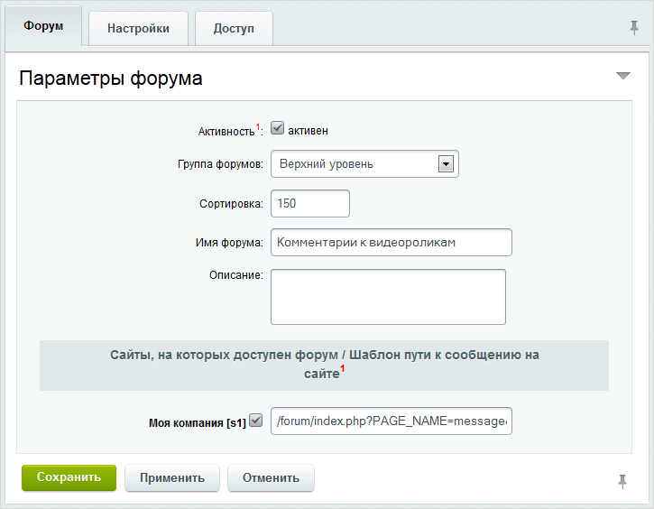
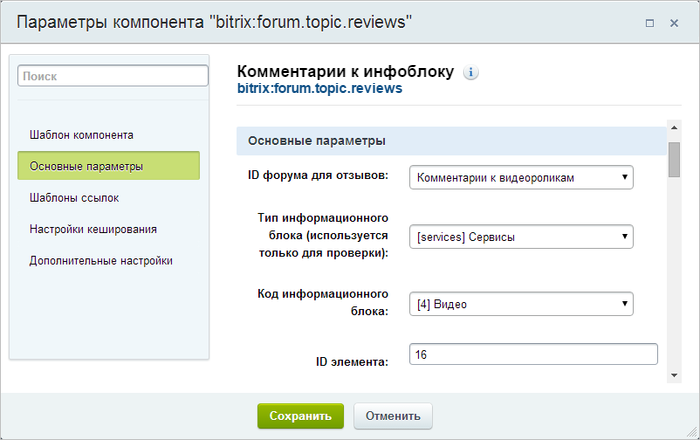
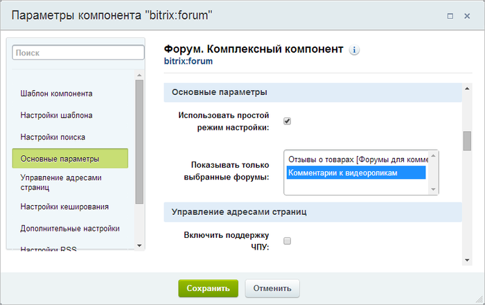
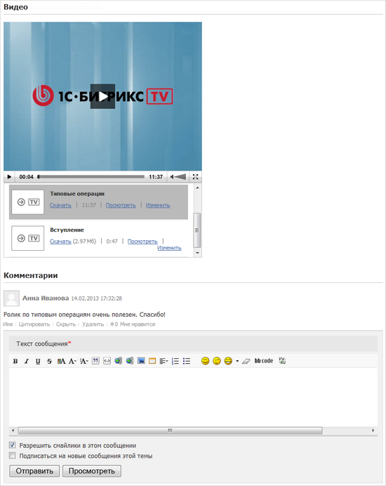

# Создание комментариев к различным элементам сайта

**Навигация**
- [← Оглавление курса](index.md)
- [← Предыдущий: 2968 — Фильтр нецензурных слов](lesson_2968.md)
- [Следующий: 7360 — Назначение модератора форума →](lesson_7360.md)

Официальная страница урока: https://dev.1c-bitrix.ru/learning/course/index.php?COURSE_ID=41&LESSON_ID=5242

### Форум как комментарии

На популярных и посещаемых сайтах гости пишут комментарии на форумах, в блогах, оставляют отзывы к товарам и фотографиям, а также обсуждают новости. Поэтому в *Bitrix Framework* в комплексные

			компоненты

                    Компонент – это программный код, оформленный в визуальную оболочку, выполняющий определённую функцию какого-либо модуля по выводу данных в Публичной части. Мы можем вставлять этот блок кода на страницы сайта без непосредственного написания кода. [Подробнее...](https://dev.1c-bitrix.ru/learning/course/index.php?COURSE_ID=34&CHAPTER_ID=04457)

		 фотогалерей, новостей и каталога товаров по умолчанию встроен компонент отзывов. В каждом компоненте представлена опция **Разрешить отзывы** и необходимые настройки.

Но иногда возникает потребность добавления отзывов и комментариев там, где они изначально не предусмотрены. Например, в разделе опросов, на странице просмотра видеотеки и т.д.

В этом случае проблема решается использованием компонента

			Комментарии к инфоблоку (forum.topic.reviews).

						[Описание компонента «Комментарии к инфоблоку» в пользовательской документации.](http://dev.1c-bitrix.ru/user_help/detail.php?ID=63173)

Рассмотрим пример добавления функционала комментариев к видеотеке. Допустим, что предварительные операции по

			настройке видеотеки

Настроить **Видеотеку** можно из публичного раздела в режиме правки с помощью команды **Редактировать параметры компонента** или через панель **Свойства** при редактировании страницы с помощью визуального редактора.

[Подробнее](https://dev.1c-bitrix.ru/learning/course/index.php?COURSE_ID=34&LESSON_ID=2203)...

		 уже выполнены и на сайте создан публичный интерфейс.

### Создание форума

Создайте форум,

Управление форумами осуществляется, как правило, в Административном разделе. Создание новых форумов возможно только в административном разделе. Список всех форумов размещается на странице **Список форумов** (Сервисы &gt; Форумы &gt; Список форумов).

[Подробнее](lesson_2964.md)...

		 например, Комментарии к видеороликам, в котором будут храниться комментарии к роликам из видеотеки:

Укажите необходимые настройки форума. На закладке **Доступ** для всех пользователей задайте право на

			создание новых тем

                    Пользователям необходимо иметь право доступа **Новая тема**, поскольку при создании первого комментария выполняется создание темы. Если пользователям выставить право **ответ**, то тема (а следовательно и первый комментарий) должен быть создан модератором форума.

		.

Все комментарии к видеотеке будут храниться в этом форуме в темах с названием элемента (ролика) инфоблока видеотеки.

Чтобы комментарии проходили премодерацию перед публикацией, в настройках форума выберите опцию **Модерация: премодерируемый**.

### Настройка компонента Комментарии к инфоблоку

Откройте страницу где размещена видеотека в визуальном редакторе. Разместите компонент **Комментарии к инфоблоку** на странице.

Настройте параметры компонента, уделив внимание следующим моментам:

- В списке **ID форума для отзывов** выберите созданный форум для комментариев, в нашем случае это **Комментарии к видеороликам**.
- В параметрах **Тип информационного блока** и **Код информационного блока** укажите тип инфоблоков и сам инфоблок, в котором хранится видеотека.
- В поле **ID элемента** задайте идентификатор любого из элементов (ролика) в инфоблоке видеотеки. Этот параметр задается для отображения формы добавления комментариев.

### Создание интерфейса для модерации комментариев

В некотором разделе сайта (или создайте новый)

			создайте страницу

Создавать страницу лучше сразу в том разделе, где она должна "жить". Перенести неверно созданную страницу можно, но зачем лишние действия? Создание страниц доступно с помощью Мастера, по шаблону и через документооборот. Самый простой и рекомендуемый нами способ - с помощью Мастера.

[Подробнее](https://dev.1c-bitrix.ru/learning/course/index.php?COURSE_ID=34&LESSON_ID=1911)...

		 на которой разместите комплексный компонент **Форум bitrix:forum**. Доступ к странице дайте только тем пользователям, кто будет выполнять модерацию комментариев.

В

			настройках компонента

                    

		 в параметре **Показывать только выбранные форумы** отметьте **Комментарии к видеороликам**. Все

			остальные параметры

                    Комплексный компонент позволяет создать полноценный публичный интерфейс форума. Компонент стандартный и входит в дистрибутив модуля.

						[Описание компонента «Форум (комплексный компонент)» в пользовательской документации.](http://dev.1c-bitrix.ru/user_help/detail.php?ID=63155)

		 настройте необходимым для вас образом.

В результате страница с видеотекой и комментариями будет выглядеть так:

Для использования других опций при работе с комментариями воспользуйтесь дополнительными модулями:

- [Счетчик комментариев](http://marketplace.1c-bitrix.ru/solutions/askaron.commentcounter/)
- [Панель комментариев](http://marketplace.1c-bitrix.ru/solutions/itena.panel/)
