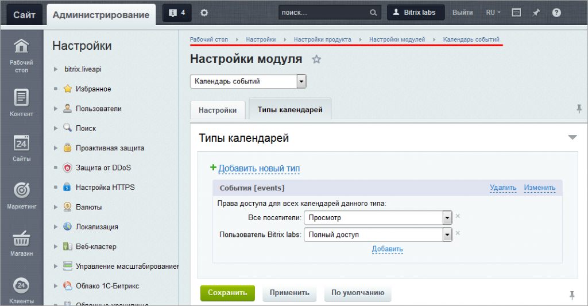
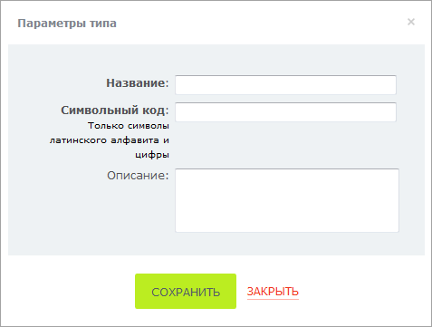
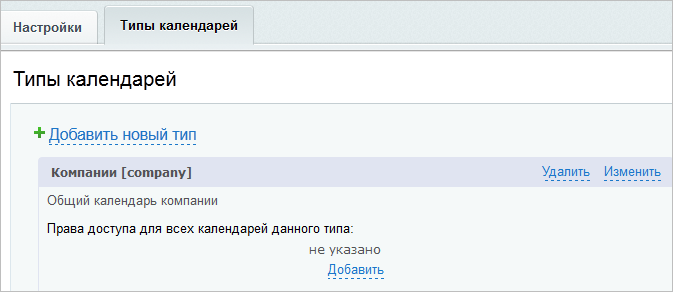
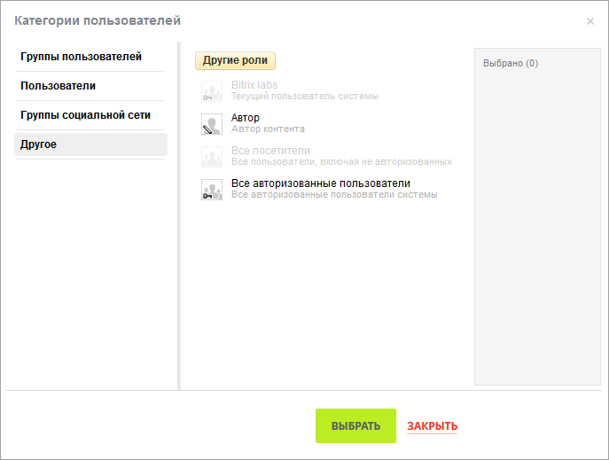
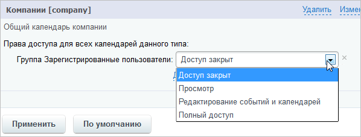

# Календарь событий

**Навигация**
- [← Оглавление курса](index.md)
- [← Предыдущий: 4996 — Веб-мессенджер: настройки модуля](lesson_4996.md)
- [Следующий: 2859 — Опросы, голосования →](lesson_2859.md)

Официальная страница урока: https://dev.1c-bitrix.ru/learning/course/index.php?COURSE_ID=41&LESSON_ID=5266

|  | ### Настройка модуля |
| --- | --- |

Настройки модуля Календарь событий расположены на странице административного раздела Настройки &gt; Настройки продукта &gt; Настройки модулей &gt; Календарь событий. Закладка **Настройки** интуитивно понятна, рассмотрим закладку **Типы календарей**:

Типы используются для систематизации календарей и управления правами доступа к ним пользователей.

Нажмите **Добавить новый тип** и заполните необходимые поля:

Нажмите **Сохранить** и новый тип будет добавлен:

Для удаления типа воспользуйтесь ссылкой **Удалить**, для изменения введенных параметров - ссылкой **Изменить**.

Чтобы добавить право доступа к типу календарей для пользователя или группы пользователей, нажмите **Добавить**:

После того, как нужные пользователи\группы пользователей будут выбраны, нажмите **Выбрать**, и затем укажите права доступа для выбранных групп:

Не забудьте сохранить внесенные изменения.

О работе с календарями подробно рассказано в курсе Контент-менеджер, глава

			Календарь

                    **Календарь** — удобный модуль для организации расписания и планирования дня.
[Подробнее...](https://dev.1c-bitrix.ru/learning/course/index.php?bitrix_include_areas=Y&COURSE_ID=34&CHAPTER_ID=011441)

		.

|  | #### Документация по теме: |
| --- | --- |

- [Настройки модуля](https://dev.1c-bitrix.ru/user_help/service/event_calendar/settings.php)
