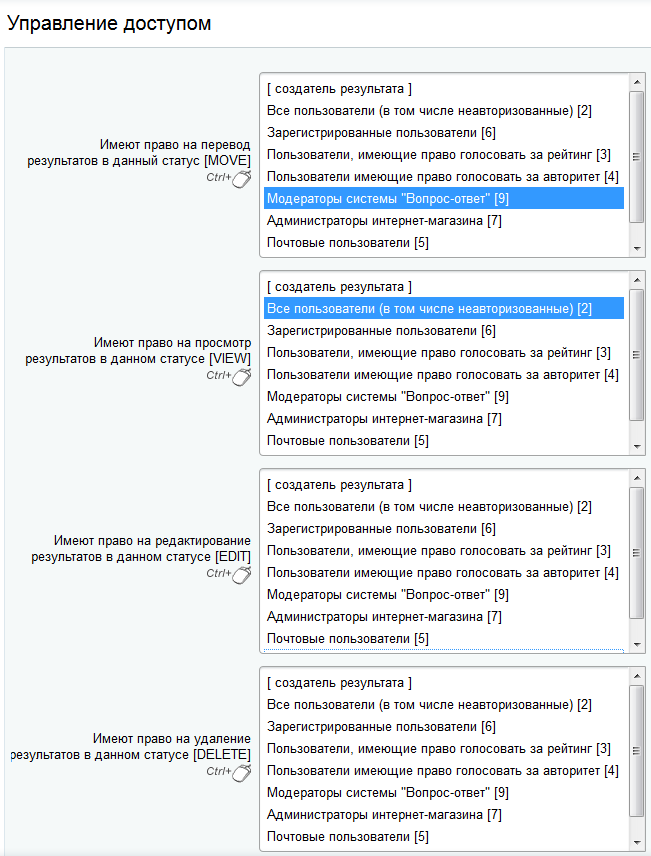

# Настройка статусов

**Навигация**
- [← Оглавление курса](index.md)
- [← Предыдущий: 5308 — Создание веб-формы, вопросов и полей](lesson_5308.md)
- [Следующий: 5310 — Создание шаблона формы →](lesson_5310.md)

Официальная страница урока: https://dev.1c-bitrix.ru/learning/course/index.php?COURSE_ID=41&LESSON_ID=5309

|  | #### Создаём статусы для вебформы |
| --- | --- |

Нам понадобятся

			два статуса

                    Они нужны для того, чтобы реализовать сложные схемы работы с веб-формами, когда нужно не просто получить ответы на вопросы от посетителей сайта, но и обработать их: занести в CRM, составить какие списки по выборочным данным и так далее.
[Подробнее...](/learning/course/index.php?COURSE_ID=34&LESSON_ID=5154)

		 для результатов заполнения веб-формы:

1. Статус **Вопрос** – устанавливается
  			по умолчанию
                      В форме создания статуса отмечаем опцию:
   
  		 сразу после заполнения формы.
  Чтобы созданный вопрос был виден только его создателю и пользователям группы **Модераторы системы "Вопрос-ответ"**, а также чтобы модераторы могли отвечать на вопрос, в настройках доступа этого статуса необходимо выставить
  			права доступа
                      
  		:

  - **Имеют право на перевод результатов в данный статус [MOVE]** – здесь выбираем `создатель результата`.
  - **Имеют право на просмотр результатов в данном статусе [VIEW]** – выбираем `создатель результата` и `Модераторы системы "Вопрос-ответ"`, чтобы остальные пользователи не видели неотвеченных вопросов в списке.
  - **Имеют право на редактирование результатов в данном статусе [EDIT]** – выбираем группу `Модераторы системы "Вопрос-ответ"`, поскольку только пользователи этой группы смогут отвечать на вопросы.
  - **Имеют право на удаление результатов в данном статусе [DELETE]** – здесь ничего не выбираем, т.к. удалять неотвеченные вопросы модераторы не могут. Это право оставляем за администратором сайта.
2. Статус **Ответ** – устанавливается вручную, когда модератор дал ответ на вопрос.
  На закладке **Свойства** указываем заголовок статуса и переходим на закладку **Доступ**, чтобы настроить
  			права доступа
                      
  		 к результатам в этом статусе:

  - **Имеют право на перевод результатов в данный статус [MOVE]** – когда модератор отвечает на вопрос, то результат сразу переводится в данный статус, поэтому здесь выбираем группу `Модераторы системы "Вопрос-ответ"`.
  - **Имеют право на просмотр результатов в данном статусе [VIEW]** – выбираем группу `Все пользователи`, поскольку все пользователи могут просматривать систему Вопрос-ответ.
  - **Имеют право на редактирование результатов в данном статусе [EDIT]** – ничего не выбираем, т.к. никто, кроме администраторов сайта, не может изменять уже отвеченные вопросы.
  - **Имеют право на удаление результатов в данном статусе [DELETE]** – ничего не выбираем, т.к. никто, кроме администраторов сайта, не может удалять вопросы из системы.
