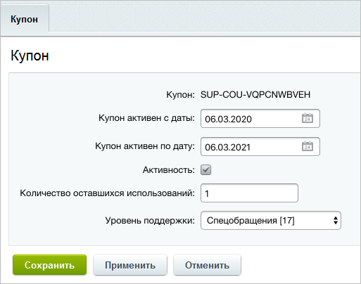

# Спецобращения

**Навигация**
- [← Оглавление курса](index.md)
- [← Предыдущий: 2628 — Группы](lesson_2628.md)
- [Следующий: 20018 — Проверьте себя →](lesson_20018.md)

Официальная страница урока: https://dev.1c-bitrix.ru/learning/course/index.php?COURSE_ID=41&LESSON_ID=5337

На странице административного раздела Сервисы &gt; Техподдержка &gt; Купоны спецобращений вы можете сгенерировать [купоны спецобращений](https://dev.1c-bitrix.ru/user_help/service/support/ticket_coupon_list.php) для ваших клиентов.

> **Спецобращение** - обращение в техподдержку, время реакции на которое ограничено одним часом вне зависимости от времени суток.

Для добавления купона нажмите **Добавить купон** на контекстной панели, откроется форма добавления:

О полях данной формы читайте в [документации](/user_help/service/support/ticket_coupon_edit.php).

После того, как купон будет создан, его

			последовательность символов

		 можно узнать либо в форме его редактирования, либо в общем списке купонов:

Данную последовательность клиенту следует вводить в специальное поле при создании обращения:

**Важно!**В настройках компонента должна быть отмечена опция **Показывать поле ввода купона**.

На странице Сервисы &gt; Техподдержка &gt; Журнал использования купонов показана информация об использовании купонов:

|  | #### Документация по теме: |
| --- | --- |

- [Купоны спецобращений](https://dev.1c-bitrix.ru/user_help/service/support/ticket_coupon_list.php)
- [Создание и редактирование купона](https://dev.1c-bitrix.ru/user_help/service/support/ticket_coupon_edit.php)
- [Журнал использования купонов](https://dev.1c-bitrix.ru/user_help/service/support/ticket_coupon_log.php)
