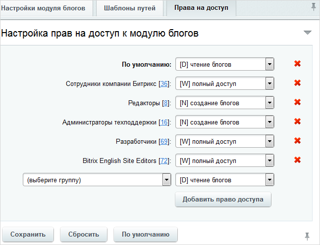

# Настройка прав

**Навигация**
- [← Оглавление курса](index.md)
- [← Предыдущий: 2860 — Настройки модуля](lesson_2860.md)
- [Следующий: 20016 — Проверьте себя →](lesson_20016.md)

Официальная страница урока: https://dev.1c-bitrix.ru/learning/course/index.php?COURSE_ID=41&LESSON_ID=5854

|  | #### Настройка прав |
| --- | --- |

Права доступа к группам блогов, блогам и комментариям блогов настраиваются на закладке **Права на доступ** на странице административного раздела Настройки &gt; Настройки продукта &gt; Настройки модулей &gt; Блоги. Если необходимо, чтобы у какого-либо пользователя было право не только чтения, но и создания блога, то необходимо причислить его к

			группе

                    Вы можете разделить пользователей по разным группам и задать каждой группе определенный набор прав на модули
[Подробнее...](https://dev.1c-bitrix.ru/learning/course/index.php?COURSE_ID=35&CHAPTER_ID=02006&LESSON_PATH=3906.4503.2006)

		, для которой  должно быть задано соответствующее право:

Каждый владелец блога может самостоятельно настраивать права доступа для него, но администратор может задать максимальную глубину такой настройки, выставив соответствующие параметры в **Настройках модуля блогов**:

То есть если Администратор укажет в настройках модуля "Максимальные права на сообщения для групп пользователей блога" уровня **Запись**, то Контент-менеджер уже не сможет дать группам пользователей блога (и стандартным группам, и

			Открытым

                    **Открытые группы** - группы, в которые и Вы сможете добавлять других пользователей, и другие пользователи сами смогут добавляться без Вашего участия
 [Подробнее...](https://dev.1c-bitrix.ru/learning/course/index.php?COURSE_ID=34&LESSON_ID=3866#open_groups)

		 группам) права **Модерирование** и **Администрирование**.

Настройка прав доступа к сообщениям и комментариям блога выполняется также при создании или редактировании блога (как в [публичном](https://dev.1c-bitrix.ru/learning/course/index.php?COURSE_ID=34&LESSON_ID=3866), так и в [административном](https://dev.1c-bitrix.ru/learning/course/index.php?COURSE_ID=34&LESSON_ID=2935) разделе) или сообщения блога.

|  | #### Документация по теме: |
| --- | --- |

- [Настройки модуля](https://dev.1c-bitrix.ru/user_help/service/blogs/settings.php)
