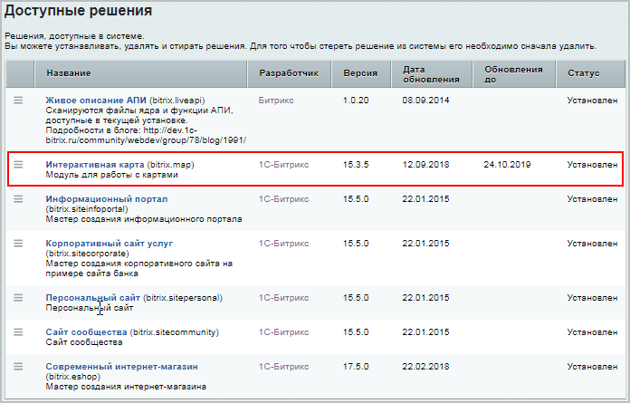
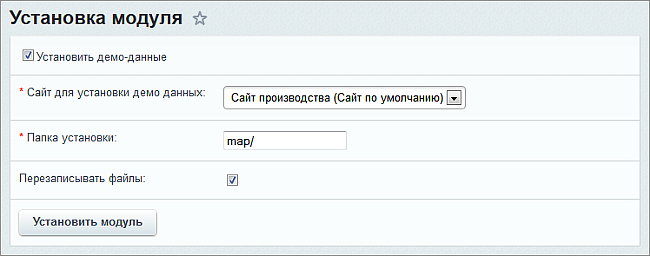
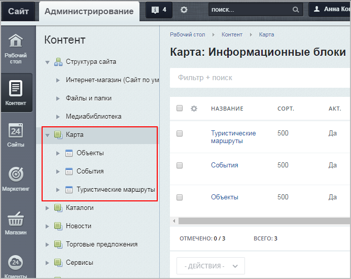

# Установка модуля

**Навигация**
- [← Оглавление курса](index.md)
- [← Предыдущий: 12123 — Возможности модуля](lesson_12123.md)
- [Следующий: 6405 — Предварительная настройка →](lesson_6405.md)

Официальная страница урока: https://dev.1c-bitrix.ru/learning/course/index.php?COURSE_ID=41&LESSON_ID=6403

**Важно!** С 1 февраля 2023 года продажа решения **1С-Битрикс: Интерактивная карта объектов** (bitrix.map) прекращена. Техническая поддержка по купленным ранее решениям будет оказываться до окончания их срока действия. Поддержка будет оказана при условии активной лицензии платформы 1С-Битрикс.

|  | ### Установка модуля |
| --- | --- |

Модуль **"1С-Битрикс: Интерактивная карта объектов"** можно установить двумя способами:

- через
  			административную часть сайта
  На странице **Marketplace** (*Marketplace &gt; Каталог решений*) можно просмотреть список доступных для загрузки и/или установленных модулей из Marketplace.
  [Подробнее](https://dev.1c-bitrix.ru/user_help/marketplace/update_system_market.php)...
- со [страницы модуля в Маркетплейс](http://marketplace.1c-bitrix.ru/solutions/bitrix.map/#tab-install-link)

После загрузки модуля, в разделе **Установленные решения** должна появиться строка

			"Интерактивная карта (bitrix.map)"

		 разработчика **"1С-Битрикс"**.

**Примечание:** При установке модуля у вас будет возможность установить также демонстрационные данные, чтобы сразу можно было посмотреть на работу карты.

Отметьте опцию

			Установить демо-данные,

		 укажите сайт, для которого будут устанавливаться данные, и путь к папке относительно корня сайта, где будут установлены примеры использования компонента карты.

**Внимание!** Если вы пропустите установку демонстрационных данных и решите сразу настроить компонент карты на свои данные, вам может потребоваться создать несколько свойств для ваших инфоблоков. Подробнее про необходимые дополнительные свойства смотрите в главе

			Предварительная настройка.

Если вы выполнили установку демонстрационных данных, то все необходимые поля для инфоблоков у вас уже созданы. В противном случае, если вы решили сразу использовать свои данные, вам нужно учесть несколько моментов.

Для разделов туристических маршрутов должны быть созданы два пользовательских свойства:

- Замкнутый маршрут;

- Тип маршрута.

[Подробнее](lesson_6405.md)...

После установки у вас должны появиться:

- Новый тип инфоблоков **Карта** (**bx_map**);
- Три инфоблока: **Объекты**, **События**, **Туристические маршруты** (Контент &gt; Карта);

