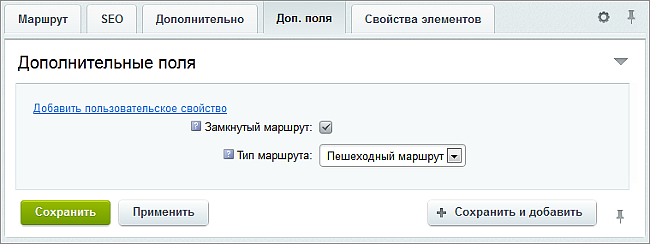
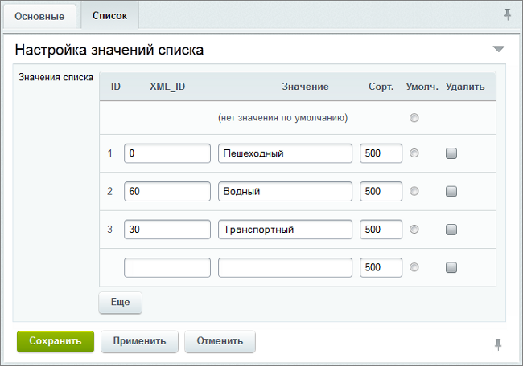
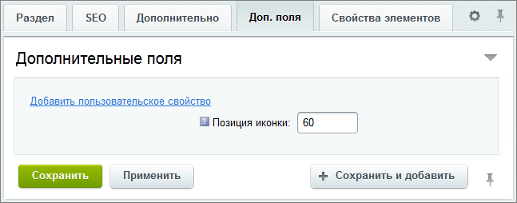

# Предварительная настройка

**Навигация**
- [← Оглавление курса](index.md)
- [← Предыдущий: 6403 — Установка модуля](lesson_6403.md)
- [Следующий: 6406 — Настройки модуля →](lesson_6406.md)

Официальная страница урока: https://dev.1c-bitrix.ru/learning/course/index.php?COURSE_ID=41&LESSON_ID=6405

**Важно!** С 1 февраля 2023 года продажа решения **1С-Битрикс: Интерактивная карта объектов** (bitrix.map) прекращена. Техническая поддержка по купленным ранее решениям будет оказываться до окончания их срока действия. Поддержка будет оказана при условии активной лицензии платформы 1С-Битрикс.

|  | ### Предварительная настройка |
| --- | --- |

Если вы выполнили установку демонстрационных данных, то все необходимые поля для инфоблоков у вас уже созданы. В противном случае, если вы решили сразу использовать свои данные, вам нужно учесть несколько моментов.

Для разделов туристических маршрутов должны быть созданы два пользовательских свойства:

- Замкнутый маршрут;
- Тип маршрута.

Свойство **Замкнутый маршрут** (в стандартном решении имеет код `UF_CLOSED`) должно быть типа **Да/Нет**. Свойство влияет на отрисовку линии маршрута – если маршрут замкнутый, то его линия автоматически соединяется между последней и первой точкой маршрута.

Свойство **Тип маршрута** (в стандартном решении имеет код `UF_ROUTE_TYPE`) должно быть типа **Список**. Это свойство обязательно для заполнения для вывода маршрута на карте. Все маршруты при выводе группируются по типу.

**Внимание!** При настройке списка в поле **XML_ID** значений вводится позиция иконки для этого типа маршрута. В стандартном шаблоне иконки хранятся в одном спрайте с шагом 30 пикселей. Следующие значения соответствуют стандартным иконкам

			типов маршрутов:

- 0 – Пешеходный маршрут.
- 30 – Транспортный маршрут.
- 60 – Водный маршрут.

Для разделов инфоблока объектов должно быть создано дополнительное свойство

			Позиция иконки

		 (в стандартном решении имеет код `UF_ICON_POS`). Свойство должно иметь тип **Число** (предпочтительней) либо **Строка**. Позиция иконки влияет на то, какая иконка для данной категории объектов будет выведена в списке на карте, а так же какой маркер будет использоваться для всех ее объектов. Как и с типами маршрутов, иконки хранятся в отдельном спрайте с шагом в 30 пикселей.

Так же следует обратить внимание на то, что все объекты должны содержаться внутри категорий.

## В стандартной поставке существуют следующие категории со стандартными иконками:

| АЗС | Детям | Парковки |
| --- | --- | --- |
| Аптеки | Инфоматы | Православные храмы |
| Аэропорты | Католические храмы | Рестораны |
| Больницы, поликлиники | Кафе, бистро | Синагоги |
| Ведомства | Колледжи | Спортивные площадки |
| Вокзалы | Метро | Стадионы |
| Вузы | Мечети | Театры |
| Выставки, выставочные залы | Музеи | Школы |
| Гостиницы | Памятники | Ярмарки |
| Детские сады | Парки |  |

Значение 0 позиции иконки соответствует маркеру/иконке по умолчанию. Все остальные иконки идут, начиная со значения 30. То есть 30 – иконка для АЗС, 60 – для аптек, 210 – для ВУЗов, 870 – для ярмарок.

Все стандартные иконки можно посмотреть в каталоге модуля `/install/images/bitrix.map`.
