# Настройки модуля

**Навигация**
- [← Оглавление курса](index.md)
- [← Предыдущий: 6405 — Предварительная настройка](lesson_6405.md)
- [Следующий: 6407 — Заполнение объектов →](lesson_6407.md)

Официальная страница урока: https://dev.1c-bitrix.ru/learning/course/index.php?COURSE_ID=41&LESSON_ID=6406

### Общие моменты

**Важно!** С 1 февраля 2023 года продажа решения **1С-Битрикс: Интерактивная карта объектов** (bitrix.map) прекращена. Техническая поддержка по купленным ранее решениям будет оказываться до окончания их срока действия. Поддержка будет оказана при условии активной лицензии платформы 1С-Битрикс.

**Примечание**: Обратите внимание на два информационных поля, которые появятся сразу после установки модуля:

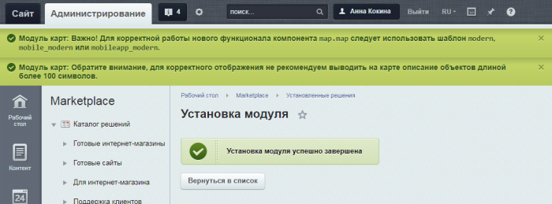

- Для корректной работы нового функционала компонента **map.map** следует использовать шаблон **modern**, **mobile_modern** или **mobileapp_modern**.
- Для корректного отображения не рекомендуется выводить на карте описание объектов длиной более 100 символов.

Модуль настраивается в шести вкладках. Часть настроек является общей для всего продукта, часть делится по сайтам и по версиям карты.

- Вкладка "Настройка";
- Вкладка "Интерфейс";
- Вкладка "Значки и цвета";
- Вкладка "Геокодирование";
- Вкладка "API-ключи";
- Вкладка "Доступ".

### Вкладка "Настройка"

Здесь собраны основные настройки модуля.

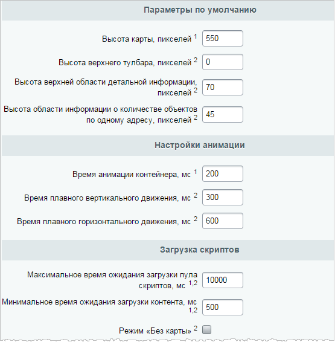

## Параметры по умолчанию

- **Высота карты, пикселей** - Высота карты по умолчанию. Это значение будет подставляться в параметры компонента при установке его на страницу. Так же это значение будет использовано, если параметр компонента не задан (пустая строка). Доступно только для десктоп-версии. Параметр скрипта - `mapHeight`.
- **Высота верхнего тулбара, пикселей** - Высота верхней области под служебные области управления. Это значение будет подставляться в параметры компонента при установке его на страницу. Так же это значение будет использовано, если параметр компонента не задан (пустая строка). Доступно только для мобильной версии. Параметр скрипта - `barHeight`.
- **Высота верхней области детальной информации, пикселей** - Высота верхней области детальной информации об объекте, маршруте, событии. Это значение будет подставляться в параметры компонента при установке его на страницу. Так же это значение будет использовано, если параметр компонента не задан (пустая строка). Доступно только для мобильной версии. Параметр скрипта - `plateHeight`.
- **Высота области информации о количестве объектов по одному адресу, пикселей** - Высота видимой части панели выбора объектов в случае совпадения их координат. В случае совпадения координат у нескольких объектов маркер меняет свой вид, и показывается краткая информация одного из них. Для выбора другого объекта следует вытянуть за эту часть всю панель целиком, в которой и находится полный список всех объектов, находящихся по этому адресу. Параметр скрипта - `fewObjectsHeight`.

## Настройки анимации

- **Время анимации контейнера, мс** - Время анимации при передвижении панелей. Этот параметр лучше не менять без особой на то необходимости. Используется только в десктоп-версии. Параметр скрипта - `animationTime`.
- **Время плавного вертикального движения, мс** - Используется при отпускании плашки с краткой информацией для плавного вертикального движения блока с подробной информацией об объекте в нужное положение. Доступно только для мобильной версии. Параметр скрипта - `itemTime`.
- **Время плавного горизонтального движения, мс** - Используется для плавного горизонтального движения блока со списком и формой прокладки маршрута. Доступно только для мобильной версии. Параметр скрипта - `listTime`.

## Загрузка скриптов

- **Максимальное время ожидания загрузки пула скриптов, мс** - Используется как для загрузки основных скриптов компонента для построения интерфейса и его обслуживания, так и загрузки скриптов, указанных для выбранного типа карты. По истечении этого времени проверяется состояние загрузки и, при наличии незагруженных скриптов, загрузка прекращается. Параметр скрипта - `responseTime`.
- **Минимальное время ожидания загрузки контента, мс** - Во избежание резкой смены элементов интерфейса некоторые действия намеренно ставятся в очередь с указанной отсрочкой. Это означает, что отдельные изменения интерфейса не будут осуществляться раньше, чем указанное время. Это используется при отправке/получении запросов и обработке полученной информации. Параметр скрипта - `loadTime`.
- **Режим "Без карты"** - Такой режим означает, что компонент осуществляет навигацию, не используя слой карты, отображая только текстовую и графическую информацию.

## Прокладка маршрута

Разделы **Прокладка маршрута Яндекс.Карт** и **Прокладка маршрута Google Maps** позволяют указать виды транспорта, которые пользователь может выбрать при прокладке маршрута. Виды транспорта зависят от типа карт.

### Вкладка "Интерфейс"

Здесь настраиваются строковые константы интерфейса карты. Вы можете настроить их сразу для всех сайтов (по умолчанию) или задать индивидуальные значения для каждого сайта.

### Вкладка "Значки и цвета"

В этой вкладке устанавливаются значки маркеров, цвета и параметры линий маршрутов, параметры кластеризации.

Для маркеров используются спрайты. Вы можете загрузить свой файл со спрайтом и настроить расположение значков маркеров в нем, указав размер иконок. Параметр **Точка привязки** отвечает за расположение точки привязки маркера к точке с координатами на карте.

Для линий маршрутов вы можете настроить цвет, толщину и прозрачность для каждого из состояний.

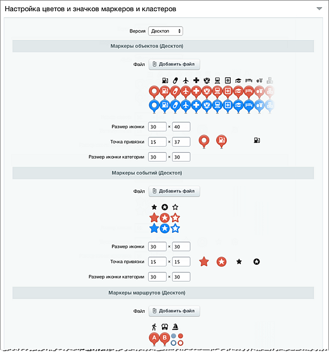

**Примечание:** Настройки различаются для десктоп и мобильной версий.

### Вкладка "Геокодирование"

Здесь можно настроить автоматическое геокодирование адресов в координаты (широту и долготу). Геокодирование может быть применено к любому инфоблоку.

Настройка заключается из последовательного выбора:

- Инфоблока, для которого применяется геокодирование;
- Свойства, в котором хранится текстовый адрес (он будет геокодирован);
- Свойств, в которые будут сохранены долгота и широта;
- Сервиса, который будет использоваться для геокодирования.

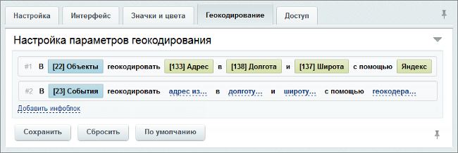

**Внимание!** Если при добавлении элемента в инфоблок, для которого настроено геокодирование, вручную задать значения долготы и широты, то данные значения не будут перезаписаны.

### Вкладка "API-ключи"

На этой вкладке вводятся ключи для работы с **Google Maps** и **Яндекс.Карты**.

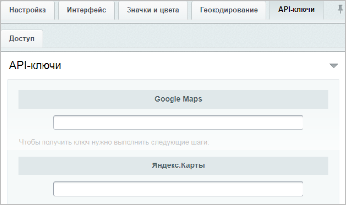

## Google Maps

Чтобы получить ключ, нужно выполнить следующие шаги:

1. Перейти по адресу [https://code.google.com/apis/console](https://code.google.com/apis/console), осуществить вход в свой аккаунт или же зарегистрировать новый аккаунт Google.
2. Создать проект
                      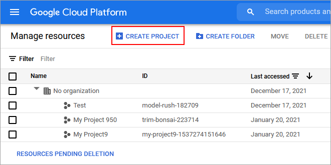
  		 (в названии проекта можно указать название домена, например yoursite.com).
3. Перейти в раздел
  			Библиотека
                      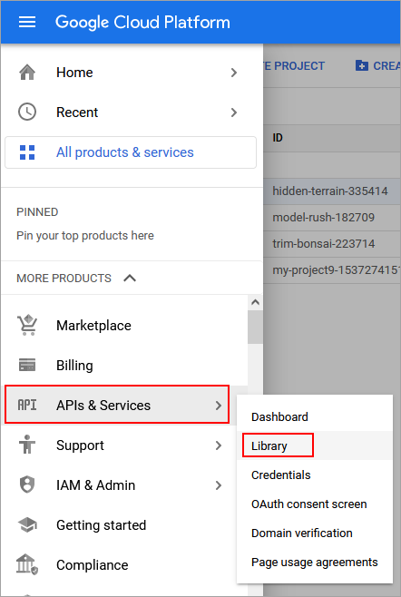
  		. В этом разделе находятся все API, которые можно подключить. Для использования компонента **Google Maps** понадобится
  			Maps JavaScript API
                      
  		. Подключим API, используя кнопку
  			Включить
                      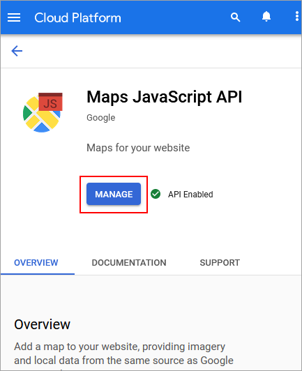
  		.
4. Нужны будут еще
  			Geocoding API и Places API
                      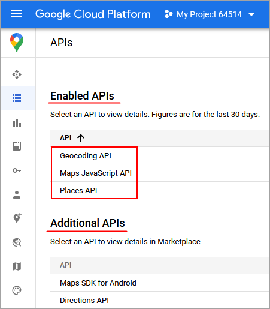
  		. Для каждого из них нажмем кнопку **Включить**.
5. Далее необходимо получить сам ключ. Переходим в раздел
  			Учетные данные
                      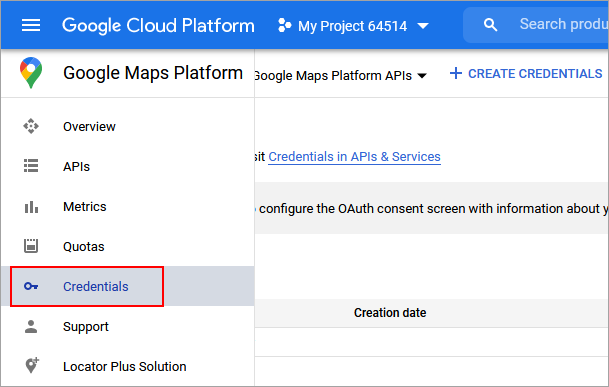
  		.
6. Нажимаем **Создать учетные данные** и выбираем пункт
  			API Key
                      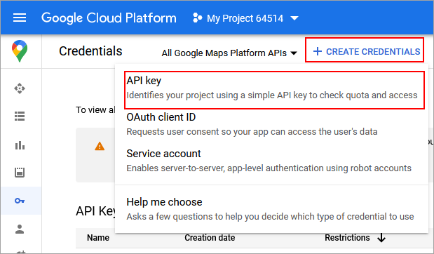
  		.
7. Ключ будет создан и появится во всплывающем окне.
  			Копируем ключ
                      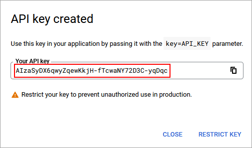
  		 и вставляем в поле выше.

Ещё более подробная инструкция есть в [Пользовательской документации](https://dev.1c-bitrix.ru/user_help/components/content/google_maps/map_google_key.php).

## Яндекс.Карты

Чтобы получить ключ, нужно выполнить следующие шаги:

1. Перейти по адресу [developer.tech.yandex.ru](https://developer.tech.yandex.ru/), осуществить вход в свой аккаунт или же зарегистрировать новый аккаунт Яндекс.
2. Нажать кнопку **Получить ключ**, ввести название ключа (в названии можно указать название домена, например yoursite.com) и выбрать **API Яндекс.Карт**.
3. Заполняем форму и нажимаем кнопку **Отправить**.
4. Далее необходимо подписать лицензионный договор с Яндексом, подробности которого вам придут на почту.

**Внимание!** Для установки модуля на продукт "Битрикс24" необходимо получить

			коммерческую версию карт.

                     API Яндекс.Карт включает в себя четыре продукта:

		 - JavaScript API и Геокодер,

		 - API Поиска по организациям,

		 - Static API,

		 - MapKit SDK,

		 - Матрица расстояний и Построение маршрута между двумя точками.

		 Каждый из этих продуктов вы можете использовать бесплатно, либо на платной основе. Для бесплатного использования необходимо соблюдать ряд условий, которые перечислены ниже.

		 Если ваш проект предполагает нарушение хотя бы одного из условий или большое количество запросов, следует приобрести коммерческую версию API.

 [Подробнее](https://yandex.ru/dev/commercial/doc/ru/)...

### Вкладка "Доступ"

Данная вкладка позволяет настроить права доступа к настройками модуля.

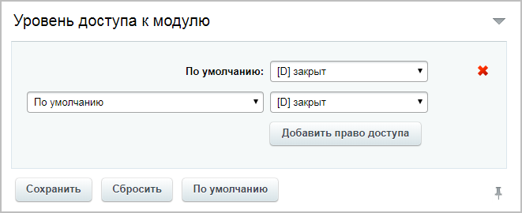
