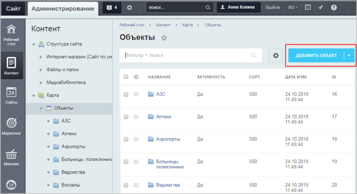
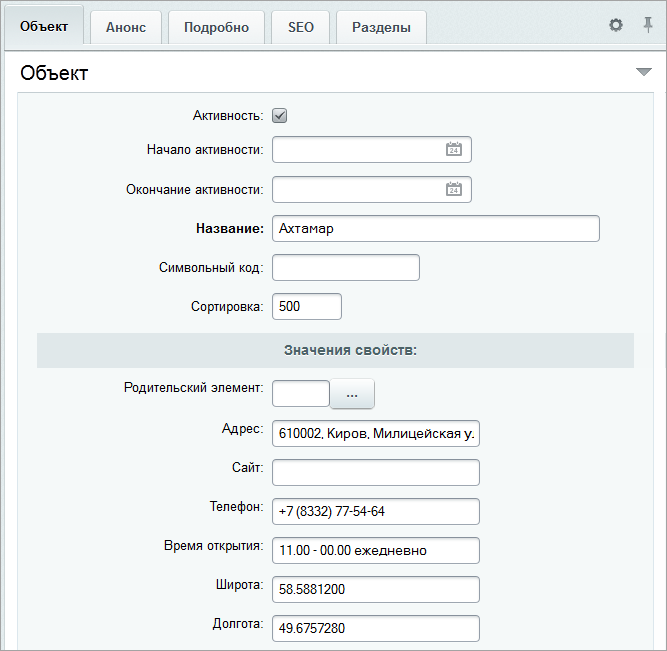
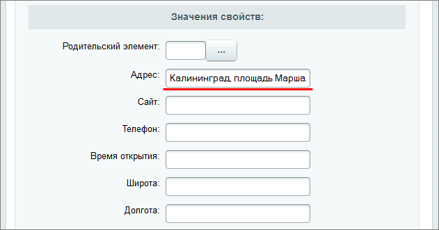

# Заполнение объектов

**Навигация**
- [← Оглавление курса](index.md)
- [← Предыдущий: 6406 — Настройки модуля](lesson_6406.md)
- [Следующий: 6408 — Заполнение туристических маршрутов →](lesson_6408.md)

Официальная страница урока: https://dev.1c-bitrix.ru/learning/course/index.php?COURSE_ID=41&LESSON_ID=6407

**Важно!** С 1 февраля 2023 года продажа решения **1С-Битрикс: Интерактивная карта объектов** (bitrix.map) прекращена. Техническая поддержка по купленным ранее решениям будет оказываться до окончания их срока действия. Поддержка будет оказана при условии активной лицензии платформы 1С-Битрикс.

|  | ### Заполнение объектов |
| --- | --- |

Данные объектов заполняются в административном разделе через редактирование элементов инфоблока **Объекты**, либо через созданный вами интерфейс для работы с элементами этого инфоблока. Разделы инфоблока соответствуют категориям, по которым объекты группируются на карте. Элементы инфоблока соответствуют самим объектам.

	<!-- &lt;p&gt;&lt;img src="/images/admin_expert/other_modules/bitrix_maps/10.png"  border="0"&gt;&lt;/p&gt; -->

Для появления объекта на карте у него должны быть заполнены следующие свойства: **Название**, **Широта**, **Долгота**. Все остальные свойства, показанные на рисунке ниже, носят информативный характер и не являются обязательными для заполнения.

При использовании [Геокодирования](lesson_6406.md#geocoding) достаточно ввести только

			адрес

		 объекта в соответствующее поле.
При условии правильной настройки **Геокодирования**, после сохранения параметров объекта координаты для него будут

			автоматически добавлены

		 в соответствии с указанным адресом.

Если заполнено фото и/или описание на вкладке **Анонс** - они так же будут выведены во всплывающем описании при клике на объект на карте.

**Внимание!** При первом открытии карта автоматически масштабируется, чтобы вмещать все объекты. Если вы заполняете объекты для одного конкретного города, но на карте видите всю область или половину страны, то вам нужно проверить правильность введенных координат. В частности подобные проблемы могут возникать при автоматическом определении координат по адресу через различные сервисы.

**Примечание:** Если вы создали объект, но он не выводится на карте, то вам так же нужно проверить правильность заполнения координат. Координаты должны быть в таком же виде, как показано на рисунке выше.
