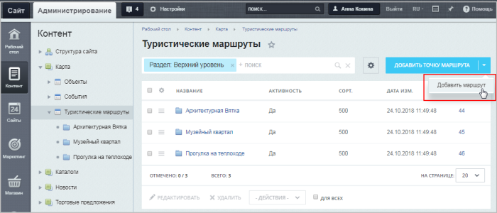

# Заполнение туристических маршрутов

**Навигация**
- [← Оглавление курса](index.md)
- [← Предыдущий: 6407 — Заполнение объектов](lesson_6407.md)
- [Следующий: 6409 — Заполнение событий →](lesson_6409.md)

Официальная страница урока: https://dev.1c-bitrix.ru/learning/course/index.php?COURSE_ID=41&LESSON_ID=6408

**Важно!** С 1 февраля 2023 года продажа решения **1С-Битрикс: Интерактивная карта объектов** (bitrix.map) прекращена. Техническая поддержка по купленным ранее решениям будет оказываться до окончания их срока действия. Поддержка будет оказана при условии активной лицензии платформы 1С-Битрикс.

|  | ### Заполнение туристических маршрутов |
| --- | --- |

Данные туристических маршрутов заполняются в административном разделе через редактирование элементов инфоблока **Туристические маршруты**. Разделы инфоблока соответствуют самим маршрутам, а элементы инфоблока соответствуют точкам этих маршрутов.

У маршрута есть два дополнительных поля:

- **Тип маршрута** – используется для группировки маршрутов, как и категории для объектов.
  Про настройку типов более подробно написано в главе [Предварительная настройка](lesson_6405.md).
- **Замкнутый маршрут** – используется, если точки начала и конца совпадают. Если опция отмечена, то линия маршрута будет автоматически продолжена до начальной точки.

Точки маршрутов заполняются аналогично

			объектам.

Для появления объекта на карте у него должны быть заполнены следующие свойства: **Название**, **Широта**, **Долгота**.

[Подробнее](lesson_6407.md)...

		 При построении линии маршрута точки будут выводиться в порядке увеличения значения поля **Сортировка**. При открытии карты маршруты неактивны. При выборе одного из них линия меняет цвет, и на ней начинают отображаться точки. При клике на точку будут выведены её адрес и описание.
