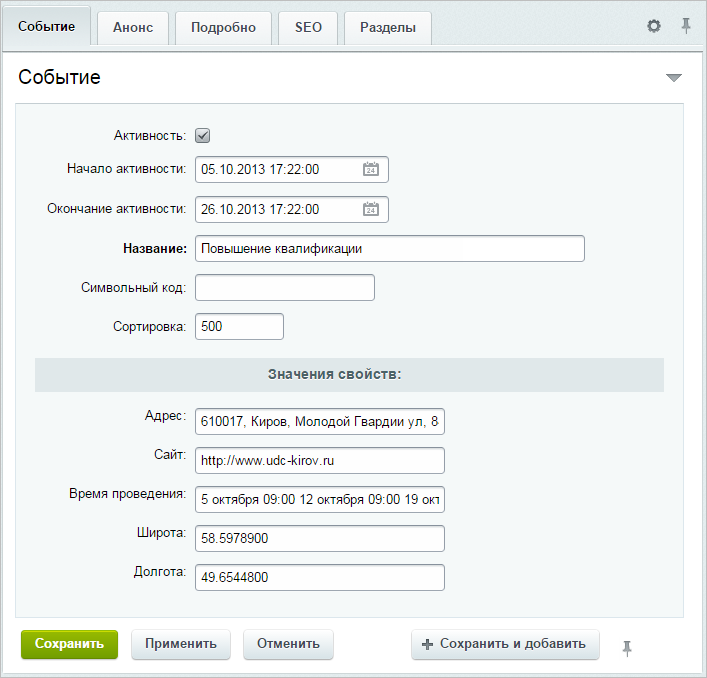

# Заполнение событий

**Навигация**
- [← Оглавление курса](index.md)
- [← Предыдущий: 6408 — Заполнение туристических маршрутов](lesson_6408.md)
- [Следующий: 11151 — Основная информация →](lesson_11151.md)

Официальная страница урока: https://dev.1c-bitrix.ru/learning/course/index.php?COURSE_ID=41&LESSON_ID=6409

**Важно!** С 1 февраля 2023 года продажа решения **1С-Битрикс: Интерактивная карта объектов** (bitrix.map) прекращена. Техническая поддержка по купленным ранее решениям будет оказываться до окончания их срока действия. Поддержка будет оказана при условии активной лицензии платформы 1С-Битрикс.

|  | ### Заполнение событий |
| --- | --- |

Данные событий заполняются в административном разделе через редактирование элементов инфоблока **События**. Разделы инфоблока при выводе данных на карту не используются. Элементы инфоблока соответствуют самим событиям.

События заполняются точно так же как

			объекты

Для появления объекта на карте у него должны быть заполнены следующие свойства: **Название**, **Широта**, **Долгота**.

[Подробнее](lesson_6407.md)...

		 и точки маршрутов, но есть одно отличие: для события **обязательно** должны быть заполнены поля **Начало активности** и **Окончание активности**.

В зависимости от этих полей события автоматически группируются по категориям:

- Идут сейчас;
- Будущие;
- Прошедшие.

