# Отображение объектов, туристических маршрутов, событий

**Навигация**
- [← Оглавление курса](index.md)
- [← Предыдущий: 11151 — Основная информация](lesson_11151.md)
- [Следующий: 6412 — Особенности мобильной версии карт →](lesson_6412.md)

Официальная страница урока: https://dev.1c-bitrix.ru/learning/course/index.php?COURSE_ID=41&LESSON_ID=6466

Рассмотрим, как выглядят на карте созданные объекты, туристические маршруты и события.

### Вывод объектов

**Важно!** С 1 февраля 2023 года продажа решения **1С-Битрикс: Интерактивная карта объектов** (bitrix.map) прекращена. Техническая поддержка по купленным ранее решениям будет оказываться до окончания их срока действия. Поддержка будет оказана при условии активной лицензии платформы 1С-Битрикс.

Объекты выводятся с группировкой по категориям. Каждой категории соответствует определенная иконка и тип маркеров, которые задаются через свойство **Позиция иконки**. При выборе одной или нескольких категорий их объекты будут отображены на карте соответствующими маркерами. Быстро снять выделение поможет кнопка под списком категорий - **Отменить выбор**.

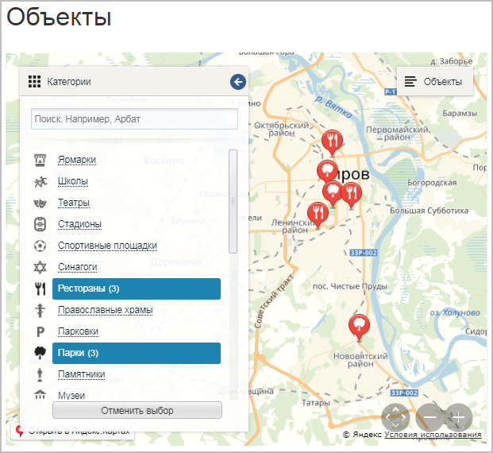

Если вас интересует какой-то конкретный объект, но вы не знаете, в какой категории его искать, то можно воспользоваться возможностями поиска по названию объекта. При этом в списке категорий останутся только те, в которых содержатся объекты, удовлетворяющие условиям поиска.

Для просмотра информации об объекте кликните на один из

			маркеров

	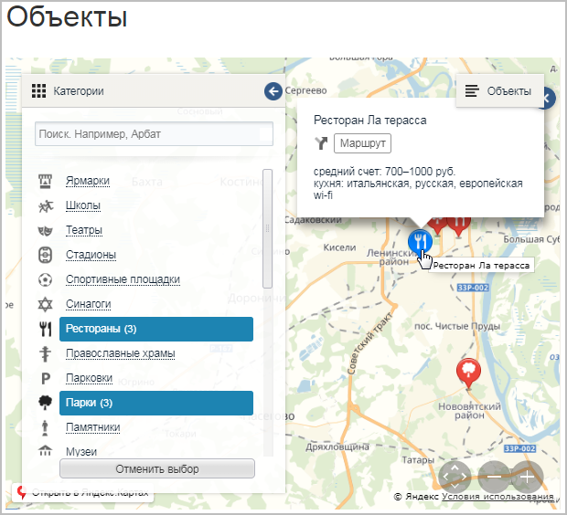

		 на карте. Так же вы можете открыть текстовый список всех выбранных вами объектов, нажав на кнопку

			Объекты.

	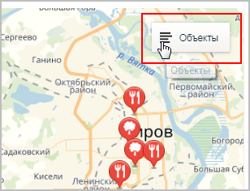

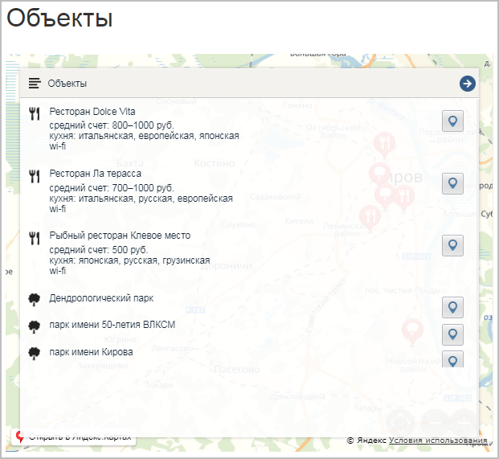

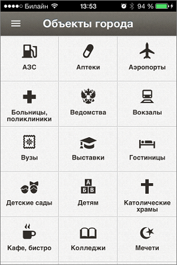
	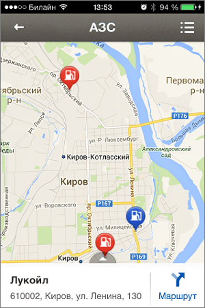

### Вывод туристических маршрутов

Отображение маршрутов на карте имеет следующий вид:

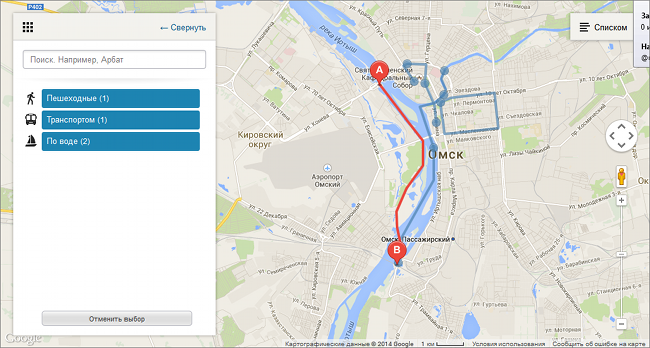

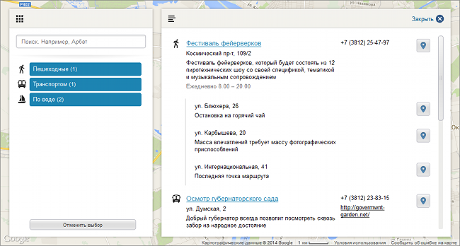

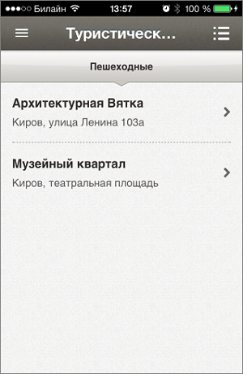
	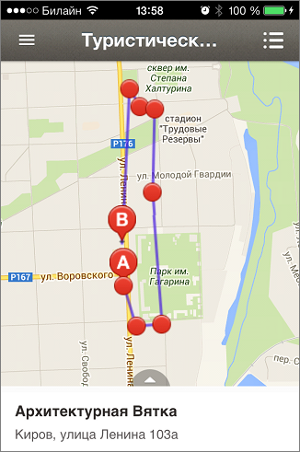

### Вывод событий

Отображение событий на карте имеет следующий вид:

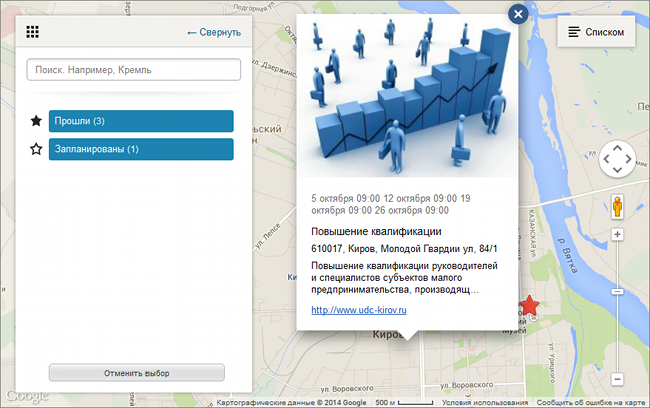

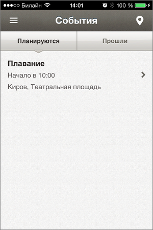
	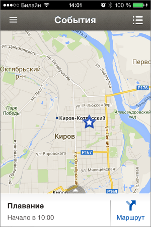
