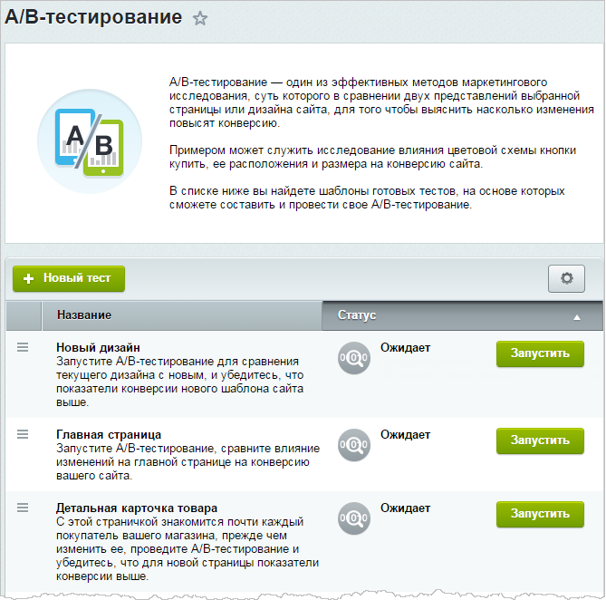

# Принципы A/B тестирования

**Навигация**
- [← Оглавление курса](index.md)
- [← Предыдущий: 25044 — Глоссарий](lesson_25044.md)
- [Следующий: 7201 — Настройки и запуск тестирования →](lesson_7201.md)

Официальная страница урока: https://dev.1c-bitrix.ru/learning/course/index.php?COURSE_ID=41&LESSON_ID=6685

> **Модуль A/B-тестирование** - это инструмент маркетингового исследования, с помощью которого можно сравнить два варианта страницы, шаблона сайта или сайта целиком, чтобы убедиться, какой из вариантов имеет более высокую конверсию и многие другие дополнительные показатели.

|  | ### А/B тестирование работает так |
| --- | --- |

Отбирается некоторая часть посетителей сайта, которая будет участвовать в тесте. Система делит  этот трафик пополам и направляет первую половину на экспериментальные страницы А (то, что видят все посетители сейчас), а вторую половину - на страницы Б (то, что мы собираемся протестировать). Для каждой из этих групп рассчитывается конверсия и прочие показатели, которые и будут включены в аналитический отчет. Этот отчет содержит информацию о том, какой вариант страницы более выгоден, имеет более высокую конверсию и т.д.

**Важно**! Запуск, редактирование и создание тестирования по умолчанию доступны только группе **Администраторы**. Чтобы разрешить другой группе выполнять данные действия, ее нужно наделить

			правом доступа

                    **Право доступа** -  комплекс операций в системе, доступный для выполнения пользователем.

[Подробнее...](http://dev.1c-bitrix.ru/learning/course/index.php?COURSE_ID=35&LESSON_ID=2015)

		 на операцию **Изменение PHP-кода (edit_php)**.

Ключевые особенности А/В тестирования:

- запуск не требует сложных технических настроек, дополнительного программирования и больших временных затрат;
- имеется широкий набор типовых тестов и возможность создавать собственные тесты;
- отчеты по тестированию содержат полную и понятную информацию о проведенных тестах.

**Внимание**! Данный модуль пока не является автоустанавливаемым, поэтому его требуется установить самостоятельно из страницы Настройки &gt; Настройки продукта &gt; Модули в административной части сайта.
