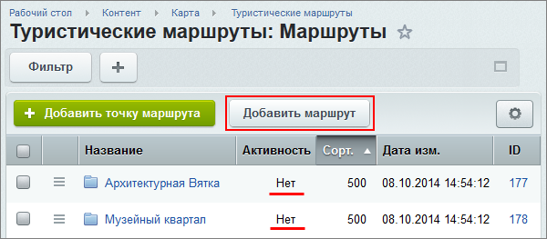
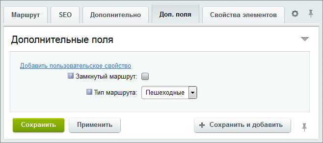
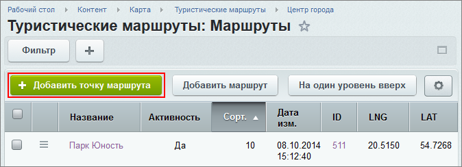
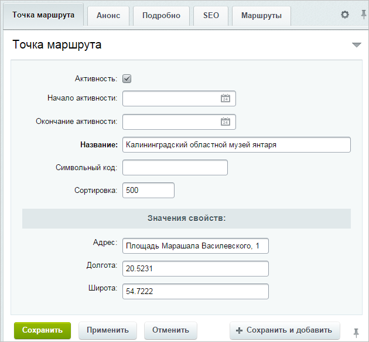
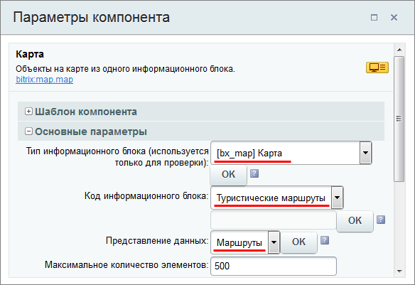
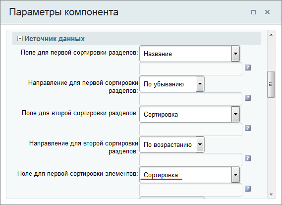
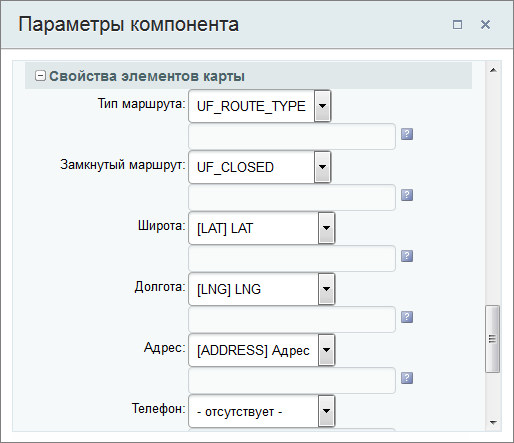
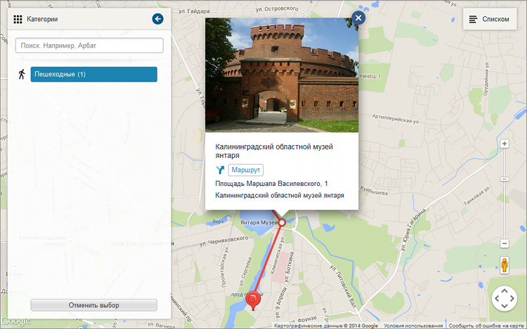

# Пример создания маршрута

**Навигация**
- [← Оглавление курса](index.md)
- [← Предыдущий: 6927 — Полноэкранный режим отображения карты](lesson_6927.md)

Официальная страница урока: https://dev.1c-bitrix.ru/learning/course/index.php?COURSE_ID=41&LESSON_ID=6771

### Пример создания маршрута

**Важно!** С 1 февраля 2023 года продажа решения **1С-Битрикс: Интерактивная карта объектов** (bitrix.map) прекращена. Техническая поддержка по купленным ранее решениям будет оказываться до окончания их срока действия. Поддержка будет оказана при условии активной лицензии платформы 1С-Битрикс.

Рассмотрим пример создания небольшого маршрута на карте.

Маршрут мы будем строить уже на основе

			установленного

Модуль "1С-Битрикс: Интерактивная карта объектов" можно установить двумя способами:

**-** через административную часть сайта

**-** со страницы модуля в Маркетплейс

После загрузки модуля, в разделе Установленные решения должна появиться строка "Интерактивная карта (bitrix.map)" разработчика "1С-Битрикс".

[Подробнее](lesson_6403.md)...

		 модуля с **демо-данными**. Это позволит сократить объем работы по созданию пользовательских свойств инфоблоков и проведения прочих настроек, необходимых для работы модуля.

- Создание маршрута;
- Создание точек маршрута;
- Настройка компонента и вывод карты.

### Создание маршрута

В инфоблоке **Туристические маршруты** (Карта &gt; Туристические маршруты) сделаем *неактивными* все существующие демо-маршруты, чтобы они не мешали строить свой собственный маршрут в другом городе.

Затем с помощью соответствующей кнопки, создадим новый маршрут:

Затем произведем его настройку:

- На вкладке **Маршрут** укажем **название** (в нашем случае *Центр города*) .
- На вкладке **Доп. поля** необходимо выбрать **тип маршрута** (в нашем случае *Пешеходный*) и является ли он **замкнутым** (в нашем случае - *нет*):
  

### Создание точек маршрута

Для построения маршрута на карте необходимо создать точки. Для этого перейдем к созданному [маршруту](lesson_6771.md#route) и воспользуемся соответствующей кнопкой:

Затем произведем настройку:

- На вкладке **Точка маршрута** укажем **Название**, **Сортировку**, **Координаты** и **Адрес**:
  
  Поля **Название** и **Координаты** обязательно должны быть заполнены.
  Поле **Сортировка** в последующем позволит строить маршрут из точек на карте в требуемой последовательности.
- На вкладке **Анонс**	добавим **Картинку** и **Описание**.

Создадим остальные точки маршрута по схеме указанной выше.

### Настройка компонента и вывод карты

Для вывода карты на отдельной странице

			разместим

Карта выводится традиционным для сайтов на CMS "1С-Битрикс: Управление сайтом" способом - компонентом Карта (bitrix:map.map) .

[Подробнее](https://dev.1c-bitrix.ru/learning/course/index.php?COURSE_ID=41&CHAPTER_ID=06410)...

		 и настроим компонент **Карта** (*bitrix:map.map*):

- В секции **Основные параметры** укажем следующие значения параметров:
  

  - **Тип информационного блока** - `[bx_map] Карта` - выберем тип инфоблока, используемый модулем *Интерактивная карта объектов* (в нашем случае это **[bx_map] Карта**, который уже создан вместе с демо-данными).
  - **Код информационного блока** - `Туристические маршруты` - инфоблок, который используется для хранения маршрутов.
  - **Представление данных** - `Маршруты` - укажем, что на карте будет использоваться режим отображения именно маршрутов.
- В секции **Источник данных** для параметра **Поле для первой сортировки элементов** выберем значение **Сортировка**.
  Это позволит расположить точки маршрута на карте в последовательности, согласно значению **Сортировка**, которое заполнялось ранее, при [их создании](#waypoints).
  
- В секции **Свойства элементов карты** для параметров проверить и указать все соответствующие свойства.
  В нашем случае это будут:
  

  - **Тип маршрута** -  `UF_ROUT_TYPE`;
  - **Замкнутый маршрут** - `UF_CLOSED`;
  - **Широта** - `[LAT] LAT`;
  - **Долгота** - `[LNG] LNG`;
  - **Адрес** - `[ADDRESS] ADDRESS`.

После всех действий на странице будет отображена карта с маршрутом на основе созданных точек:

