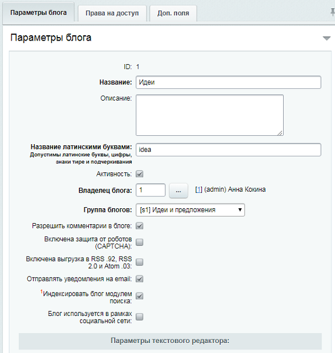
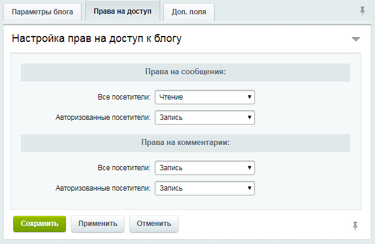

# Создание сервиса

**Навигация**
- [← Оглавление курса](index.md)
- [← Предыдущий: 6984 — Возможности Менеджера идей](lesson_6984.md)
- [Следующий: 11137 — Создание и редактирование статусов →](lesson_11137.md)

Официальная страница урока: https://dev.1c-bitrix.ru/learning/course/index.php?COURSE_ID=41&LESSON_ID=6906

|  | **Менеджер идей** настраивается и работает через  компонент Компонент – это программный код, оформленный в визуальную оболочку, выполняющий определённую функцию какого-либо модуля по выводу данных в Публичной части. Мы можем вставлять этот блок кода на страницы сайта без непосредственного написания кода. [Подробнее...](https://dev.1c-bitrix.ru/learning/course/index.php?COURSE_ID=34&CHAPTER_ID=04457) |
| --- | --- |

Сами идеи, как и комментарии к ним, функционируют на основе

			блогов,

                    Блог - инструмент, позволяющий пользователям сайта вести регулярно добавляемые записи, содержащие текст, изображения или мультимедиа.

 [Подробнее](/learning/course/index.php?COURSE_ID=41&CHAPTER_ID=04555)...

		 а категории идей являются разделами соответствующего

			инфоблока

                    Информационный блок (или Инфоблок) – специальный инструмент "1С-Битрикс: Управление сайтом" с помощью которого заносится информация в Базу данных.
 [Подробнее...](https://dev.1c-bitrix.ru/learning/course/index.php?COURSE_ID=34&CHAPTER_ID=04477&LESSON_PATH=3905.4477)

		. Поэтому необходимо сначала создать соответствующий [блог](https://dev.1c-bitrix.ru/learning/course/index.php?COURSE_ID=34&LESSON_ID=2935), а далее создать [инфоблок](/learning/course/index.php?COURSE_ID=34&CHAPTER_ID=02011&LESSON_PATH=3905.4477.2011) и подключить в публичной части [компонент](/learning/course/index.php?COURSE_ID=34&LESSON_ID=4695).

|  | #### Настройки Блога, выполняемые Администратором сайта. |
| --- | --- |

- Если комментирование будущих Идей разрешается, то:
  По умолчанию модерировать сервис **Менеджер идей** (*Есть идея!*) могут только пользователи группы **Администраторы**. Чтобы разрешить другим группам пользователей модерировать сервис, необходимо в настройках прав доступа к [блогу идей](lesson_5854.md)  задать уровень **Администрирование** к сообщениям и комментариям для авторизованных посетителей.
  Конкретную же группу лиц, имеющих право модерировать сервис, указывает Контент-менеджер в настройках комплексного компонента идей (**bitrix:idea**) в параметре
  			Группы пользователей, которые могут добавлять специальный ответ
                       
  Чтобы пользователи смогли голосовать за идеи, необходимо в административной части (Сервисы &gt; Рейтинги &gt; Список рейтингов, Рейтинг) во вкладке **Блог** отметить
  			пункты
                      
  		:
  - Голосование за сообщения пользователя в блогах
  - Голосование за комментарии пользователя в блогах
  Подробнее с настройками рейтинга можно ознакомиться в уроке [Рейтинги (курс Администратор. Базовый)](https://dev.1c-bitrix.ru/learning/course/index.php?COURSE_ID=35&CHAPTER_ID=04975&LESSON_PATH=3906.4493.4975)

  - на закладке
    			Параметры блога
                         
    		 отметьте опцию **Разрешить комментарии в блоге**
  - на закладке
    			Права на доступ
                        В нашем примере все посетители сайта могут читать идеи и оставлять комментарии, однако новые идеи
    могут предлагать только авторизованные посетители:
    
    		 настройте права доступа к блогу, чтобы пользователи могли создавать идеи и комментировать их.

Подробнее о создании и управлении **Менеджером идей** можно ознакомиться в уроке [Менеджер идей (курс Контент-менеджер)](https://dev.1c-bitrix.ru/learning/course/index.php?COURSE_ID=34&CHAPTER_ID=02610&LESSON_PATH=3905.4753.2610)
