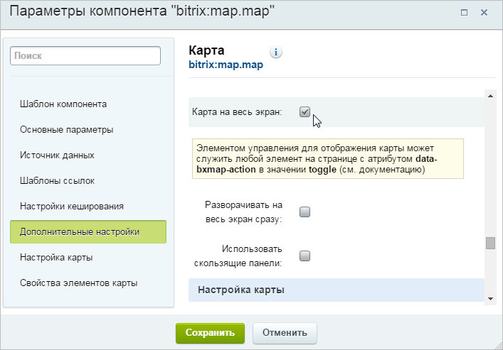
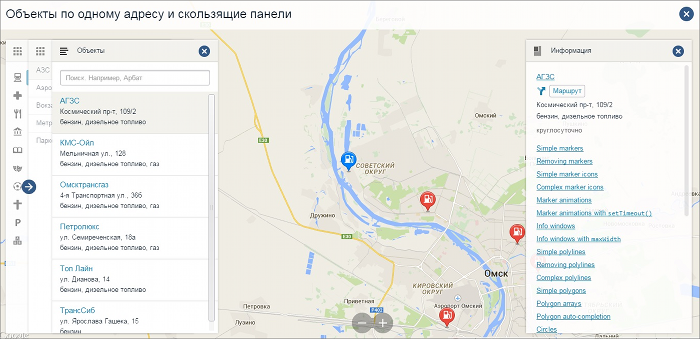
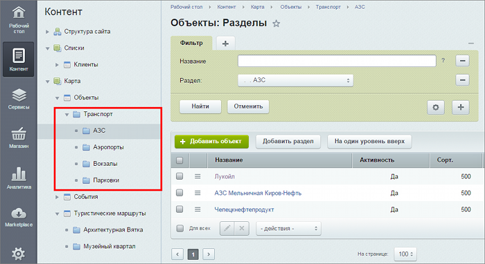

# Полноэкранный режим отображения карты

**Навигация**
- [← Оглавление курса](index.md)
- [← Предыдущий: 6412 — Особенности мобильной версии карт](lesson_6412.md)
- [Следующий: 6771 — Пример создания маршрута →](lesson_6771.md)

Официальная страница урока: https://dev.1c-bitrix.ru/learning/course/index.php?COURSE_ID=41&LESSON_ID=6927

**Важно!** С 1 февраля 2023 года продажа решения **1С-Битрикс: Интерактивная карта объектов** (bitrix.map) прекращена. Техническая поддержка по купленным ранее решениям будет оказываться до окончания их срока действия. Поддержка будет оказана при условии активной лицензии платформы 1С-Битрикс.

|  | ### Полноэкранный режим отображения карты |
| --- | --- |

Для вывода карты в полноэкранном режиме достаточно разместить «кнопку», отвечающую за перевод в этот режим отображения, и в параметрах компонента установить опцию **Карта на весь экран**:

При этом станут доступны два дополнительных параметра: **Разворачивать на весь экран сразу** и **Использовать скользящие панели**:

- **Разворачивать на весь экран сразу** - при включении этой опции карта в полноэкранном режиме открывается сразу же при загрузке страницы.
  В случае если параметр отключен, карта будет скрыта, и в этом случае для отображения карты необходимо разместить элемент со специальным атрибутом для отображения слоя с картой.
- **Скользящие панели** - в случае включения этого параметра, данные выводятся в режиме с тремя панелями: категории – подкатегории – объекты. В этом интерфейсе при клике на маркер информация об объекте размещается как четвёртая панель, позволяя размещать любое количество информации.
  
  Структура категорий (разделов инфоблоков) для этого режима строго предполагает использование 2-х уровней вложения категорий:
  
  В случае отсутствия у категории родительской, будет сформирована искусственная категория с названием, определенным в параметре компонента.

**Примечание:** Подробнее про работу с категориями и полноэкранный режим карты можно посмотреть в [документации для разработчиков](http://www.1c-bitrix.ru/download/doc/1c_bitrix_map-guide_13may2014.docx).
