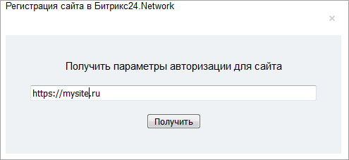
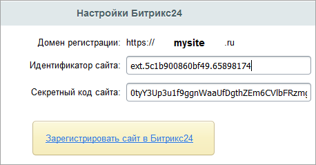

# Битрикс24.Network

**Навигация**
- [← Оглавление курса](index.md)
- [← Предыдущий: 10169 — Office365](lesson_10169.md)
- [Следующий: 7288 — Box.com →](lesson_7288.md)

Официальная страница урока: https://dev.1c-bitrix.ru/learning/course/index.php?COURSE_ID=41&LESSON_ID=7132

> **Битрикс24.Network** – сеть для бизнес-коммуникаций, которая объединяет в одной среде партнеров, коллег, поставщиков и других контрагентов. Позволяет свести использование различных инструментов для общения к минимуму и хранить историю общения в одном месте.

|  | ### Подключение сервиса Битрикс24.Network |
| --- | --- |

1. Кликнуть на ссылку
  			Зарегистрировать сайт в Битрикс24.Network
                      
  		.
2. В всплывающем окошке ввести
  			адрес сайта
                      
  		.
3. Автоматически будут получены
  			Идентификатор портала и Секретный код портала
                      
  		.
4. Нажав на кнопку **Вставить**, полученные идентификаторы
  			автоматически вставятся
                      
  		 в нужные поля формы.

**Не работает авторизация в Битрикс24.Network**

Ошибка авторизации Битрикс24.Network может возникнуть из-за устаревших модулей. Если авторизация не проходит:

1) проверьте версии модулей в разделе *Настройки &gt; Настройки продукта &gt; Модули*:

- Главный модуль — не ниже 25.100.500
- Социальные сервисы — не ниже 24.100.100

2) обновите модули в разделе *Marketplace &gt; Обновление платформы*, если версии ниже требуемых.

[Как обновить продукт](https://dev.1c-bitrix.ru/learning/course/index.php?COURSE_ID=135&LESSON_ID=2693)

3) обратитесь в [техническую поддержку](https://www.1c-bitrix.ru/support/), если модули актуальны, но проблема сохраняется.
