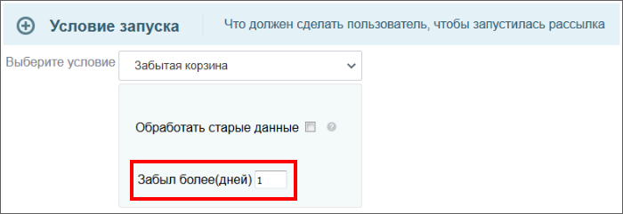
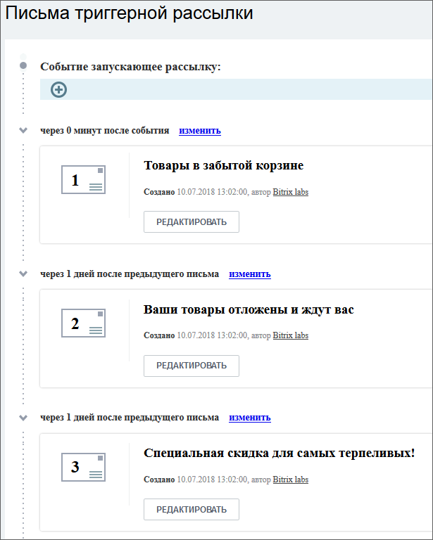

# Триггерные рассылки

**Навигация**
- [← Оглавление курса](index.md)
- [← Предыдущий: 8619 — Текстовая версия письма](lesson_8619.md)
- [Следующий: 6662 — Типовой порядок работ →](lesson_6662.md)

Официальная страница урока: https://dev.1c-bitrix.ru/learning/course/index.php?COURSE_ID=41&LESSON_ID=7157

> **Триггерная рассылка** - это последовательность писем, которые отправляются сайтом автоматически в ответ на действие пользователя или после наступления некоторого события, связанного с пользователем. Инструмент используется для возвратов покупателей в магазин и повторных покупок.

Триггерные рассылки относятся к модулю **Email-маркетинг** (sender).

Задачи, которые решают триггерные рассылки:

- Повышение конверсии магазина;
- Удержание существующей клиентской базы;
- Увеличение среднего чека;
- Экономия ресурсов;
- Эмоциональные коммуникации с клиентами.

|  | #### Пример триггерной рассылки |
| --- | --- |

Покупатель отложил товар в корзину и не сделал заказ. Товар пролежал в корзине более указанного в настройках рассылки **Брошенная корзина**

			срока

                    

		 и тут сработает триггер и владельцу корзины уйдёт заданная

			последовательность писем

                    

		 с заданным интервалом.

**Примечание**: Работу с триггерными рассылками выполняет контент-менеджер, описание работ дано в курсе

			Продвижение сайта и Маркетинг

                    Список рассылок в административном разделе размещён по пути Маркетинг &gt; Триггерные рассылки.
 [Подробнее...](https://dev.1c-bitrix.ru/learning/course/index.php?COURSE_ID=139&CHAPTER_ID=04650)

		. .
