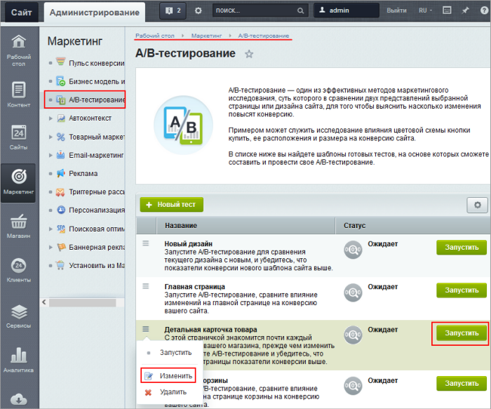
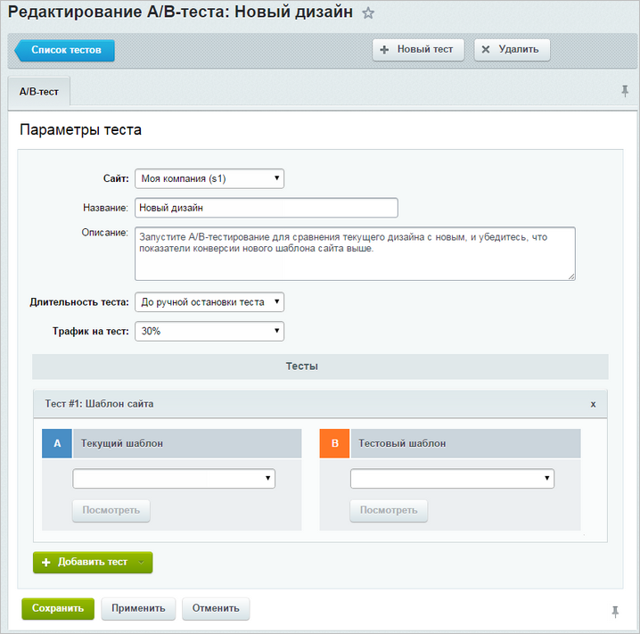
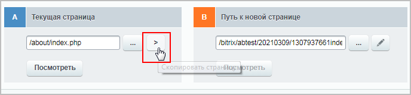
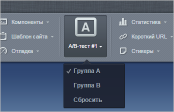

# Настройки и запуск тестирования

**Навигация**
- [← Оглавление курса](index.md)
- [← Предыдущий: 6685 — Принципы A/B тестирования](lesson_6685.md)
- [Следующий: 21638 — Пример A/B-тестирования страниц →](lesson_21638.md)

Официальная страница урока: https://dev.1c-bitrix.ru/learning/course/index.php?COURSE_ID=41&LESSON_ID=7201

### Запуск тестирования

Для запуска А/В тестирования произведите настройки в пункте административного меню Маркетинг &gt; A/B тестирование. Для этого выберите **Изменить** в меню действий списка тестов. Если же вы впервые запускаете тестирование, то попадете в настройки автоматически при выборе опции **Запустить** в меню действий или при нажатии на кнопку **Запустить** в строке с тестом:

### Форма настроек

Форма настроек тестирования выглядит следующим образом:

Поясним некоторые поля:

- **Сайт** - выберите сайт, для которого запускается тестирование.
- **Длительность теста** - выберите время, в течение которого будет производиться тестирование. Можно указать точное количество недель или дней, либо выбрать опцию **До ручной остановки теста**. В таком случае тестирование будет продолжаться, пока пользователь самостоятельно его не остановит.
- **Трафик на тест** - укажите процент пользователей, которые участвуют в тестировании. Эта цифра означает общее количество пользователей, участвующих в тестировании. Половина от трафика будет направлена на текущий дизайн, а половина - на новый. Если указано 30%, то новый дизайн увидят только 15%.

**Примечание**: последние два пункта напрямую связаны с посещаемостью сайта. Чем она больше, тем более коротким по продолжительности может быть тест и тем меньше пользователей нужно привлекать к тестированию, чтобы получить адекватные результаты с высокой точностью.

- **Тесты** - два варианта страницы или шаблона сайта, которые будут сравниваться друг с другом. Вариант А - это то, что видят все посетители сайта на данный момент, вариант В - то, что будет тестироваться.
  Если будет проводиться сравнение двух шаблонов сайта, то в открывающемся списке нужно указать сравниваемые шаблоны. Шаблоны будут применены ко всему сайту. Если в одном А/В тестировании есть несколько тестов, направленных на сравнение шаблонов, то проверяться будут условия только первого теста.
  > **Напоминаем**: для того, чтобы изменить внешний вид одной из страниц многостраничного (комплексного) компонента, следует менять его [шаблон](https://dev.1c-bitrix.ru/learning/course/index.php?COURSE_ID=34&LESSON_ID=9165#templ).
  Если же сравниваются страницы, то в варианте А можно либо выбрать соответствующий файл в системе сайта, либо указать адрес нынешней страницы. Далее можно
  			скопировать
                       
  		 содержимое этой страницы в пункт B и внести необходимые изменения, либо же просто в пункте B указать адрес новой страницы. У каждого из вариантов есть кнопка **Посмотреть**, позволяющая увидеть внешний вид страницы для каждой группы.
  Также можно добавлять дополнительные тесты по нажатии на кнопку **Добавить тест**.

**Внимание!** Одновременно может быть запущено только одно А/В тестирование, но в рамках него может быть добавлено несколько тестов.

**Примечание**: при сравнении как шаблонов сайта, так и страниц, адреса остаются неизменными, поэтому проблем с переходами по страницам сайта у посетителей не возникает.

При нажатии кнопки **Сохранить** настройки теста будут сохранены и тестирование можно будет запустить.

### Работа в публичном разделе

После того, как тест запущен, появится возможность переключаться между вариантами А и В прямо из панели управления в публичном разделе сайта. Так можно понять, что видят посетители сайта, принадлежащие к каждой из тестируемых групп.

**Примечание**: по умолчанию данная кнопка из публичного раздела будет видна только группе пользователей **Администраторы**. Чтобы другие пользователи тоже могли ее видеть, их нужно наделить

			правом доступа

                    **Право доступа** - комплекс операций в системе, доступный для выполнения пользователем.

 [Подробнее...](http://dev.1c-bitrix.ru/learning/course/index.php?COURSE_ID=35&LESSON_ID=2015)

		 к операции **Просмотр остальных настроек главного модуля (view_other_settings)**. Также ее может увидеть запускающий тестирование пользователь при нажатии кнопки **Посмотреть** во время настройки теста.

### Документация по теме

- [Список A/B-тестов](https://dev.1c-bitrix.ru/user_help/marketing/ab_testing/abtest_admin.php);
- [Создание и редактирование A/B-теста](https://dev.1c-bitrix.ru/user_help/marketing/ab_testing/abtest_edit.php).
- [Создание физических страниц](https://dev.1c-bitrix.ru/learning/course/index.php?COURSE_ID=34&LESSON_ID=1911).
- [Разработка шаблона дизайна](https://dev.1c-bitrix.ru/learning/course/index.php?COURSE_ID=43&LESSON_ID=3234).
