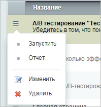
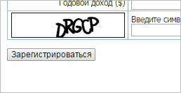
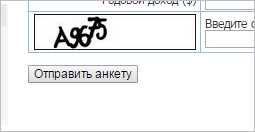
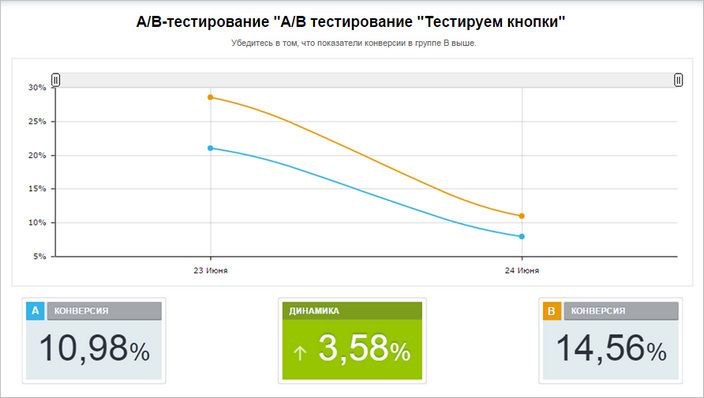
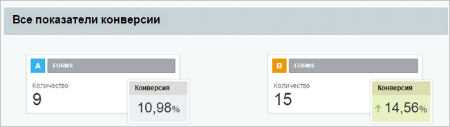

# Отчеты по тестам

**Навигация**
- [← Оглавление курса](index.md)
- [← Предыдущий: 21638 — Пример A/B-тестирования страниц](lesson_21638.md)
- [Следующий: 20118 — Проверьте себя →](lesson_20118.md)

Официальная страница урока: https://dev.1c-bitrix.ru/learning/course/index.php?COURSE_ID=41&LESSON_ID=7202

|  | ### Какой вариант лучше? |
| --- | --- |

В любой момент после запуска теста, даже не дожидаясь его окончания, можно посмотреть

			отчет о проводимом тестировании

                    

		.

**Примечание**: Если выбрана опция автоматического завершения тестирования по истечению какого-то времени, то его вручную завершать не обязательно.

Надо учитывать, что конверсия будет высчитываться по тем счетчикам, которые были выбраны в настройках модуля

			Конверсия

                    Модуль **Конверсия** позволяет оценить ключевые показатели эффективности сайта.

[Подробнее...](/learning/course/index.php?COURSE_ID=41&CHAPTER_ID=09031).

Для примера запустим тест, в котором будем рассчитывать конверсию для заполнения формы, где мы заменим текст кнопки сохранения анкеты.

Такой увидит кнопку посетители сайта из группы **А**.

А такой увидят кнопку посетители сайта из группы **В**.

После завершения тестирования можно посмотреть отчет по тесту. В отчете по А/В тестированию содержится график, отражающий изменение показателя конверсии в динамике, значение конверсии по каждому из сравниваемых вариантов, а так же разницу для конверсии по обеим тестовым группам.

Кроме самой конверсии в отчете будут содержаться и другие дополнительные показатели, зависящие от того, для каких модулей мы рассчитываем конверсию. В нашем примере кроме самой конверсии отображается и количество пользователей, заполнивших тестовую форму.

**Внимание**! Каждый тест имеет только один отчет. Поэтому если запустить тест заново, то результаты вновь проведенного теста будут добавлены к результатам предыдущего, что повышает их точность.

Однако менять набор тестов внутри хотя бы однажды запущенного А/В тестирования крайне не рекомендуется, т.к. это может значительно исказить результаты. Для того, чтобы проверить новые шаблоны сайта или страницы, следует создавать новые тестирования.
