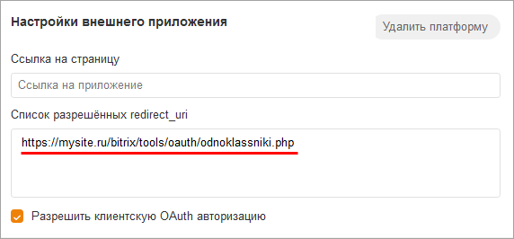

# Одноклассники

**Навигация**
- [← Оглавление курса](index.md)
- [← Предыдущий: 7289 — Яндекс](lesson_7289.md)
- [Следующий: 10169 — Office365 →](lesson_10169.md)

Официальная страница урока: https://dev.1c-bitrix.ru/learning/course/index.php?COURSE_ID=41&LESSON_ID=7285

|  | ### Одноклассники |
| --- | --- |

Для Одноклассников необходимо указать в

			настройках

                    

		 модуля **Социальные сервисы** (Настройки &gt; Настройки продукта &gt; Настройки модулей &gt; Социальные сервисы) параметры **ID приложения**, **Ключ приложения** и **Секретный код приложения**, а в настройках сервиса специальную ссылку:

Получить уникальные **ID приложения**, **Ключ приложения** и **Секретный код приложения** нужно на сайте [разработчиков Одноклассников](http://ok.ru/dk?st.cmd=appsInfoMyDevList).

Для этого необходимо:

1. Получить права разработчика по адресу: [http://ok.ru/devaccess](http://ok.ru/devaccess).
2. Добавить приложение
                      
  		 по [ссылке](https://ok.ru/vitrine/myuploaded).
3. Далее на странице **Основные настройки приложения** указать название, тип, имя в ссылке и описание приложения:
4. Нажать кнопку **Добавить платформу** и выбрать
  			OAuth
                      
  		. На странице появится дополнительный раздел
  			Настройки внешнего приложения
                      
  		, где в поле "Список разрешённых redirect_uri" нужно указать адрес из настроек модуля **Социальные сервисы** (в примере - www.mysite.ru - ваш адрес сайта).
5. После нажатия кнопки **Сохранить** на почту, указанную в аккаунте разработчика, придет
  			письмо с данными
                      
  		 **Application ID**, **Публичный ключ приложения** и **Секретный ключ приложения**, которые нужно вписать в соответствующие поля в настройках модуля **Социальные сервисы** продукта «1С-Битрикс»:

**Примечание**: По умолчанию сервис **Одноклассники** не имеет доступа к email пользователя.

	 Для [запроса прав](https://apiok.ru/ext/oauth/permissions) (в частности, `GET_EMAIL` - доступ к email адресу пользователя) необходимо прислать id приложения и перечень нужных разрешений с описанием кейса их использования на адрес **api-support@ok.ru**.

**Примечание:**Со временем социальные сервисы могут изменять внешний вид мастеров регистрации приложений. В уроках могут не отображаться последние изменения. Пожалуйста, сообщайте нам о замеченных вами изменениях.

	 Для отправки комментария воспользуйтесь расположенной в правом нижнем углу окна браузера кнопкой:
