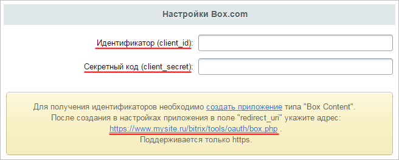
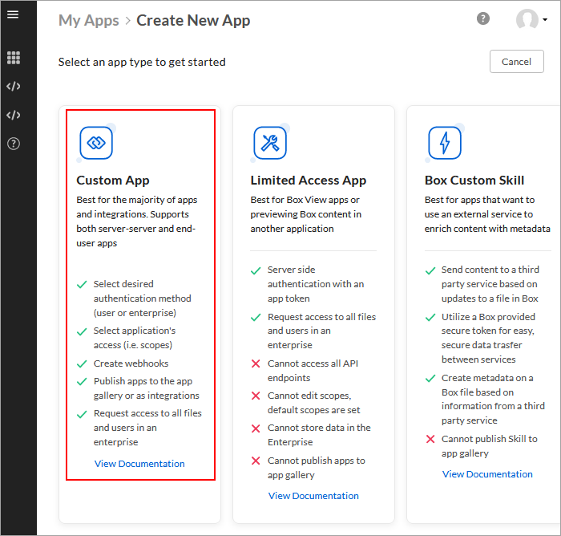

# Box.com

**Навигация**
- [← Оглавление курса](index.md)
- [← Предыдущий: 7132 — Битрикс24.Network](lesson_7132.md)
- [Следующий: 7133 — ВКонтакте →](lesson_7133.md)

Официальная страница урока: https://dev.1c-bitrix.ru/learning/course/index.php?COURSE_ID=41&LESSON_ID=7288

|  | ### Box.com |
| --- | --- |

**Внимание!**Сервис **Box.com** поддерживает работу только по протоколу **https**.

Для Box.com необходимо указать в

			настройках

                    

		 модуля **Социальные сервисы** (Настройки &gt; Настройки продукта &gt; Настройки модулей &gt; Социальные сервисы) параметры **Идентификатор (client_id)** и **Секретный код (client_secret)**, а в настройках сервиса специальную ссылку.

Получить уникальные **Идентификатор (client_id)** и **Секретный код (client_secret)** нужно на сайте [Box Developers](https://box.com/).

Для этого необходимо:

1. **Создать новое приложение** по одноименной [ссылке](https://app.box.com/developers/services/edit/) в настройках модуля **Социальные сервисы** продукта «1С-Битрикс» (Настройки &gt; Настройки продукта &gt; Настройки модулей &gt; Социальные сервисы). Вы можете создать Пользовательское приложение (Custom App).
  
2. При выборе метода идентификации нужно выбрать Пользовательскую идентификацию
  			Standard OAuth 2.0 (User Authentication)
                      
  		 и задать уникальное имя вашему приложению.
3. В настройках доступа отметьте галочку
  			**Write all files and folders stored in Box**
                      
  		, чтобы иметь возможность скачивать файлы на Битрикс24.Диск. Эту опцию можно включить в настройках и позже;
4. После
  			создания приложения
                      
  		 вы сможете перейти к просмотру конфигурации. На странице конфигурации можно скопировать параметры **Client ID** и **Client Secret** и вписать их в соответствующие поля в настройках модуля **Социальные сервисы** продукта «1С-Битрикс» (Настройки &gt; Настройки продукта &gt; Настройки модулей &gt; Социальные сервисы):
  
5. И в поле **Redirest URI** ввести адрес из настроек модуля **Социальные сервисы** (в примере - [www.mysite.ru](http://www.mysite.ru) - ваш адрес сайта) и нажать кнопку **Save Changes**.

**Примечание:**Со временем социальные сервисы могут изменять внешний вид мастеров регистрации приложений. В уроках могут не отображаться последние изменения. Пожалуйста, сообщайте нам о замеченных вами изменениях.

	 Для отправки комментария воспользуйтесь расположенной в правом нижнем углу окна браузера кнопкой:
