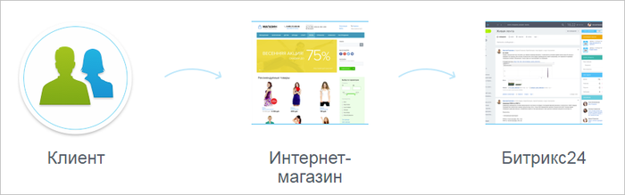

# Коммуникации с клиентами

**Навигация**
- [← Оглавление курса](index.md)
- [← Предыдущий: 20316 — Практические задания](lesson_20316.md)
- [Следующий: 8553 — Подключение Битрикс24 →](lesson_8553.md)

Официальная страница урока: https://dev.1c-bitrix.ru/learning/course/index.php?COURSE_ID=41&LESSON_ID=8545

|  | Модуль **Коммуникации с клиентами** позволяет подключить продукт *«1С-Битрикс: Управление сайтом»* к порталу *Битрикс24*, т.е подключить все цифровые каналы коммуникаций: онлайн-чат, соцсети, мессенджеры, обратный звонок, веб-формы и т.п. |
| --- | --- |

При этом осуществляется:

- подключение за 5 минут;
- гибкая настройка сообщений онлайн-чата в зависимости от раздела сайта;
- специальные сценарии работы с мобильных устройств;
- идеальный инструмент для поддержки клиентов;
- автоматическая интеграция с Битрикс24.CRM;
- автоматизированное управление клиентским потоком от первого касания до повторных продаж;
  единая клиентская база для работы нескольких сайтов.

Подключение привычных для клиентов коммуникаций позволяет увеличить конверсию в интернет-магазинах.

