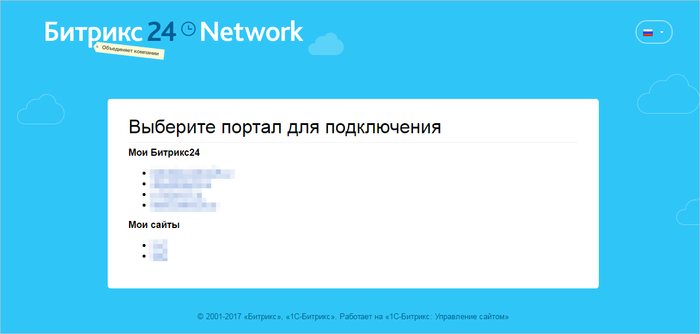
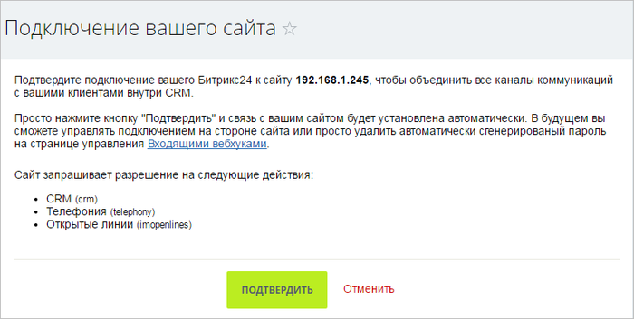
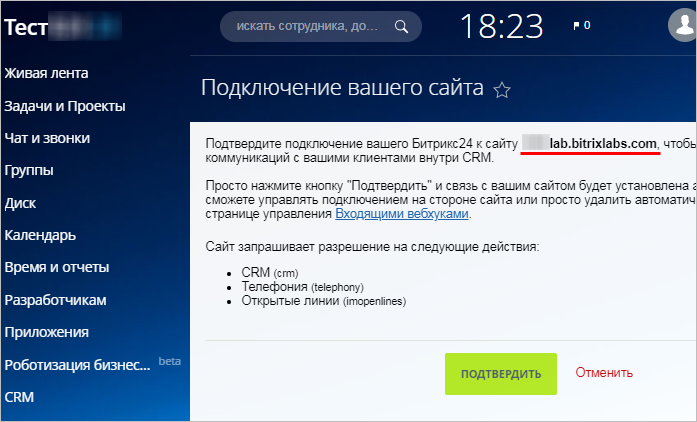
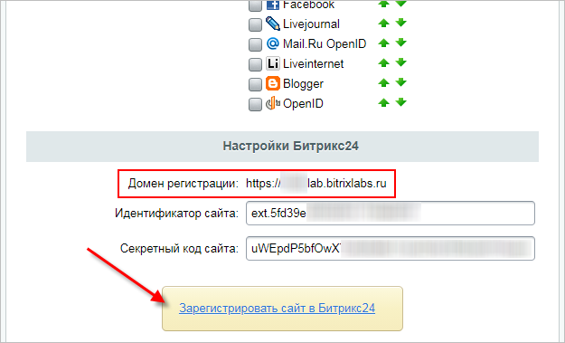
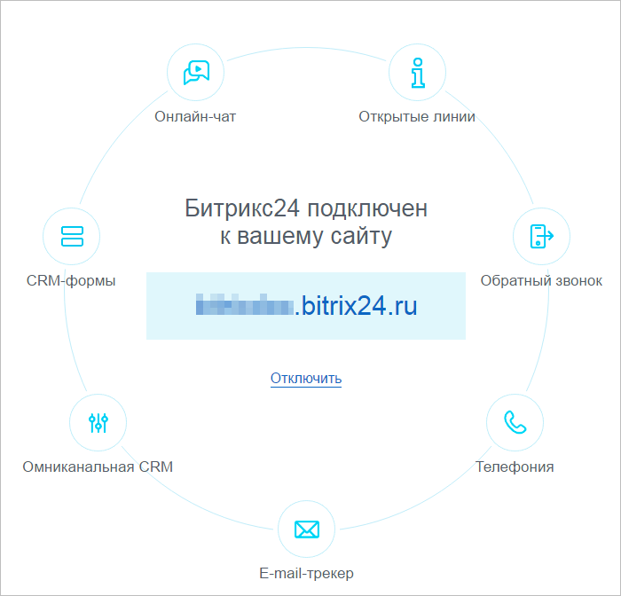

# Подключение Битрикс24

**Навигация**
- [← Оглавление курса](index.md)
- [← Предыдущий: 8545 — Коммуникации с клиентами](lesson_8545.md)
- [Следующий: 8661 — Виджеты →](lesson_8661.md)

Официальная страница урока: https://dev.1c-bitrix.ru/learning/course/index.php?COURSE_ID=41&LESSON_ID=8553

**Внимание!** Возможно подключение только облачной версии Битрикс24. Коробочная версия по описанному сценарию не подключается.

|  | Подключение портала *Битрикс24* осуществляется на любой странице **Коммуникаций с клиентами** (Клиенты &gt; Коммуникации с клиентами): |
| --- | --- |

1. Нажать на кнопку **Подключить свой Битрикс24** (если уже создан портал) или **Создать новый Битрикс24** (если еще нет портала):
  
2. Далее нужно будет авторизоваться в окне *Bitrix24.Network* и выбрать из списка ваших порталов и сайтов нужный Битрикс24 для подключения:
  
3. Затем в открывшемся окне запроса на портале согласиться с подключением:
  
  **Примечание**: если в окне запроса отображается
  			неверный адрес
  
  		 Вашего сайта, проверьте, какой адрес указан в настройках модуля
  			Социальные сервисы
  Настройки &gt; Настройки продукта &gt; Настройки модулей &gt; Социальные сервисы
  
  		 (и актуализируйте его, нажав на кнопку **Зарегистрировать сайт в Битрикс24**).
4. Подключение успешно установлено:
  

**Примечание**: Для подключения **Коммуникаций с клиентами** к порталу *Битрикс24*, вы должны быть администратором сайта и портала.

**Примечание**: про интеграцию магазина и портала Битрикс24 читайте в [соответствующем уроке](https://dev.1c-bitrix.ru/learning/course/index.php?COURSE_ID=42&LESSON_ID=3645).

|  | #### Документация по теме: |
| --- | --- |

- [Настройки модуля](https://dev.1c-bitrix.ru/user_help/clients/settings.php)
