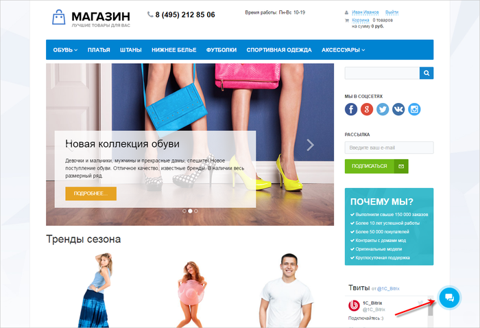
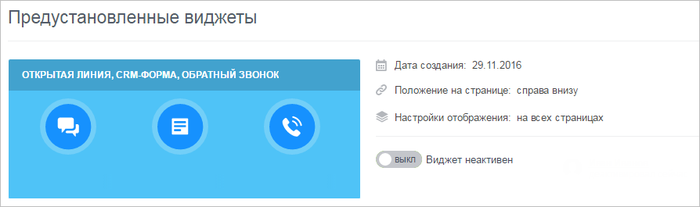
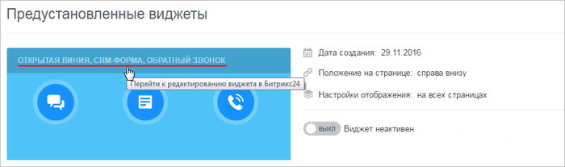
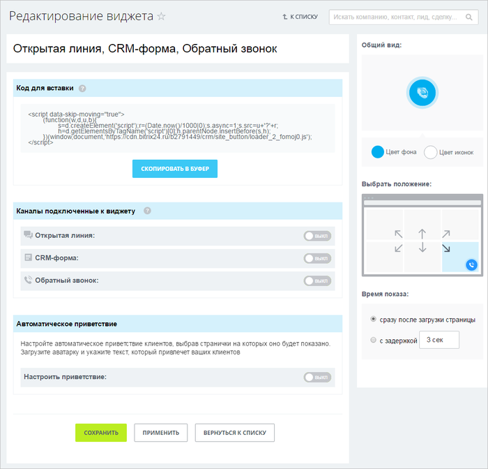
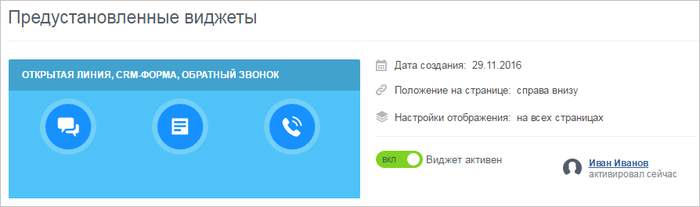
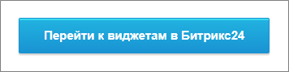
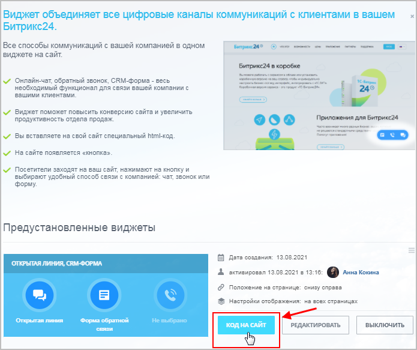
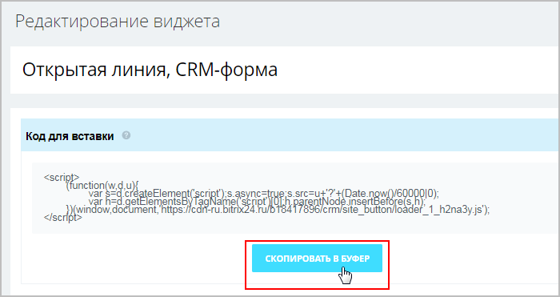
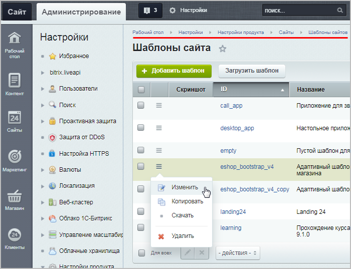
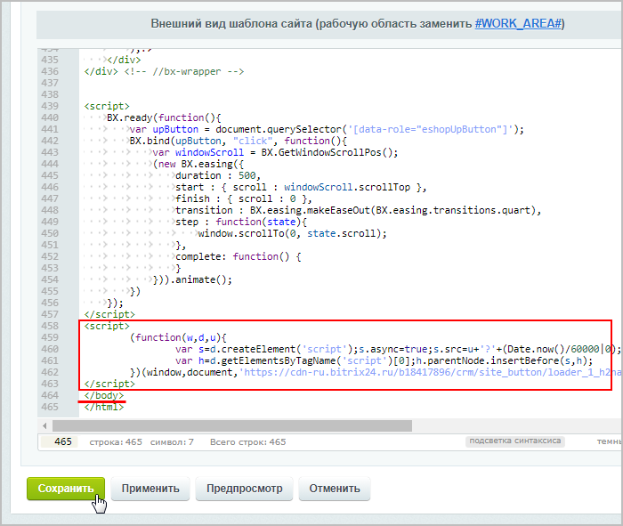

# Виджеты

**Навигация**
- [← Оглавление курса](index.md)
- [← Предыдущий: 8553 — Подключение Битрикс24](lesson_8553.md)
- [Следующий: 8665 — Онлайн-чат →](lesson_8665.md)

Официальная страница урока: https://dev.1c-bitrix.ru/learning/course/index.php?COURSE_ID=41&LESSON_ID=8661

**Виджет** объединяет все цифровые каналы коммуникаций с клиентами в вашем *Битрикс24*.

### О виджете

**Внимание!** Виджет работает на любом сайте, даже, если он собран не на "1С-Битрикс: Управление сайтом". Но на сайте сделанном на "1С-Битрикс: Управление сайтом" нужно быть внимательным с версией Главного модуля. Требуется не ниже 19.0.500.

Виджет устанавливается на сайт как кнопка, с помощью которой посетители сайта выбирают удобный способ связи с компанией: чат, звонок или форму. Таким образом, виджет помогает повысить конверсию сайта и увеличить продуктивность отдела продаж.

### Как настроить виджет

Настройка Виджета проста:

1. После
  			подключения
                      Подключение портала *Битрикс24* осуществляется на любой странице **Коммуникаций с клиентами** (Клиенты &gt; Коммуникации с клиентами).
  [Подробнее...](lesson_8553.md)
  		 сайта к *«Битрикс24»* в разделе **Виджеты** (Клиенты &gt; Коммуникации с клиентами &gt; Виджеты) появится предустановленный Виджет:
  
2. Далее необходимо перейти к редактированию Виджета на портале *Битрикс24*, кликнув на ссылку названия Виджета:
  
3. Откроется страница настройки Виджета:
  
4. После настройки Виджета остается его только включить в разделе **Виджеты** (Клиенты &gt; Коммуникации с клиентами &gt; Виджеты:
  

Далее, если обновить страницу сайта, то иконка Виджета будет в том месте сайта, где указывалось ее расположение в настройках, а при клике по ней будут представлены настроенные ранее инструменты коммуникаций:

**Примечание:** В настройках коммуникаций (на странице виджеты, онлайн-чат и т.д.) Вы можете увидеть вместо формы настроек ошибку:
Ошибка получения информации подключенного портала (ACCESS_DENIED: REST is available only on commercial plans.).
Доступ к настройкам коммуникаций в 1С-Битрикс: Управление сайтом осуществляется с помощью REST API, который

			недоступен

                    С [1 января 2021](https://helpdesk.bitrix24.ru/open/12661426/) года использование REST API доступен только на коммерческих тарифах Битрикс24.

		 на бесплатном тарифе Битрикс24. В таком случае настройки доступны только со стороны Битрикс24. Для перехода к настройкам воспользуйтесь соответствующей

			кнопкой

                    Например внизу страницы Клиенты &gt; Коммуникации с клиентами &gt; Виджеты
Вы увидите такую кнопку:

		 внизу страницы.

### Виджет на сайте

#### Как добавить виджет на сайт

Для добавления виджета на сайт выполните следующие действия:

1. На стороне *Битрикс24* скопируйте код виджета одним из двух способов:

  - на странице **Список виджетов** (CRM &gt; Виджет на сайт) нажмите кнопку
    			Код на сайт
    
    		 и в открывшемся окне скопируйте код:
    
  - в форме редактирования конкретного виджета в разделе **Код для вставки** нажмите кнопку
    			Скопировать в буфер
    
    		.
2. В административном разделе Вашего сайта перейдите на страницу Настройки &gt; Настройки продукта &gt; Сайты &gt; Шаблоны сайтов и откройте в режиме
  			редактирования
  
  		 используемый на сайте шаблон;
3. Разместите скопированный ранее код виджета перед закрывающим тегом `</body>`:
  
4. Сохраните изменения.

Готово! Теперь виджет добавлен на сайт.

#### Как удалить виджет

Удалить виджет просто: удалите вставленный код.
