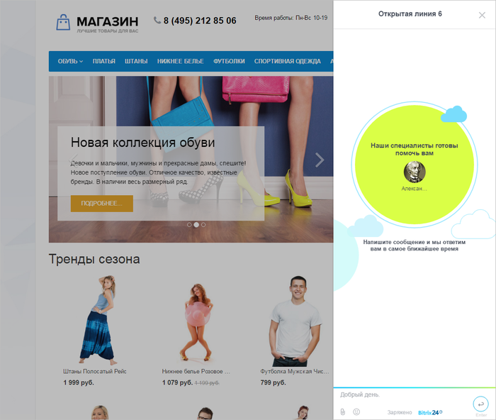
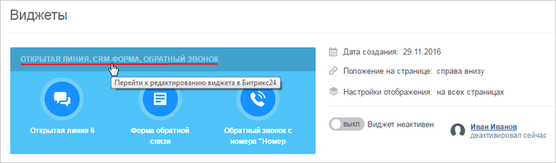

# Онлайн-чат

**Навигация**
- [← Оглавление курса](index.md)
- [← Предыдущий: 8661 — Виджеты](lesson_8661.md)
- [Следующий: 8667 — Обратный звонок →](lesson_8667.md)

Официальная страница урока: https://dev.1c-bitrix.ru/learning/course/index.php?COURSE_ID=41&LESSON_ID=8665

|  | **Онлайн-чат** представляет собой современный и удобный способ коммуникации клиента вашего сайта с вами. Чат отлично подходит для сопровождения клиента по сайту, поддержки, помощи в выборе или оформлении заказа. |
| --- | --- |

**Онлайн-чат** позволяет:

- Отвечать клиенту в режиме реального времени.
- Консультировать по делу, ведь менеджер будет знать, какие страницы посещал клиент и чем интересовался.
- Обращаться к клиенту персонально, фиксировать общение в CRM, собирать полный портрет каждого клиента сайта.

Подключение **Онлайн-чата** производится  с помощью клика на названии виджета и последующей настройкой на

			странице редактирования Виджета

                    На этой странице настраивается внешний вид кнопки, параметры приветствия и подключаются каналы коммуникаций.
[Подробнее...](lesson_8661.md)

		:

и последующим включением Виджета на странице:

**Примечание:** В настройках коммуникаций (на странице виджеты, онлайн-чат и т.д.) Вы можете увидеть вместо формы настроек ошибку:
Ошибка получения информации подключенного портала (ACCESS_DENIED: REST is available only on commercial plans.).
Доступ к настройкам коммуникаций в 1С-Битрикс: Управление сайтом осуществляется с помощью REST API, который

			недоступен

                    С [1 января 2021](https://helpdesk.bitrix24.ru/open/12661426/) года использование REST API доступен только на коммерческих тарифах Битрикс24.

		 на бесплатном тарифе Битрикс24. В таком случае настройки доступны только со стороны Битрикс24. Для перехода к настройкам воспользуйтесь соответствующей

			кнопкой

                    Например внизу страницы Клиенты &gt; Коммуникации с клиентами &gt; Виджеты
Вы увидите такую кнопку:

		 внизу страницы.

В работе продукта «1С-Битрикс24: Интернет-магазин+ CRM» используется многосайтовая конфигурация на одном ядре. В этом случае есть [особенности настройки виджета](https://dev.1c-bitrix.ru/learning/course/index.php?COURSE_ID=135&LESSON_ID=22634).
