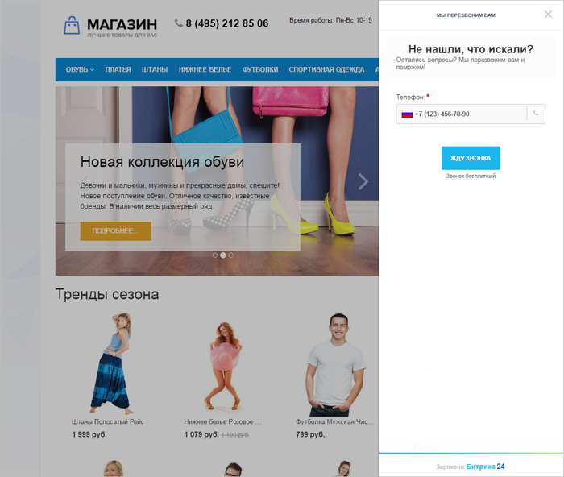

# Обратный звонок

**Навигация**
- [← Оглавление курса](index.md)
- [← Предыдущий: 8665 — Онлайн-чат](lesson_8665.md)
- [Следующий: 8669 — CRM-формы →](lesson_8669.md)

Официальная страница урока: https://dev.1c-bitrix.ru/learning/course/index.php?COURSE_ID=41&LESSON_ID=8667

|  | **Обратный звонок** позволяет получить быструю консультацию по телефону, автоматически совершает исходящий звонок на указанный клиентом номер и соединяет клиента со свободным менеджером. |
| --- | --- |

Установив **Обратный звонок** на свой сайт, увеличивайте продажи и повышайте лояльность ваших клиентов, предоставив им быстрый и бесплатный способ связи.

**Примечание**: Подробнее об Обратном звонке можно прочитать в [статье](https://helpdesk.bitrix24.ru/open/6986667/).

Подключение **Обратного звонка** производится  с помощью клика на названии виджета и последующей настройкой на

			странице редактирования Виджета

                    На этой странице настраивается внешний вид кнопки, параметры приветствия и подключаются каналы коммуникаций.
[Подробнее...](lesson_8661.md)

		:

и последующим включением Виджета на странице:

**Примечание**: Для работы Обратного звонка необходимо настроить

			Телефонию

                    Сервис *Битрикс24* даёт возможность использовать телефонию для решения производственных задач. Телефония в *Битрикс24* реализована с помощью технологии [WebRTC](https://ru.wikipedia.org/wiki/WebRTC) позволяющей совершать/принимать звонки прямо из браузера.
[Подробнее...](https://helpdesk.bitrix24.ru/section/45939/)

		 на портале *Битрикс24*.

**Примечание:** В настройках коммуникаций (на странице виджеты, онлайн-чат и т.д.) Вы можете увидеть вместо формы настроек ошибку:
Ошибка получения информации подключенного портала (ACCESS_DENIED: REST is available only on commercial plans.).
Доступ к настройкам коммуникаций в 1С-Битрикс: Управление сайтом осуществляется с помощью REST API, который

			недоступен

                    С [1 января 2021](https://helpdesk.bitrix24.ru/open/12661426/) года использование REST API доступен только на коммерческих тарифах Битрикс24.

		 на бесплатном тарифе Битрикс24. В таком случае настройки доступны только со стороны Битрикс24. Для перехода к настройкам воспользуйтесь соответствующей

			кнопкой

                    Например внизу страницы Клиенты &gt; Коммуникации с клиентами &gt; Виджеты
Вы увидите такую кнопку:

		 внизу страницы.
