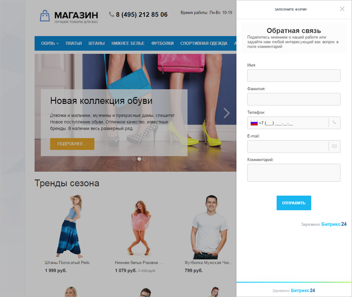

# CRM-формы

**Навигация**
- [← Оглавление курса](index.md)
- [← Предыдущий: 8667 — Обратный звонок](lesson_8667.md)
- [Следующий: 8671 — Открытые линии →](lesson_8671.md)

Официальная страница урока: https://dev.1c-bitrix.ru/learning/course/index.php?COURSE_ID=41&LESSON_ID=8669

|  | **CRM-формы** – необходимый для бизнеса инструмент, который поможет повысить эффективность менеджеров, получить новых клиентов, дополнить информацию о текущих и записать все это в CRM. |
| --- | --- |

Установив **CRM-формы** на свой сайт, собирайте всю информацию о клиентах в CRM.

**Примечание**: Подробнее о CRM-формах можно прочитать в [статье](https://helpdesk.bitrix24.ru/open/6986667/).

Подключение **CRM-форм** производится  с помощью клика на названии виджета и последующей настройкой на

			странице редактирования Виджета

                    На этой странице настраивается внешний вид кнопки, параметры приветствия и подключаются каналы коммуникаций.
[Подробнее...](lesson_8661.md)

		:

и последующим включением Виджета на странице:

**Примечание:** В настройках коммуникаций (на странице виджеты, онлайн-чат и т.д.) Вы можете увидеть вместо формы настроек ошибку:
Ошибка получения информации подключенного портала (ACCESS_DENIED: REST is available only on commercial plans.).
Доступ к настройкам коммуникаций в 1С-Битрикс: Управление сайтом осуществляется с помощью REST API, который

			недоступен

                    С [1 января 2021](https://helpdesk.bitrix24.ru/open/12661426/) года использование REST API доступен только на коммерческих тарифах Битрикс24.

		 на бесплатном тарифе Битрикс24. В таком случае настройки доступны только со стороны Битрикс24. Для перехода к настройкам воспользуйтесь соответствующей

			кнопкой

                    Например внизу страницы Клиенты &gt; Коммуникации с клиентами &gt; Виджеты
Вы увидите такую кнопку:

		 внизу страницы.

#### Что делать с CRM-формами при переходе с облачного портала на Битрикс24 в коробке

CRM-формы потребуется переопубликовать для привязки к новому домену и новому лицензионному ключу. В облачной версии нужно переопубликовать сайт на другом домене (поддомене Битрикс), после чего можно будет в коробочной версии публиковать CRM-форму на освободившемся домене. Больше информации в [системе помощи Битрикс24](https://helpdesk.bitrix24.ru/):

- [Как разместить CRM-форму на сайте Битрикс24](https://helpdesk.bitrix24.ru/open/12986340/);
- [Как разместить CRM-форму на сайте, созданном не в Битрикс24](https://helpdesk.bitrix24.ru/open/13003062/).
