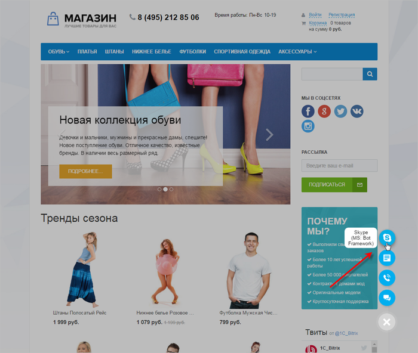

# Открытые линии

**Навигация**
- [← Оглавление курса](index.md)
- [← Предыдущий: 8669 — CRM-формы](lesson_8669.md)
- [Следующий: 8673 — Телефония →](lesson_8673.md)

Официальная страница урока: https://dev.1c-bitrix.ru/learning/course/index.php?COURSE_ID=41&LESSON_ID=8671

|  | Люди привыкли общаться через цифровые каналы: социальные сети и мессенджеры, потому что это быстро, доступно и удобно. Такой сценарий стал ожидаем и от компании, клиент хочет получить консультацию быстро, персонально и по конкретному вопросу. |
| --- | --- |

**Открытые линии Битрикс24** объединяют множество цифровых каналов: **Facebook***, **Vkontakte**, **Telegram**, **Viber** и другие.

Обращения клиентов собираются в один чат и автоматически распределяются по ответственным менеджерам.

Клиент обращается через удобный для него канал, а ваши менеджеры получают все сообщения в одном рабочем чате, могут маршрутизировать обращение между собой или привлекать в обсуждение коллег.

**Примечание**: Подробнее об Открытых линиях можно прочитать в [статье](https://helpdesk.bitrix24.ru/open/6986667/).

Подключение **Открытых линий** производится с помощью клика на названии виджета и последующей настройкой на

			странице редактирования Виджета

                    На этой странице настраивается внешний вид кнопки, параметры приветствия и подключаются каналы коммуникаций.
[Подробнее...](lesson_8661.md)

		:

