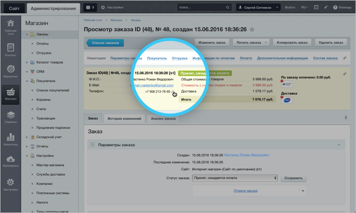

# Телефония

**Навигация**
- [← Оглавление курса](index.md)
- [← Предыдущий: 8671 — Открытые линии](lesson_8671.md)
- [Следующий: 20112 — Проверьте себя →](lesson_20112.md)

Официальная страница урока: https://dev.1c-bitrix.ru/learning/course/index.php?COURSE_ID=41&LESSON_ID=8673

|  | Подключение **Телефонии Битрикс24** к сайту позволяет звонить клиентам без дополнительных затрат на гарнитуру, настройки и обслуживание. |
| --- | --- |

Все звонки будут автоматически зафиксированы в Битрикс24.CRM:

- Исходящий звонок выполняется в один клик прямо из карточки заказа.
- Входящий звонок от клиента сразу попадает на своего менеджера, не дожидаясь несколько минут, пока его переключат.
- Менеджер не переспрашивает клиента, кто он и что заказывал – вся информация уже есть на экране.
- Все пропущенные звонки фиксируются в CRM и становятся вашей «зацепкой», потенциальным покупателем.
- Руководитель получает отчеты по звонкам и видит, как работает каждый менеджер и весь отдел продаж в целом.
- Запись звонков помогает выяснить, как менеджеры общаются с клиентами, и определить лучшие сценарии продажи.

**Примечание**: Подробнее о Телефонии Битрикс24 можно прочитать в [статье](https://helpdesk.bitrix24.ru/open/6513077/).
