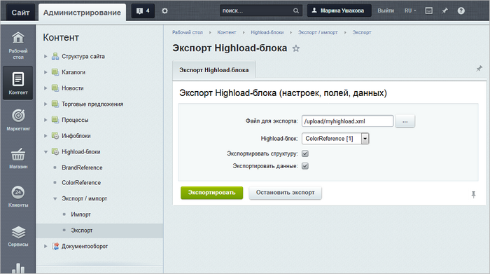
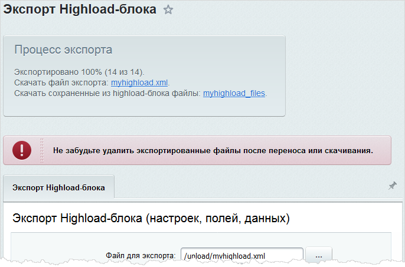

# Экспорт Highload-блока за 3 шага

**Навигация**
- [← Оглавление курса](index.md)
- [← Предыдущий: 5194 — Пример работы со свойством типа "Справочник"](lesson_5194.md)
- [Следующий: 9085 — Как подготовить XML-файл →](lesson_9085.md)

Официальная страница урока: https://dev.1c-bitrix.ru/learning/course/index.php?COURSE_ID=41&LESSON_ID=9065

Вам нужно перенести информацию из Highload-блока? Используйте инструмент экспорта. Он позволяет всего за 3 простых шага выгрузить данные в файл формата **XML**.

### Шаг 1. Страница Экспорт Highload-блока

Откройте страницу **Экспорт Highload-блока** (Контент &gt; Highload-блоки &gt; Экспорт/импорт &gt; Экспорт):

### Шаг 2. Параметры выгрузки

Задайте параметры выгрузки:

- **Файл для экспорта** – укажите путь относительно корня сайта к файлу и сам XML-файл, в который будет выгружена информация из Highload-блока. Чтобы создать новый файл, укажите произвольное название в формате ***&lt;имя_файла_экспорта&gt;*.xml** – этот файл будет создан в процессе выгрузки.
- **Highload-блок** – выберите Highload-блок для экспорта.
- **Экспортировать структуру** – отметьте опцию для выгрузки структуры Highload-блока: его названия, перечня полей, названия таблицы в базе данных.
- **Экспортировать данные** – отметьте для выгрузки записей Highload-блока. Файлы при этом выгружаются в папку с названием ***&lt;имя_файла_экспорта&gt;*_files**. Она размещается внутри той же папки, где и файл экспорта.

### Шаг 3. Экспорт

Нажмите кнопку  **Экспортировать**. Начинается экспорт Highload-блока, и над формой отображается ход процесса выгрузки. По окончании на странице выводится соответствующее сообщение:

Итак, скачайте файлы и используйте информацию из Highload-блока по своему усмотрению.
