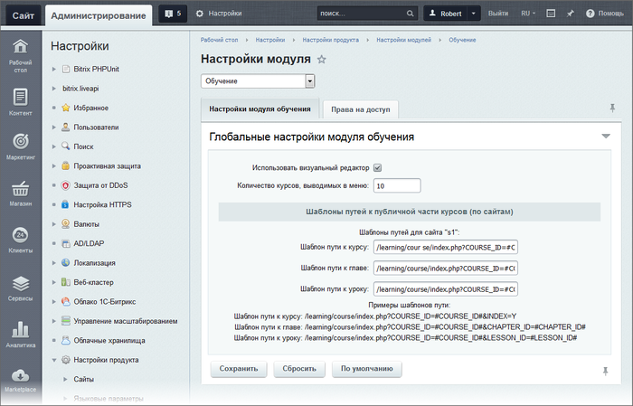
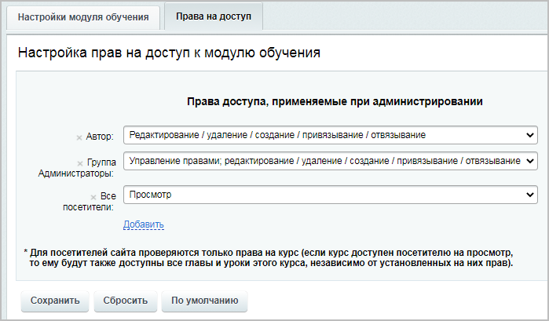

# Настройки модуля Обучение

**Навигация**
- [← Оглавление курса](index.md)
- [← Предыдущий: 4479 — Основные понятия](lesson_4479.md)
- [Следующий: 2878 — Экспорт\импорт курсов →](lesson_2878.md)

Официальная страница урока: https://dev.1c-bitrix.ru/learning/course/index.php?COURSE_ID=41&LESSON_ID=9105

### Настройки модуля

Модуль **Обучение** настраивается в Административной части на странице Настройки &gt; Настройки продукта &gt; Настройки модулей &gt; Обучение

Значение полей формы настройки понятны из названий. Дадим некоторые пояснения:

- **Использовать визуальный редактор** - включается возможность использовать
  			визуальный редактор
  В любой работе важен хороший инструмент. *"1С-Битрикс: Управление сайтом"*
  обладает мощным встроенным WYSIWYG редактором для работы со страницами сайта.
  С его помощью мы способны редактировать любую информацию на сайте.
  Визуальный редактор позволяет работать с:
  **-** текстом;
  **-** графикой и видео;
  **-** компонентами и сниппетами.
  [Подробнее](https://dev.1c-bitrix.ru/learning/course/index.php?COURSE_ID=34&CHAPTER_ID=06299&LESSON_PATH=3905.6299)...
  		 при создании/редактировании глав и уроков.
- **Количество курсов, выводимых в меню,** устанавливается любое, но учтите, что длинный список в административном меню не удобен для поиска. Если курсов много, то рекомендуем с помощью значений полей **Сортировка** вывести на верх списка самые используемые, а само число отображаемых в меню курсов сделать не более 20.
- Если публичные компоненты курсов на проекте расположены не в стандартном разделе `/learning/`, то перенастройте пути к нужному разделу. Это делается в полях **Шаблоны путей к публичной части курсов**. Настройка задаётся для каждого сайта по отдельности.
  Кроме переназначения путей скопируйте файл **search.php** из папки `/bitrix/modules/learning/install/public/site/ru` модуля в директорию, где размещена публичная часть модуля.

### Права на доступ

На вкладке **Права на доступ** задаются уровни прав для всех групп пользователей, которые должны работать с учебным курсом или иметь возможность его просмотреть:

**Примечание**: Для посетителей сайта проверяются только права на курс (если курс доступен посетителю на просмотр, то ему будут также доступны все главы и уроки этого курса, независимо от установленных на них прав).

|  | #### Документация по теме: |
| --- | --- |

- [Настройки модуля](https://dev.1c-bitrix.ru/user_help/service/learning/settings.php)
