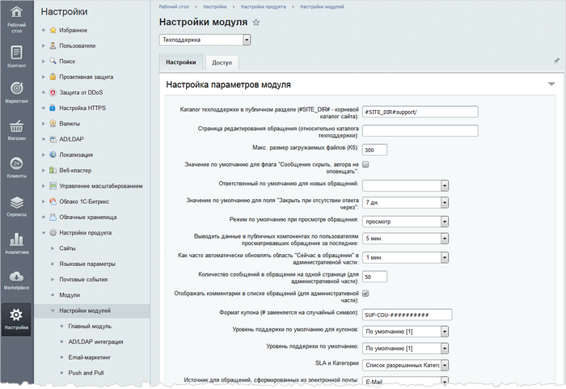

# Настройки модуля Техподдержка

**Навигация**
- [← Оглавление курса](index.md)
- [← Предыдущий: 31026 — Как установить модуль Техподдержка](lesson_31026.md)
- [Следующий: 2686 — Создание мастера →](lesson_2686.md)

Официальная страница урока: https://dev.1c-bitrix.ru/learning/course/index.php?COURSE_ID=41&LESSON_ID=9109

Вы организовываете у себя на сайте техническую поддержку? Настройте параметры модуля. Откройте страницу Настройки &gt; Настройки продукта &gt; Настройки модулей &gt; Техподдержка:

Заполните поля на закладке **Настройки**. При этом обратите особое внимание на следующие параметры:

- **Ответственный по умолчанию для новых обращений** - укажите ответственного по умолчанию сотрудника техподдержки.
- **Режим по умолчанию при просмотре обращения** - задайте режим по умолчанию при работе с обращением клиента: либо в режиме просмотра, либо сразу в режиме ответа.
- **Значение по умолчанию для поля "Закрыть при отсутствии ответа через"** - укажите через какое время обращение должно закрываться автоматически, в случае отсутствия ответа от клиента.
- **Как часто автоматически обновлять область "Сейчас в обращении" в административной части** - определите период, через который автоматически обновляется список просматривающих сообщение пользователей.
- **Уровень поддержки по умолчанию** - задайте уровень, устанавливаемый для обращений по умолчанию.
- **SLA и Категории** -  выберите способ настройки категорий обращений в соответствии с уровнями поддержки.

Настройте доступ для работающих с модулем групп пользователей на закладке **Доступ**.

|  | #### Документация по теме: |
| --- | --- |

- [Настройки модуля](https://dev.1c-bitrix.ru/user_help/service/support/settings.php)
