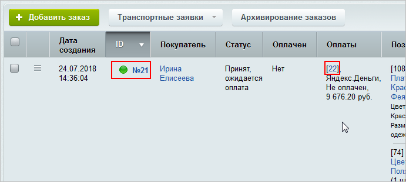
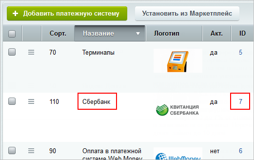
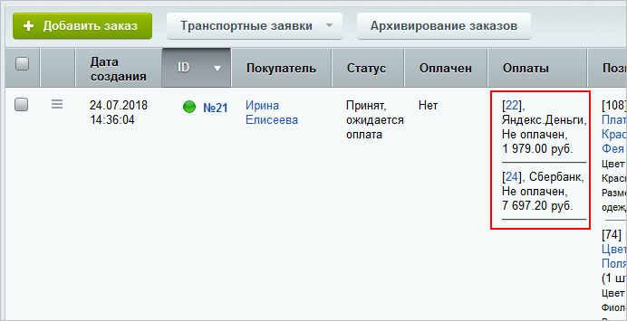

# Пример разделения оплаты на 2 части

**Навигация**
- [← Оглавление курса](index.md)
- [← Предыдущий: 8449 — Пример изменения заказа через API](lesson_8449.md)
- [Следующий: 3632 — Видео →](lesson_3632.md)

Официальная страница урока: https://dev.1c-bitrix.ru/learning/course/index.php?COURSE_ID=43&LESSON_ID=11471

В уроке мы рассмотрим, как средствами API продукта разделить на части оплату в уже существующем заказе. Допустим, у нас есть заказ с идентификатором 21, а его документ оплаты имеет идентификатор 22:



Составим код, с помощью которого оплата будет разбита на 2 части.

- В первую очередь загружаем заказ из базы и получаем коллекцию оплат:
  ```
  Bitrix\Main\Loader::includeModule('sale');
  $order = \Bitrix\Sale\Order::load(21);
  $paymentCollection = $order->getPaymentCollection();
  ```
- Затем из коллекции выбираем оплату, которую необходимо изменить (напомним, что у нас она имеет идентификатор 22):
  ```
  $payment = $paymentCollection->getItemById(22);
  ```
- Сумму данной оплаты заменяем, например, на величину стоимости одной из позиций заказа (у нас это 1979 рублей):
  ```
  $payment->setField('SUM', 1979);
  ```
- Добавляем новую оплату. Минимальный набор полей при создании оплаты - это платежная система (идентификатор и название платежной системы) и сумма. Для примера будем использовать платежную систему
  			Сбербанк
                      
  		 с идентификатором 7.
  Создать объект оплаты можно двумя способами:

  - передать объект платежной системы в параметре, из которого возьмется вся необходимая информация:
    ```
    $service = \Bitrix\Sale\PaySystem\Manager::getObjectById(7);
    $newPayment = $paymentCollection->createItem($service);
    ```
  - либо установить необходимую информацию по платежной системе явно:
    ```
    $newPayment = $paymentCollection->createItem();
    $newPayment->setField('PAY_SYSTEM_ID',7);
    $newPayment->setField('PAY_SYSTEM_NAME', "Сбербанк");
    ```
- Устанавливаем сумму новой оплаты:
  ```
  $newPayment->setField('SUM', $order->getPrice() - 1979);
  ```
- Сохраняем заказ:
  ```
  $result = $order->save();
  ```
  Метод *save()* сохранит и заказ, и все связанные объекты.

После выполнения вышеуказанного кода через командную php-строку наш заказ будет иметь 2 оплаты:



**Примечание:** разделение оплаты на этапе создания заказа делается аналогично.
