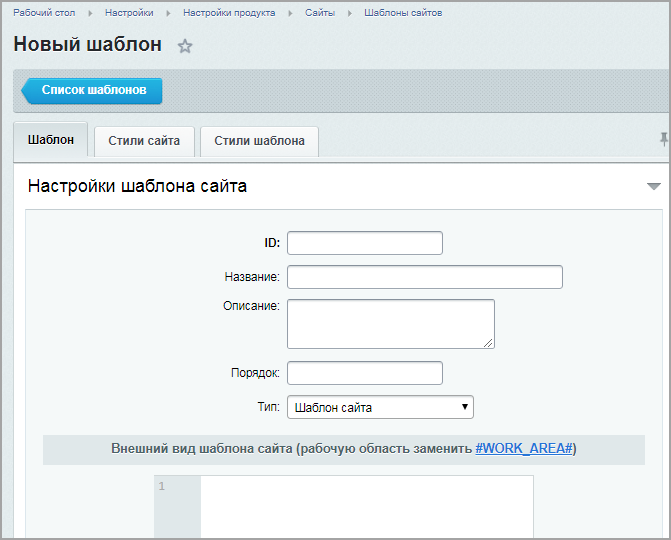
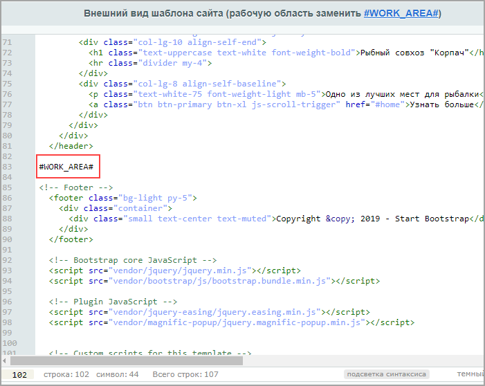
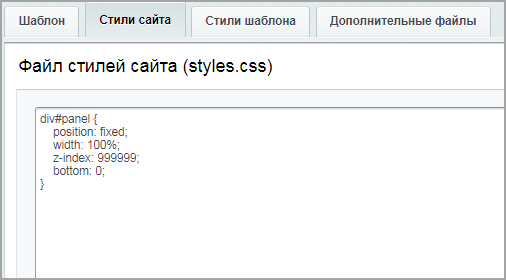
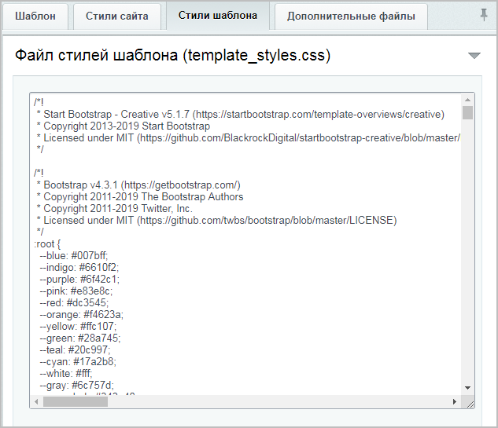
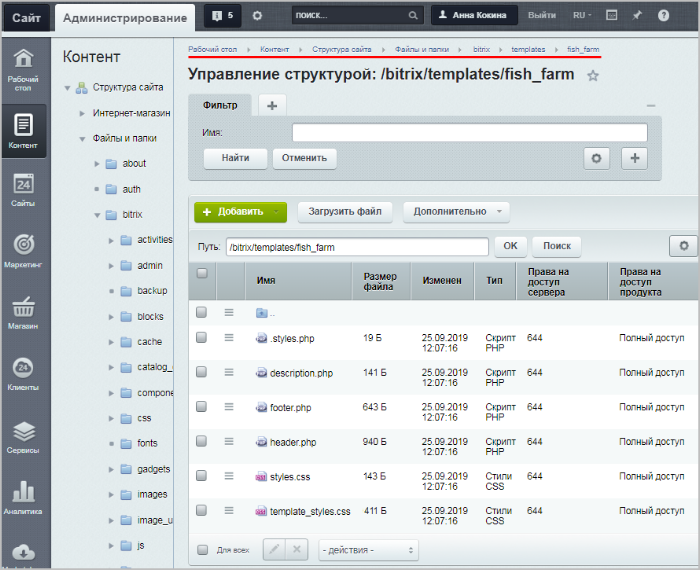

# Шаблон сайта (создание папки шаблона)

**Навигация**
- [← Оглавление курса](index.md)
- [← Предыдущий: 12776 — Разделение шаблона на header, footer и work_area](lesson_12776.md)
- [Следующий: 12766 — Шаблон сайта (настройка и подключение) →](lesson_12766.md)

Официальная страница урока: https://dev.1c-bitrix.ru/learning/course/index.php?COURSE_ID=43&LESSON_ID=12720

Создание шаблона – первый шаг в интеграции дизайна. Рассмотрим подробнее на примере, как это сделать.

#### Добавление кода шаблона / создание папки шаблона

- Откроем исходный код страницы **index.html**, выделим весь код и скопируем его в буфер обмена.
- На сайте перейдём в раздел Настройки &gt; Настройки продукта &gt; Сайты &gt; Шаблоны сайтов. Кликнем по кнопке **Добавить шаблон**, и в Рабочей области откроется форма **Шаблоны сайтов**.
- Выполним команду **Добавить шаблон** на Контекстной панели. В открывшейся
  			форме создания
  
  		 нового шаблона укажем
  			идентификатор шаблона
  Можно использовать латинские буквы и цифры.
  		 и остальные параметры (описание понятно интуитивно).
- Вставим скопированный код в поле **Внешний вид шаблона сайта**.
- Теперь нужно определить шапку сайта (header) и подвал (footer) - это те области, которые будут неизменны на каждой странице сайта.
  В нашем примере шапка сайта будет содержать основную заставку с названием сайта и навигацию по странице (верхнее горизонтальное меню, кнопки РЫБЫ.НЕТ и Узнать больше) - т.е. заканчиваться на теге `</header>`. Подвал сайта будет содержать только копирайт, т.е. начинаться с блока ``.
  Выделим и удалим весь код между шапкой (header) и подвалом сайта (footer).
  Таким образом, мы удалили весь код (контент сайта) между тегом `</header>` и блоком ``. Вместо удаленного кода пропишем `#WORK_AREA#`:
  
- Теперь нужно заполнить вкладки
  			Стили сайта
  Стили, используемые при оформлении **контента страниц** (стили сайта), хранятся
  в файле **styles.css**.
  
  		 и
  			Стили шаблона.
  Стили, используемые в **шаблоне дизайна,** хранятся в файле **template_styles.css**. Это - основной
  CSS-файл шаблона.
  
  		 Скопируйте туда содержимое файлов **styles.css** и **creative.css** (если же эти вкладки оставить пустыми, то придется дополнительно подключать файлы в шапке сайта).
- Сохраним изменения.

После выполнения вышеперечисленных действий будет создана папка этого шаблона, включающая отдельные файлы шапки сайта (**header.php**), подвала сайта (**footer.php**) и файлы с автоматически подключаемыми скриптами и стилями (Контент &gt; Структура сайта &gt; Файлы и папки &gt; bitrix &gt; templates):

|  |
| --- |

#### Загрузка файлов шаблона

			Загрузите

Например, по протоколу FTP. Или же можно создать папки вручную и загрузить в них содержимое.

		 в папку созданного шаблона следующие папки из архива (стили шаблона, картинки и js-файлы):

- css
- img
- js
- vendor

|  |
| --- |

Новый шаблон создан (точнее, создана папка этого шаблона со всем необходимым содержимым). Теперь нужно отредактировать шапку и подвал сайта (файлы **header.php** и **footer.php**), а также настроить их подключение. Об этом читайте

			в следующем уроке.

В папке шаблона откроем файл **header.php** в режиме редактирования как PHP.

Первой строкой пропишем служебный код (защита от подключения файла напрямую без подключения ядра).

[Подробнее](lesson_12766.md)...

**Примечание**: вместо папки **bitrix** можно использовать папку **local** (подробнее

			в уроке

Чтобы сделать жизнь разработчиков проектов удобнее, в рамках работ по новому ядру D7 с версии главного модуля `14.0.1` основные файлы проекта вынесены из папки `/bitrix` в папку `/local`. Это позволит изолировать изменяющиеся файлы проекта от папки продукта. По сути, в исключения достаточно будет добавить одну папку /bitrix.

[Подробнее](lesson_2705.md)...

		).
