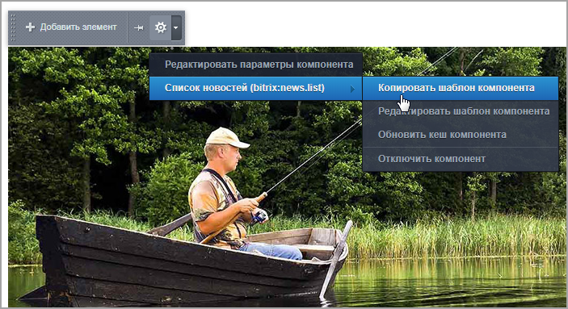
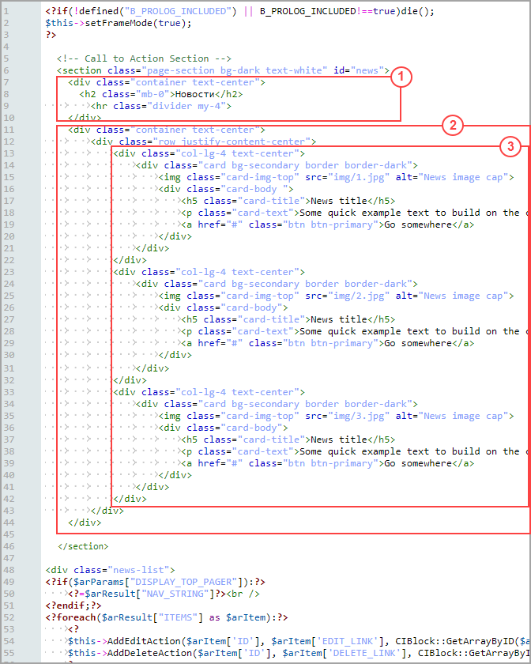

# Список новостей: кастомизация шаблона компонента

**Навигация**
- [← Оглавление курса](index.md)
- [← Предыдущий: 12766 — Шаблон сайта (настройка и подключение)](lesson_12766.md)
- [Следующий: 12754 — Детальный просмотр новости: шаблон страницы и компонента →](lesson_12754.md)

Официальная страница урока: https://dev.1c-bitrix.ru/learning/course/index.php?COURSE_ID=43&LESSON_ID=12744

В

			предыдущем уроке


Создание шаблона – первый шаг в интеграции дизайна.

Ранее можно было задавать внешний вид шаблона сайта с помощью визуального редактора. С версии 14.0 работа выполняется без визуального редактора. Разберем пошагово на примере, как это сделать.

[Подробнее](lesson_12720.md)...

		 мы создали шаблон главной страницы сайта. Однако пока вся информация на сайте - статическая, и для внесения любых изменений придется править главную страницу **index.php**. Это не очень удобно, если информация на сайте должна постоянно обновляться. И при этом слишком громоздко.

Поэтому однородную информацию лучше заносить в

			инфоблоки,


**Информационные блоки** - модуль, позволяющий каталогизировать и управлять различными типами (блоками) однородной информации. С помощью информационных блоков может быть реализована публикация различных типов динамической информации: каталоги товаров, блоки новостей, справочники и т.д.

[Подробнее](https://dev.1c-bitrix.ru/learning/course/index.php?COURSE_ID=43&CHAPTER_ID=04610)...

		 а потом с помощью

			компонентов


**Компонент** - это логически завершённый код, предназначенный для извлечения информации из инфоблоков и других источников и преобразования её в HTML-код для отображения в виде фрагментов web-страниц. Состоит из собственно компонента (контроллер) и шаблона (представление). Компонент, с помощью API одного или нескольких модулей, манипулирует данными. Шаблон компонента выводит данные на страницу.

[Подробнее](https://dev.1c-bitrix.ru/learning/course/index.php?COURSE_ID=43&CHAPTER_ID=04565&LESSON_PATH=3913.4565)...

		 выводить её на сайте. А чтобы информация отображалась именно так, как задумал дизайнер, необходимо

			кастомизировать


Кастомизация шаблона компонента, как правило, преследует две цели:

1. Приведение формы вывода данных компонента в соответствие с дизайном сайта;

2. Организация вывода данных компонента в виде, недоступном в стандартном варианте.

[Подробнее](https://dev.1c-bitrix.ru/learning/course/index.php?COURSE_ID=43&CHAPTER_ID=04778&LESSON_PATH=3913.4565.4790.4778)...

		 шаблон компонента.

Новости будем выводить с использованием двух простых компонентов:

- Список новостей
  			(news.list)
                      Одностраничный компонент выводит список новостей из одного информационного блока.
  						[Описание компонента «Список новостей» в пользовательской документации.](http://dev.1c-bitrix.ru/user_help/detail.php?ID=62968)
  		 - его разместим на главной странице сайта для вывода
  			анонсов новостей;
  
- Новость детально
  			(news.detail)
                      Одностраничный компонент, осуществляющий вывод детального описание новости. Компонент стандартный и входит в дистрибутив модуля.
  						[Описание компонента «Новость детально» в пользовательской документации.](http://dev.1c-bitrix.ru/user_help/detail.php?ID=62969)
  		 - для вывода
  			детальной новости
  
  		 нужно будет создать новую страницу со своим шаблоном.

В этом уроке изменим дизайн компонента **Список новостей**. Рассмотрим пошагово:

#### 1. Копирование шаблона компонента

Скопируйте шаблон компонента **Список новостей**. Это можно сделать двумя способами:

- В рамках файловой системы копированием папки Контент &gt; Структура сайта &gt; Файлы и папки &gt; bitrix &gt; templates &gt; [ваш шаблон] &gt; components &gt; bitrix &gt; [название компонента] &gt; [название шаблона компонента].
- Средствами интерфейса системы, разместив на странице компонент и скопировав его с помощью команды
  			Копировать шаблон компонента
  
  		 (при включённом режиме **Правка**). Копировать лучше в
  			текущий шаблон
  
  		 сайта.

В данном примере скопирован шаблон **default**.

#### 2. Кастомизация шаблона компонента

- В исходном файле вёрстки **index.html** скопируйте блок, выводящий новости (в нашем случае блок **Call to Action Section**).
- В папке скопированного шаблона компонента **news.list** откройте в режиме редактирования файл **template.php**.
- После первой строки `<? if (!defined('B_PROLOG_INCLUDED') || B_PROLOG_INCLUDED !== true) die(); ?>` (защита от подключения файла напрямую без подключения ядра) вставьте скопированный ранее код вёрстки.
- Теперь нужно разобраться в общей структуре кода вёрстки (какая часть кода за что отвечает):
  
  1 - стиль заголовка блока и сам заголовок;
  2 - стиль блока;
  3 - три элемента блока (т.е. три новости) со своими стилями.
  Код 1 и 2 оставим без изменений, а работать будем с 3:

**Примечание**: Весь нижеприведённый код есть в штатном шаблоне компонента, который мы копировали в пункте 1.

- Код трёх новостей заменим на конструкцию `foreach`, которая будет перебирать массив элементов и выводить найденные новости:
  ```
  <? foreach ($arResult["ITEMS"] as $arItem): ?>
  	<?
  	$this->AddEditAction($arItem['ID'], $arItem['EDIT_LINK'], CIBlock::GetArrayByID($arItem["IBLOCK_ID"], "ELEMENT_EDIT"));
  	$this->AddDeleteAction($arItem['ID'], $arItem['DELETE_LINK'], CIBlock::GetArrayByID($arItem["IBLOCK_ID"], "ELEMENT_DELETE"), array("CONFIRM" => GetMessage('CT_BNL_ELEMENT_DELETE_CONFIRM')));
  	?>
  	<!--  Код одной новости из исходного файла index.html  -->
  		<div class="col-lg-4 text-center">
  			<div class="card bg-secondary border border-dark">
  				
  				<div class="card-body">
  					<h5 class="card-title">News title</h5>
  					<p class="card-text">Some quick example text to build on the card title and make up the bulk of the card's content.</p>
  					<a href="#" class="btn btn-primary">Go somewhere</a>
  				</div>
  			</div>
  		</div>
  <? endforeach; ?>
  ```
- Пропишем вызов пути картинки анонса `src="<?= $arItem["PREVIEW_PICTURE"]["SRC"] ?>"`. Вместо статического названия элемента укажем `<? echo $arItem["NAME"] ?>` (будут подтягиваться названия элементов инфоблока):
  ```
  "
  	alt="<? echo $arItem["NAME"] ?>">
  <div class="card-body ">
  		<h5 class="card-title"><? echo $arItem["NAME"] ?></h5>
  ```
- Выводить текст анонса новостей будем конструкцией:
  ```
  <? if ($arParams["DISPLAY_PREVIEW_TEXT"] != "N" && $arItem["PREVIEW_TEXT"]): ?>
  	<p class="card-text"><? echo $arItem["PREVIEW_TEXT"]; ?></p>
  <? endif; ?>
  ```
- В коде, отвечающем за вывод кнопки перехода на страницу детального просмотра элемента, пропишем `<? echo $arItem["DETAIL_PAGE_URL"] ?>`:
  ```
  <a href="<? echo $arItem["DETAIL_PAGE_URL"] ?>" class="btn btn-primary">Подробнее</a>
  ```

## Итоговый код кастомизированного шаблона компонента news.list

```

<?if(!defined("B_PROLOG_INCLUDED") || B_PROLOG_INCLUDED!==true)die();
$this->setFrameMode(true);
?>

<!-- Call to Action Section -->
<section class="page-section bg-dark text-white" id="news">
	<div class="container text-center">
		<h2 class="mb-0">Новости</h2>
		<hr class="divider my-4">
	</div>
	<div class="container text-center">
		<div class="row justify-content-center">
			<? foreach ($arResult["ITEMS"] as $arItem): ?>
				<?
				$this->AddEditAction($arItem['ID'], $arItem['EDIT_LINK'], CIBlock::GetArrayByID($arItem["IBLOCK_ID"], "ELEMENT_EDIT"));
				$this->AddDeleteAction($arItem['ID'], $arItem['DELETE_LINK'], CIBlock::GetArrayByID($arItem["IBLOCK_ID"], "ELEMENT_DELETE"), array("CONFIRM" => GetMessage('CT_BNL_ELEMENT_DELETE_CONFIRM')));
				?>
			<div class="col-lg-4 text-center">
				<div class="card bg-secondary border border-dark">
							"
								 alt="<? echo $arItem["NAME"] ?>">
							<div class="card-body ">
								<h5 class="card-title"><? echo $arItem["NAME"] ?></h5>
								<? if ($arParams["DISPLAY_PREVIEW_TEXT"] != "N" && $arItem["PREVIEW_TEXT"]): ?>
									<p class="card-text"><? echo $arItem["PREVIEW_TEXT"]; ?></p>
								<? endif; ?>
								<a href="<? echo $arItem["DETAIL_PAGE_URL"] ?>" class="btn btn-primary">Подробнее</a>
							</div>
				</div>
			</div>
			<? endforeach; ?>
		</div>
	</div>
</section>
```
