# Детальный просмотр новости: шаблон страницы и компонента

**Навигация**
- [← Оглавление курса](index.md)
- [← Предыдущий: 12744 — Список новостей: кастомизация шаблона компонента](lesson_12744.md)
- [Следующий: 12770 — Меню: кастомизация шаблона компонента →](lesson_12770.md)

Официальная страница урока: https://dev.1c-bitrix.ru/learning/course/index.php?COURSE_ID=43&LESSON_ID=12754

В

			предыдущем уроке


Однородную информацию лучше заносить в инфоблоки, а потом с помощью компонентов выводить её на сайте. А чтобы информация отображалась именно так, как задумал дизайнер, необходимо кастомизировать шаблон компонента.

Новости будем выводить с использованием двух простых компонентов:

**Список новостей** (news.list) - его разместим на главной странице сайта для вывода анонсов новостей;

**Новость детально** (news.detail) - для вывода детальной новости нужно будет создать новую страницу со своим шаблоном.

В этом уроке изменим дизайн компонента Список новостей. Рассмотрим пошагово:

[Подробнее](lesson_12744.md)...

		 мы настроили вывод списка новостей, а в этом уроке займемся страницей детального просмотра новости:

- создадим шаблон страницы;
- разместим и кастомизируем компонент **Новость детально**
  			(news.detail)
                      Одностраничный компонент, осуществляющий вывод детального описание новости. Компонент стандартный и входит в дистрибутив модуля.
  						[Описание компонента «Новость детально» в пользовательской документации.](http://dev.1c-bitrix.ru/user_help/detail.php?ID=62969)
  		.

#### 1. Создание шаблона страниц для вывода детальной информации

Шаблон главной страницы уже подготовлен. Теперь нужно подготовить шаблон страницы вывода детальной информации.

Можно, конечно, создать шаблон по ранее описанному пути, но в этом случае можно сделать гораздо легче:

			копировать папку


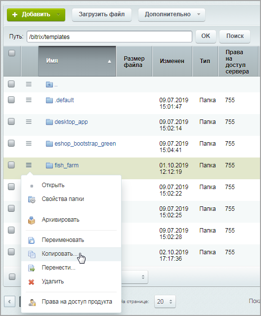

		 шаблона,

			переименовать


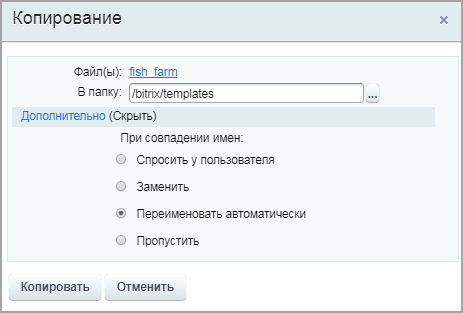

		 и откорректировать файлы.

**Примечание**: напоминаем, что в шапку и подвал сайта Вы можете разместить любую информацию, которую не требуется часто изменять.

В нашем примере сделаем шаблон для страниц с подробной информацией минималистичным, оставив только

			копирайт


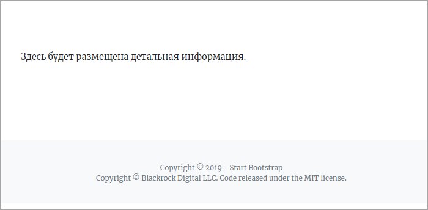

		 в подвале сайта. Поэтому файл **footer.php** (в котором и содержится копирайт) оставим без изменений, отредактировав только файл **header.php**:

```

<? if (!defined('B_PROLOG_INCLUDED') || B_PROLOG_INCLUDED !== true) die(); ?> <!-- Служебный код, необходим для защиты подключения этого файла без подключения ядра -->

<!DOCTYPE html>
<html lang="ru">

	<head>
	<meta charset="utf-8">
	<meta name="viewport" content="width=device-width, initial-scale=1, shrink-to-fit=no">
	<meta name="description" content="">
	<meta name="author" content="">

	<title><? $APPLICATION->ShowTitle(); ?></title> <!-- Отображение заголовка страницы -->
	<? $APPLICATION->ShowHead();  ?> <!--  Вывод в шаблоне сайта основных полей тега head (мета-теги Content-Type, robots, keywords, description; стили CSS; скрипты) -->

	<!-- Font Awesome Icons -->
	<link href="<?=SITE_TEMPLATE_PATH?>/vendor/fontawesome-free/css/all.min.css" rel="stylesheet" type="text/css">

	<!-- Google Fonts -->
	<link href="https://fonts.googleapis.com/css?family=Merriweather+Sans:400,700&selection.subset=cyrillic" rel="stylesheet">
	<link href='https://fonts.googleapis.com/css?family=Merriweather:300,300i,400,400i,700,700i&display=swap&subset=cyrillic' rel='stylesheet' type='text/css'>

</head>

<body id="page-top">
<div id="panel">
    <? $APPLICATION->ShowPanel(); ?> <!-- Отображение административной панели внизу страницы -->
</div>
```

В **header.php** мы оставили только служебный код, а также подключение стилей оформления текста.

#### 2. Применение шаблона к странице

Создадим страницу вывода детальной информации. По умолчанию к ней будет применен шаблон сайта.

Изменим шаблон этой страницы (Настройки &gt; Настройки продукта &gt; Сайты &gt; Список сайтов):

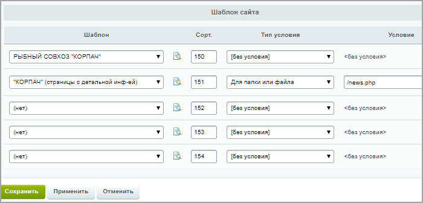

Значение Сортировки

                    Обязательно проработайте порядок сортировки для шаблонов (колонка Сорт.). Указанные цифры определят порядок применения шаблонов.

[Подробнее ...](https://dev.1c-bitrix.ru/learning/course/index.php?COURSE_ID=34&LESSON_ID=1994)

		 для этого шаблона должно быть меньше, чем значение для основного шаблона.

#### 3. Размещение и настройка компонента

- На созданной странице
  			разместим и настроим
  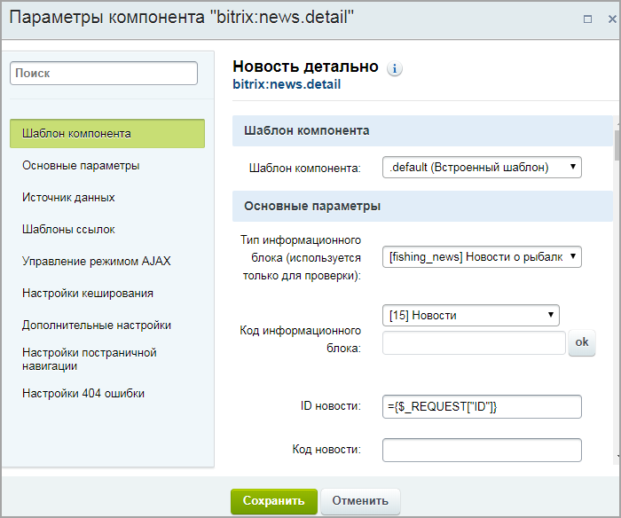
  		 компонент **Новость детально** (news.detail). Не вдаваясь, пока, в объяснения почему так, проверьте чтобы в поле **ID новости** стояло значение `={$_REQUEST["ID"]}`
- Теперь на главной странице сайта откроем настройки размещенного ранее компонента **Список новостей**. В разделе **Шаблоны ссылок** пропишем
  			URL страницы детального просмотра.
  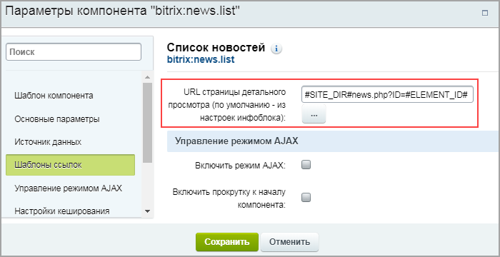

В результате при клике по кнопке

			Подробнее


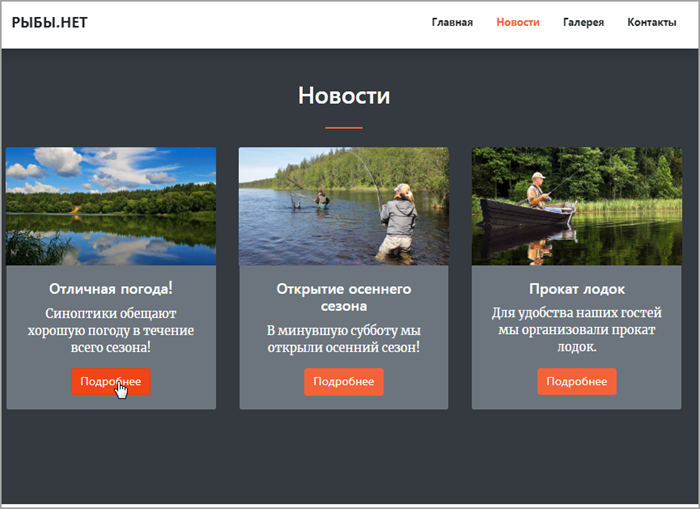

		 в разделе **Новости** главной страницы сайта перейдем на страницу подробного описания новости, однако

			отображение новости


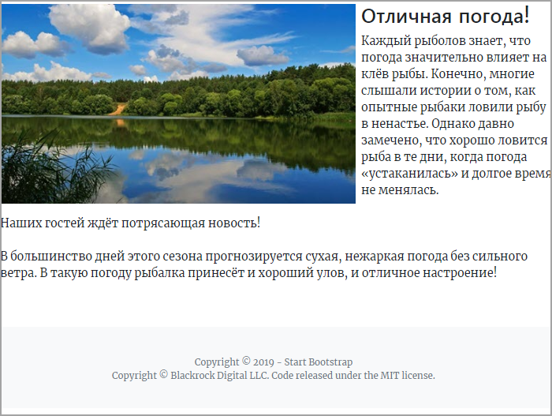

		 не совсем соответствует дизайну нашего сайта. Исправим это на следующем этапе.

#### 4. Кастомизация компонента

- Скопируем шаблон компонента **Новость детально** по аналогии с
  			уроком.
  Это можно сделать двумя способами:
  1. В рамках файловой системы копированием папки `/bitrix/components/bitrix/_нужный_компонент_/templates/` в папку `/local/templates/шаблон_сайта/components/namespace/название_компонента/_название_шаблона`.
  2. Средствами интерфейса системы, разместив на странице компонент и скопировав его с помощью команды **Копировать шаблон компонента** (при включённом режиме **Правка**).
  [Подробнее](lesson_12744.md)...
- В папке скопированного шаблона компонента **news.detail** откроем в режиме редактирования файл **template.php**.
- Оформим детальный показ новости в том же стиле, что и показ анонса новостей. Для этого в файле исходной вёрстки страницы **index.html** скопируем
  			часть кода,
  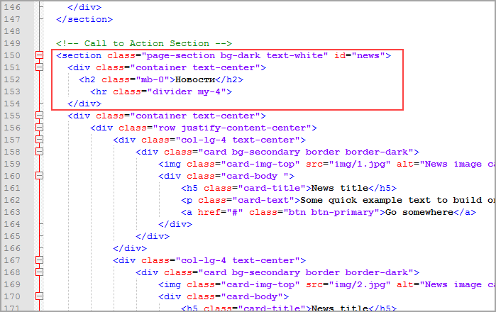
  		 отвечающую за стиль блока **Новости**.
- После первой строки `<? if (!defined('B_PROLOG_INCLUDED') || B_PROLOG_INCLUDED !== true) die(); ?>` (защита от подключения файла напрямую без подключения ядра) вставим скопированный ранее код вёрстки.  Не забудьте поставить закрывающий тег `</section>`.
- В коде шаблона компонента, который скопировали, оставим только те части, которые отвечают за вывод картинки и текста.

Теперь осталось в настройках компонента **news.detail** установить подготовленный нами

			шаблон


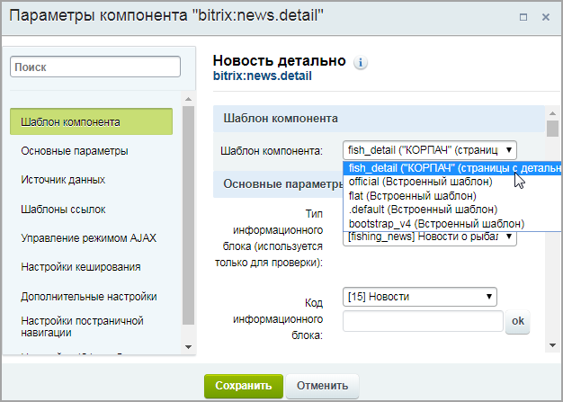

		 и проверить

			результат.


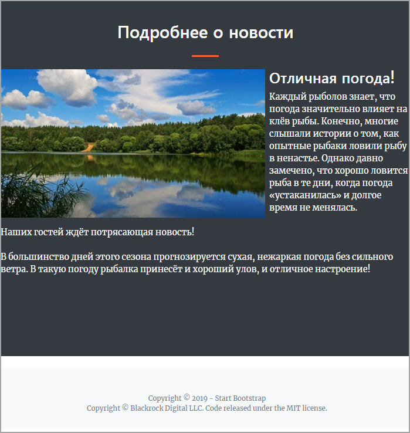
