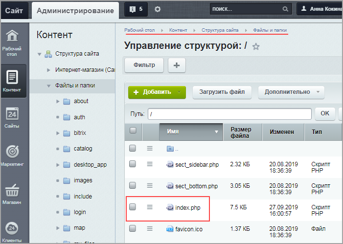

# Шаблон сайта (настройка и подключение)

**Навигация**
- [← Оглавление курса](index.md)
- [← Предыдущий: 12720 — Шаблон сайта (создание папки шаблона)](lesson_12720.md)
- [Следующий: 12744 — Список новостей: кастомизация шаблона компонента →](lesson_12744.md)

Официальная страница урока: https://dev.1c-bitrix.ru/learning/course/index.php?COURSE_ID=43&LESSON_ID=12766

Ранее


Создание шаблона – первый шаг в интеграции дизайна.

**Примечание:** Ранее можно было задавать внешний вид шаблона сайта с помощью визуального редактора. С версии `14.0` работа выполняется без визуального редактора.

[Подробнее](lesson_12720.md)...

		 мы создали папку шаблона сайта. Однако для корректного отображения шаблона на сайте нужно еще адаптировать вёрстку, подключив все стили и js-файлы в шапке и подвале сайта, а также прописав новые пути до картинок и объектов.

Необходимо выполнить три важных шага:

1. [Редактирование шапки сайта (header.php)](#header)
2. [Редактирование подвала сайта (footer.php)](#footer)
3. [Подключение шапки и подвала (index.php), добавление контента](#index)

#### 1. Редактирование шапки сайта (header.php)

- В папке шаблона откроем файл **header.php** в режиме редактирования как PHP.
- Первой строкой пропишем служебный код (защита от подключения файла напрямую без подключения ядра):
  ```
  <? if (!defined('B_PROLOG_INCLUDED') || B_PROLOG_INCLUDED !== true) die(); ?>
  ```
- Внутри тегов `<head>` добавим следующие строки:

  - Код отображения заголовка страницы:
    ```
    <title><? $APPLICATION->ShowTitle(); ?></title>
    ```
  - Код вывода в шаблоне сайта основных полей тега `<head>` (мета-теги Content-Type, robots, keywords, description; стили CSS; скрипты):
    ```
    <? $APPLICATION->ShowHead();  ?>
    ```
- После открывающего тега `<body>` пропишем код для отображения административной панели `<? $APPLICATION->ShowPanel(); ?>`. В связи с особенностями данного html-макета заключим код отображения панели в теги `<div>` (панель будет отображаться внизу страницы), иначе административная панель "наедет" на меню:
  ```
  <div id="panel">
  	<? $APPLICATION->ShowPanel(); ?>
  </div>
  ```
- Во все строках, где есть обращение к файлам, добавим в начале пути константу
  			`<?=SITE_TEMPLATE_PATH?>`
  Возвращает путь до текущего подключённого шаблона сайта без последнего слеша.
  		 и слеш **/**.
  Рассмотрим на примере блока ``:
  ```
    <!-- Bootstrap core JavaScript -->
    <script src="<?=SITE_TEMPLATE_PATH?>/vendor/jquery/jquery.min.js"></script>
    <script src="<?=SITE_TEMPLATE_PATH?>/vendor/bootstrap/js/bootstrap.bundle.min.js"></script>
  ```
- Сохраним изменения.

## Пример отредактированного файла header.php с комментариями

```

<? if (!defined('B_PROLOG_INCLUDED') || B_PROLOG_INCLUDED !== true) die(); ?> <!-- Служебный код, необходим для защиты подключения этого файла без подключения ядра -->

<!DOCTYPE html>
<html lang="ru">

<head>
	<meta charset="utf-8">
	<meta name="viewport" content="width=device-width, initial-scale=1, shrink-to-fit=no">
	<meta name="description" content="">
	<meta name="author" content="">

	<title><? $APPLICATION->ShowTitle(); ?></title> <!-- Отображение заголовка страницы -->
	<? $APPLICATION->ShowHead();  ?> <!--  Вывод в шаблоне сайта основных полей тега head (мета-теги Content-Type, robots, keywords, description; стили CSS; скрипты) -->

	<!-- Font Awesome Icons -->
		<link href="<?=SITE_TEMPLATE_PATH?>/vendor/fontawesome-free/css/all.min.css" rel="stylesheet" type="text/css">

	<!-- Google Fonts -->
	<link href="https://fonts.googleapis.com/css?family=Merriweather+Sans:400,700&selection.subset=cyrillic" rel="stylesheet">
	<link href='https://fonts.googleapis.com/css?family=Merriweather:300,300i,400,400i,700,700i&display=swap&subset=cyrillic' rel='stylesheet' type='text/css'>

	<!-- Plugin CSS -->
		<link href="<?=SITE_TEMPLATE_PATH?>/vendor/magnific-popup/magnific-popup.css" rel="stylesheet">

	<!-- Theme CSS - Includes Bootstrap -->
		<link href="<?=SITE_TEMPLATE_PATH?>/css/creative.min.css" rel="stylesheet">

</head>

<body id="page-top">

<div id="panel">
	<? $APPLICATION->ShowPanel(); ?> <!-- Отображение административной панели внизу страницы -->
</div>

	<!-- Navigation -->
	<nav class="navbar navbar-expand-lg navbar-light fixed-top py-3" id="mainNav">
		<div class="container">
		<a class="navbar-brand js-scroll-trigger" href="#page-top">РЫБЫ.НЕТ</a>
		<button class="navbar-toggler navbar-toggler-right" type="button" data-toggle="collapse" data-target="#navbarResponsive" aria-controls="navbarResponsive" aria-expanded="false" aria-label="Toggle navigation">
			<span class="navbar-toggler-icon"></span>
		</button>
		<div class="collapse navbar-collapse" id="navbarResponsive">
			<ul class="navbar-nav ml-auto my-2 my-lg-0">
			<li class="nav-item">
				<a class="nav-link js-scroll-trigger" href="#home">Главная</a> <!-- перемещение по клику к блоку About Section -->
			</li>
			<li class="nav-item">
 				<a class="nav-link js-scroll-trigger" href="#news">Новости</a> <!-- перемещение по клику к блоку Новости -->
			</li>
			<li class="nav-item">
				<a class="nav-link js-scroll-trigger" href="#portfolio">Галерея</a> <!-- перемещение по клику к блоку Галерея -->
			</li>
			<li class="nav-item">
				<a class="nav-link js-scroll-trigger" href="#contact">Контакты</a> <!-- перемещение по клику к блоку Контакты -->
			</li>
		</ul>
		</div>
	</div>
	</nav>

	<!-- Masthead -->
	<header class="masthead">
		<div class="container h-100">
		<div class="row h-100 align-items-center justify-content-center text-center">
 			<div class="col-lg-10 align-self-end">
			<h1 class="text-uppercase text-white font-weight-bold">Рыбный совхоз "Корпач"</h1>
			<hr class="divider my-4">
		</div>
			<div class="col-lg-8 align-self-baseline">
			<p class="text-white-75 font-weight-light mb-5">Одно из лучших мест для рыбалки</p>
			<a class="btn btn-primary btn-xl js-scroll-trigger" href="#home">Узнать больше</a><!-- Перемещение по клику к блоку УЗНАТЬ БОЛЬШЕ -->
			</div>
		</div>
	</div>
</header>
```

**Примечание**: css-стили в шапке сайта предпочтительнее подключить с помощью метода [Asset::addCss()](https://dev.1c-bitrix.ru/api_d7/bitrix/main/page/asset/addcss.php) ядра D7.

## Пример файла header.php с комментариями

```

<?
if (!defined('B_PROLOG_INCLUDED') || B_PROLOG_INCLUDED !== true) die(); //Защита от подключения файла напрямую без подключения ядра
use Bitrix\Main\Page\Asset; //Подключение библиотеки для использования  Asset::getInstance()->addCss()
global $USER;
?>
<!DOCTYPE html>
<html lang="ru">

<head>
	<meta charset="utf-8">
	<meta name="viewport" content="width=device-width, initial-scale=1, shrink-to-fit=no">
	<meta name="description" content="">
	<meta name="author" content="">

		<title><? $APPLICATION->ShowTitle(); ?></title> <!-- Отображение заголовка страницы -->
		<?
		Asset::getInstance()->addJs(SITE_TEMPLATE_PATH . "/vendor/jquery/jquery.min.js");
$APPLICATION->ShowHead();
		Asset::getInstance()->addCss(SITE_TEMPLATE_PATH . "/vendor/fontawesome-free/css/all.min.css");
		Asset::getInstance()->addCss("https://fonts.googleapis.com/css?family=Merriweather+Sans:400,700&selection.subset=cyrillic");
		Asset::getInstance()->addCss("https://fonts.googleapis.com/css?family=Merriweather:300,300i,400,400i,700,700i&display=swap&subset=cyrillic");
		Asset::getInstance()->addCss(SITE_TEMPLATE_PATH . "/vendor/magnific-popup/magnific-popup.css");
?>

</head>

<body id="page-top">

<div id="panel">
    <? $APPLICATION->ShowPanel(); ?> <!-- Отображение панели администратора -->
</div>

	<!-- Navigation -->
	<nav class="navbar navbar-expand-lg navbar-light fixed-top py-3" id="mainNav">
		<div class="container">
		<a class="navbar-brand js-scroll-trigger" href="#page-top">РЫБЫ.НЕТ</a>
		<button class="navbar-toggler navbar-toggler-right" type="button" data-toggle="collapse" data-target="#navbarResponsive" aria-controls="navbarResponsive" aria-expanded="false" aria-label="Toggle navigation">
			<span class="navbar-toggler-icon"></span>
		</button>
		<div class="collapse navbar-collapse" id="navbarResponsive">
			<ul class="navbar-nav ml-auto my-2 my-lg-0">
			<li class="nav-item">
				<a class="nav-link js-scroll-trigger" href="#home">Главная</a> <!-- перемещение по клику к блоку About Section -->
			</li>
			<li class="nav-item">
				<a class="nav-link js-scroll-trigger" href="#news">Новости</a> <!-- перемещение по клику к блоку Новости -->
			</li>
			<li class="nav-item">
				<a class="nav-link js-scroll-trigger" href="#portfolio">Галерея</a> <!-- перемещение по клику к блоку Галерея -->
			</li>
			<li class="nav-item">
				<a class="nav-link js-scroll-trigger" href="#contact">Контакты</a> <!-- перемещение по клику к блоку Контакты -->
			</li>
			</ul>
		</div>
	</div>
	</nav>

	<!-- Masthead -->
<header class="masthead">
	<div class="container h-100">
		<div class="row h-100 align-items-center justify-content-center text-center">
			<div class="col-lg-10 align-self-end">
				<h1 class="text-uppercase text-white font-weight-bold">Рыбный совхоз "Корпач"</h1>
				<hr class="divider my-4">
			</div>
			<div class="col-lg-8 align-self-baseline">
				<p class="text-white-75 font-weight-light mb-5">Одно из лучших мест для рыбалки</p>
				<a class="btn btn-primary btn-xl js-scroll-trigger" href="#home">Узнать больше</a><!-- Перемещение по клику к блоку УЗНАТЬ БОЛЬШЕ -->
			</div>
		</div>
	</div>
</header>
```

|  |
| --- |

#### 2. Редактирование подвала сайта (footer.php)

Подвал сайта почти

			не нуждается в изменениях

                    Проверьте обязательно наличие строки `<?if(!defined("B_PROLOG_INCLUDED") || B_PROLOG_INCLUDED!==true) die();?>` в начале файла.

		. Необходимо только в строках, обращающихся к файлам, добавить в начале пути константу

			`<?=SITE_TEMPLATE_PATH?>`


Возвращает путь до текущего подключённого шаблона сайта без последнего слеша.

		 со слешем **/** и сохранить изменения.

## Пример отредактированного файла footer.php

```

<!-- Footer -->
	<footer class="bg-light py-5">
		<div class="container">
			<div class="small text-center text-muted">Copyright © 2019 - Start Bootstrap<br/>Copyright © Blackrock Digital LLC. Code released under the MIT license.</div>
		</div>
	</div>
</footer>

	<!-- Bootstrap core JavaScript -->
	<script src="<?=SITE_TEMPLATE_PATH?>/vendor/jquery/jquery.min.js"></script>
	<script src="<?=SITE_TEMPLATE_PATH?>/vendor/bootstrap/js/bootstrap.bundle.min.js"></script>

	<!-- Plugin JavaScript -->
	<script src="<?=SITE_TEMPLATE_PATH?>/vendor/jquery-easing/jquery.easing.min.js"></script>
	<script src="<?=SITE_TEMPLATE_PATH?>/vendor/magnific-popup/jquery.magnific-popup.min.js"></script>

	<!-- Custom scripts for this template -->
	<script src="<?=SITE_TEMPLATE_PATH?>/js/creative.min.js"></script>

</body>

</html>
```

#### 3. Подключение шапки и подвала (index.php), добавление контента

- Необходимо удостовериться в подключении на странице вывода файлов **header.php** и **footer.php**.
  Для этого в файле главной страницы сайта
  			index.php
                       (Контент &gt; Структура сайта &gt; Файлы и папки &gt; index.php)
  
  		 сверим следующие конструкции:

  - первая строка: `<?require($_SERVER["DOCUMENT_ROOT"]."/bitrix/header.php");?>`
  - последняя строка: `<?require($_SERVER["DOCUMENT_ROOT"]."/bitrix/footer.php");?>`
- Добавим
  			статический
  Т.е. для изменения контента страницы нужно будет вновь отредактировать вручную код страницы **index.php**.
  		 контент.
  Откроем файл с подготовленной вёрсткой (**index.html**) и скопируем код между шапкой (header) и подвалом сайта (footer) - тот, который мы в пункте 1 заменяли на **#WORK_AREA#**, то есть контент сайта.
  Настроим пути к картинкам. Пропишем в существующих путях уже знакомую константу  `<?=SITE_TEMPLATE_PATH?>/`.

## Пример отредактированного файла index.php с комментариями

```

<?require($_SERVER["DOCUMENT_ROOT"]."/bitrix/header.php");?>

<!-- About Section -->
	<section class="page-section bg-primary" id="home">
		<div class="container">
			<div class="row justify-content-center">
			<div class="col-lg-8 text-center">
			<h2 class="text-white mt-0">О прикорме</h2>
			<hr class="divider light my-4">
				<p class="text-white-50 mb-4">Споры о том, на что ловить и чем лучше прикармливать, наверное, никогда не закончатся. Одни предпочи-тают новомодные прикор-мки, изготовленные фирма-ми, специализи-рующимися на их производ-стве; другие ни за что не променяют кастрюлю с душистым варевом, над которой они колдовали не один час, словно баба-яга над зельем. Но речь не об этом. Я не буду давать советы и рецепты, а выскажусь по поводу некоторых заблуждений. В большинстве статей пишут, что рыбу можно перекормить большим количеством прикормки. Но никто не пишет конкретных цифр - сколько "много", а сколько "мало" или "достаточно". Потому что никто не знает и никогда не узнает, сколько же это "много". Для одного и килограмм - уже много, а для другого и ведра кажется мало. Но причина не в этом. Давайте на проблему посмотрим с другой стороны.
```

			&lt;/div&gt;
			&lt;/div&gt;
		&lt;/div&gt;
	&lt;/section&gt;

&lt;!-- Services Section --&gt;
	&lt;section class="page-section"&gt;
		&lt;div class="container"&gt;
		&lt;h2 class="text-center mt-0"&gt;Почему мы?&lt;/h2&gt;
		&lt;hr class="divider my-4"&gt;
    	&lt;/div&gt;
	&lt;/section&gt;

&lt;!-- Portfolio Section --&gt;
	&lt;section id="portfolio"&gt;
		&lt;div class="container-fluid p-0"&gt;
			&lt;div class="row no-gutters"&gt;
			&lt;div class="col-lg-4 col-sm-6"&gt;
				&lt;a class="portfolio-box" href="&lt;?=SITE_TEMPLATE_PATH?&gt;/img/1.jpg"&gt;
				&lt;img class="img-fluid" src="&lt;?=SITE_TEMPLATE_PATH?&gt;/img/1.jpg" alt=""&gt;
				&lt;div class="portfolio-box-caption"&gt;
				&lt;div class="project-name"&gt;Прекрасные пейзажи&lt;/div&gt;
				&lt;/div&gt;
			&lt;/a&gt;
		&lt;/div&gt;
			&lt;div class="col-lg-4 col-sm-6"&gt;
			&lt;a class="portfolio-box" href="&lt;?=SITE_TEMPLATE_PATH?&gt;/img/2.jpg"&gt;
				&lt;img class="img-fluid" src="&lt;?=SITE_TEMPLATE_PATH?&gt;/img/2.jpg" alt=""&gt;
				&lt;div class="portfolio-box-caption"&gt;
				&lt;div class="project-name"&gt;Крупная рыба&lt;/div&gt;
				&lt;/div&gt;
			&lt;/a&gt;
			&lt;/div&gt;
		&lt;div class="col-lg-4 col-sm-6"&gt;
			&lt;a class="portfolio-box" href="&lt;?=SITE_TEMPLATE_PATH?&gt;/img/3.jpg"&gt;
				&lt;img class="img-fluid" src="&lt;?=SITE_TEMPLATE_PATH?&gt;/img/3.jpg" alt=""&gt;
				&lt;div class="portfolio-box-caption"&gt;
				&lt;div class="project-name"&gt;Тихие места&lt;/div&gt;
				&lt;/div&gt;
			&lt;/a&gt;
		&lt;/div&gt;
		&lt;div class="col-lg-4 col-sm-6"&gt;
			&lt;a class="portfolio-box" href="&lt;?=SITE_TEMPLATE_PATH?&gt;/img/4.jpg"&gt;
				&lt;img class="img-fluid" src="&lt;?=SITE_TEMPLATE_PATH?&gt;/img/4.jpg" alt=""&gt;
				&lt;div class="portfolio-box-caption"&gt;
				&lt;div class="project-name"&gt;Дзен&lt;/div&gt;
				&lt;/div&gt;
			&lt;/a&gt;
		&lt;/div&gt;
		&lt;div class="col-lg-4 col-sm-6"&gt;
			&lt;a class="portfolio-box" href="&lt;?=SITE_TEMPLATE_PATH?&gt;/img/5.jpg"&gt;
				&lt;img class="img-fluid" src="&lt;?=SITE_TEMPLATE_PATH?&gt;/img/5.jpg" alt=""&gt;
				&lt;div class="portfolio-box-caption"&gt;
				&lt;div class="project-name"&gt;Оснащение плавсредствами&lt;/div&gt;
				&lt;/div&gt;
			&lt;/a&gt;
		&lt;/div&gt;
		&lt;div class="col-lg-4 col-sm-6"&gt;
			&lt;a class="portfolio-box" href="&lt;?=SITE_TEMPLATE_PATH?&gt;/img/6.jpg"&gt;
				&lt;img class="img-fluid" src="&lt;?=SITE_TEMPLATE_PATH?&gt;/img/6.jpg" alt=""&gt;
				&lt;div class="portfolio-box-caption p-3"&gt;
				&lt;div class="project-name"&gt;Хорошее настроение&lt;/div&gt;
				&lt;/div&gt;
			&lt;/a&gt;
		&lt;/div&gt;
		&lt;/div&gt;
	&lt;/div&gt;
&lt;/section&gt;

&lt;!-- Call to Action Section --&gt;
&lt;section class="page-section bg-dark text-white" id="news"&gt;
	&lt;div class="container text-center"&gt;
		&lt;h2 class="mb-0"&gt;Новости&lt;/h2&gt;
			&lt;hr class="divider my-4"&gt;
	&lt;/div&gt;
	&lt;div class="container text-center"&gt;
		&lt;div class="row justify-content-center"&gt;
			&lt;div class="col-lg-4 text-center"&gt;
				&lt;div class="card bg-secondary border border-dark"&gt;
					&lt;img class="card-img-top" src="&lt;?=SITE_TEMPLATE_PATH?&gt;/img/1.jpg" alt="News image cap"&gt;
					&lt;div class="card-body "&gt;
					&lt;h5 class="card-title"&gt;News title
						&lt;p class="card-text"&gt;Some quick example text to build on the card title and make up the bulk of the card's content.&lt;/p&gt;
						&lt;a href="#" class="btn btn-primary"&gt;Go somewhere&lt;/a&gt;
					&lt;/div&gt;
				&lt;/div&gt;
			&lt;/div&gt;
			&lt;div class="col-lg-4 text-center"&gt;
				&lt;div class="card bg-secondary border border-dark"&gt;
					&lt;img class="card-img-top" src="&lt;?=SITE_TEMPLATE_PATH?&gt;/img/2.jpg" alt="News image cap"&gt;
					&lt;div class="card-body"&gt;
						&lt;h5 class="card-title"&gt;News title&lt;/h5&gt;
						&lt;p class="card-text"&gt;Some quick example text to build on the card title and make up the bulk of the card's content.&lt;/p&gt;
						&lt;a href="#" class="btn btn-primary"&gt;Go somewhere&lt;/a&gt;
					&lt;/div&gt;
				&lt;/div&gt;
			&lt;/div&gt;
			&lt;div class="col-lg-4 text-center"&gt;
				&lt;div class="card bg-secondary border border-dark"&gt;
					&lt;img class="card-img-top" src="&lt;?=SITE_TEMPLATE_PATH?&gt;/img/3.jpg" alt="News image cap"&gt;
					&lt;div class="card-body"&gt;
						&lt;h5 class="card-title"&gt;News title&lt;/h5&gt;
						&lt;p class="card-text"&gt;Some quick example text to build on the card title and make up the bulk of the card's content.&lt;/p&gt;
						&lt;a href="#" class="btn btn-primary"&gt;Go somewhere&lt;/a&gt;
					&lt;/div&gt;
				&lt;/div&gt;
			&lt;/div&gt;
		&lt;/div&gt;
    &lt;/div&gt;

&lt;/section&gt;

&lt;!-- Contact Section --&gt;
	&lt;section class="page-section" id="contact"&gt;
		&lt;div class="container"&gt;
			&lt;div class="row justify-content-center"&gt;
			&lt;div class="col-lg-8 text-center"&gt;
			&lt;h2 class="mt-0"&gt;Связаться с нами&lt;/h2&gt;
			&lt;hr class="divider my-4"&gt;
			&lt;/div&gt;
			&lt;/div&gt;
		&lt;div class="row"&gt;
			&lt;div class="col-lg-4 ml-auto text-center mb-5 mb-lg-0"&gt;
			&lt;i class="fas fa-phone fa-3x mb-3 text-muted"&gt;&lt;/i&gt;
			&lt;div&gt;+1 (202) 555-0149&lt;/div&gt;
		&lt;/div&gt;
		&lt;div class="col-lg-4 mr-auto text-center"&gt;
			&lt;i class="fas fa-envelope fa-3x mb-3 text-muted"&gt;&lt;/i&gt;
			&lt;!-- Make sure to change the email address in anchor text AND the link below! --&gt;
			&lt;a class="d-block" href="mailto:contact@yourwebsite.com"&gt;contact@yourwebsite.com&lt;/a&gt;
		&lt;/div&gt;
		&lt;/div&gt;
		&lt;/div&gt;
	&lt;/section&gt;

&lt;?require($_SERVER["DOCUMENT_ROOT"]."/bitrix/footer.php");?&gt;

Удобнее, разумеется, настроить вывод динамической информации и работать с ним. Подробнее об этом в

			следующем уроке.


В предыдущем уроке мы создали шаблон главной страницы сайта. Однако пока вся информация на сайте - статическая, и для внесения любых изменений придется править главную страницу **index.php**. Это не очень удобно, если информация на сайте должна постоянно обновляться. И при этом слишком громоздко.

Поэтому однородную информацию лучше заносить в инфоблоки, а потом с помощью компонентов выводить её на сайте. А чтобы информация отображалась именно так, как задумал дизайнер, необходимо кастомизировать шаблон компонента.

[Подробнее](lesson_12744.md)...

Готово! Теперь осталось только

			назначить


Откройте в Административном разделе страницу Настройки &gt; Настройки продукта &gt; Сайты &gt; Список сайтов. С помощью меню действий откройте для редактирования нужный сайт.

Выберите шаблон, который вы хотите применить и условия.

[Подробнее](https://dev.1c-bitrix.ru/learning/course/?COURSE_ID=34&LESSON_ID=1994)...

		 созданный шаблон для тестового сайта и посмотреть результат.

**Примечание**:
Всегда можно изменить шапку или подвал сайта, перенеся требуемую часть кода из индексной страницы в файл **header.php** или **footer.php**.

## Пример: перенос блока "Связаться с нами" в footer.php

Пример:

Перенесём блок **Связаться с нами**:

- Откроем индексную страницу сайта **index.php**, где сейчас располагается этот блок, скопируем его код в буфер обмена и удалим из этого файла;
- Откроем файл **footer.php** и вставим в самом начале скопированный код.

```

<!-- Contact Section -->
<section class="page-section" id="contact">
	<div class="container">
		<div class="row justify-content-center">
			<div class="col-lg-8 text-center">
				<h2 class="mt-0">Связаться с нами</h2>
			<hr class="divider my-4">
			</div>
		</div>
		<div class="row">
		<div class="col-lg-4 ml-auto text-center mb-5 mb-lg-0">
			<i class="fas fa-phone fa-3x mb-3 text-muted"></i>
			<div>+1 (202) 555-0149</div>
		</div>
		<div class="col-lg-4 mr-auto text-center">
			<i class="fas fa-envelope fa-3x mb-3 text-muted"></i>
			<!-- Make sure to change the email address in anchor text AND the link below! -->
			<a class="d-block" href="mailto:contact@yourwebsite.com">contact@yourwebsite.com</a>
		</div>
		</div>
	</div>
</section>

<!-- Footer -->
	<footer class="bg-light py-5">
		<div class="container">
		<div class="small text-center text-muted">Copyright © 2019 - Start Bootstrap<br/>Copyright © Blackrock Digital LLC. Code released under the MIT license.
		</div>
		</div>
	</footer>

	<!-- Bootstrap core JavaScript -->
	<script src="<?=SITE_TEMPLATE_PATH?>/vendor/jquery/jquery.min.js"></script>
	<script src="<?=SITE_TEMPLATE_PATH?>/vendor/bootstrap/js/bootstrap.bundle.min.js"></script>

	<!-- Plugin JavaScript -->
	<script src="<?=SITE_TEMPLATE_PATH?>/vendor/jquery-easing/jquery.easing.min.js"></script>
	<script src="<?=SITE_TEMPLATE_PATH?>/vendor/magnific-popup/jquery.magnific-popup.min.js"></script>

	<!-- Custom scripts for this template -->
	<script src="<?=SITE_TEMPLATE_PATH?>/js/creative.min.js"></script>

</body>

</html>
```

Теперь блок **Связаться с нами** находится в шаблоне сайта, и при создании новой страницы его не придётся вновь добавлять.
