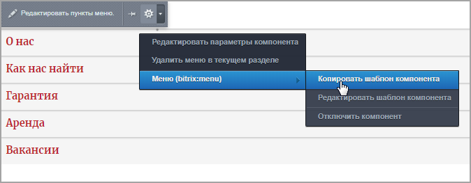
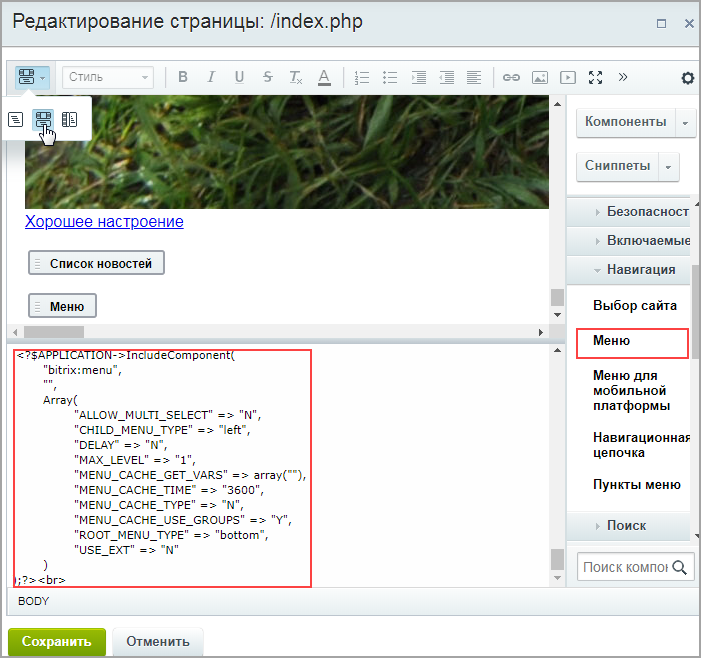
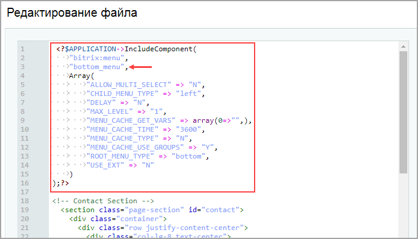

# Меню: кастомизация шаблона компонента

**Навигация**
- [← Оглавление курса](index.md)
- [← Предыдущий: 12754 — Детальный просмотр новости: шаблон страницы и компонента](lesson_12754.md)
- [Следующий: 4934 — Управление кодировкой страниц →](lesson_4934.md)

Официальная страница урока: https://dev.1c-bitrix.ru/learning/course/index.php?COURSE_ID=43&LESSON_ID=12770

До этого момента навигация на нашем тестовом сайте-лендинге осуществлялась с помощью

			html-якорей,


**Якорем** называется закладка с уникальным именем на определенном месте веб-страницы, предназначенная для создания перехода к ней по ссылке. Якоря удобно применять в документах большого объема, чтобы можно было быстро переходить к нужному разделу.

Для создания якоря следует вначале сделать закладку в соответствующем месте и дать ей имя при помощи атрибута `name` тега `<a>`. В качестве значения `href` для перехода к этому якорю используется имя закладки с символом решетки (#) впереди.

[Подробнее](http://htmlbook.ru/samhtml/yakorya)...

		 что довольно удобно для переходов на "длинной" странице.


Однако для более масштабных сайтов, имеющих несколько разделов, появляется необходимость создать

			меню


В общем случае задача формирования меню включает:

**-** выделение HTML элементов для построения меню;

**-**создание шаблона меню (создание шаблона компонента **Меню**);

**-**включение функции показа меню (вызов компонента **Меню**) в общем шаблоне ("прологе" и "эпилоге");

**-**заполнение меню в соответствии со структурой сайта.

[Подробнее](lesson_3254.md)...

		 в качестве средства навигации по сайту.

В этом уроке разберём создание

			статического


Как вы уже знаете, в *"1С-Битрикс: Управление сайтом"* информация делится на два вида - статическую и динамическую . Статическая вводится непосредственно на странице сайта, меняется редко и вручную. Динамическая размещается с помощью программного кода, меняется автоматически в зависимости от изменений в источнике данных - инфоблоке. Кроме того, эти два типа информации отличаются способами хранения, вывода и обработки.

[Подробнее](https://dev.1c-bitrix.ru/learning/course/index.php?COURSE_ID=34&LESSON_ID=10239)...

		 нижнего меню, выводящегося компонентом

			Меню

                    Компонент выводит меню указанного типа. Компонент является стандартным и входит в дистрибутив модуля.


						[Описание компонента «Меню» в пользовательской документации.](http://dev.1c-bitrix.ru/user_help/detail.php?ID=133381)

		 (понятия "нижнее", "верхнее" - условны, и влияют только на названия файлов и отображение при создании нового пункта; т.е. рассмотренное в данном уроке меню можно расположить в любой части сайта: и в шапке, и в подвале).

Итак, для создания меню выполним следующие шаги:

|  |
| --- |

#### 1. Кастомизация шаблона компонента Меню

- Скопируйте шаблон компонента **Меню**. Это можно сделать двумя способами:

  - В рамках файловой системы копированием папки Контент &gt; Структура сайта &gt; Файлы и папки &gt; bitrix &gt; templates &gt; [ваш шаблон] &gt; components &gt; bitrix &gt; [название компонента] &gt; [название шаблона компонента].
  - Средствами интерфейса системы, разместив на странице компонент и скопировав его с помощью команды
    			Копировать шаблон компонента
    
    		 (при включённом режиме **Правка**).
- Задайте скопированному шаблону новое название (переименуйте папку шаблона). Например, **bottom_menu**.
- В папке скопированного шаблона компонента **Меню** откройте в режиме редактирования файл **template.php**. Теперь нужно отредактировать этот шаблон в соответствии с исходным html-макетом сайта (т.е. согласно исходному файлу **index.html**):
  ```
  <?if (!defined("B_PROLOG_INCLUDED") || B_PROLOG_INCLUDED!==true)die();?>
  <?if (!empty($arResult)):?>
  <nav class="navbar navbar-expand-lg navbar-light">
  	<ul class="navbar-nav mx-auto">
  <?
  foreach($arResult as $arItem):
  	if($arParams["MAX_LEVEL"] == 1 && $arItem["DEPTH_LEVEL"] > 1)
  		continue;
  ?>
  	<?if($arItem["SELECTED"]):?>
  		<li class="nav-item"><a href="<?=$arItem["LINK"]?>" class="selected nav-link"><?=$arItem["TEXT"]?></a></li>
  	<?else:?>
  		<li class="nav-item"><a href="<?=$arItem["LINK"]?>" class="nav-link"><?=$arItem["TEXT"]?></a></li>
  	<?endif?>
  <?endforeach?>
  </ul>
  </nav>
  <?endif?>
  ```
  Добавлены служебные классы навигационной панели **navbar**, а также классы оформления:
  Все используемые классы и стили можно посмотреть в документации используемой библиотеки шаблонов (в нашем примере -
  			Bootstrap
  Навигационная панель.
  Документация и примеры для мощного и отзывчивого навигационного заголовка Bootstrap и навигационной панели. Включает поддержку брендинга, навигации и прочего, включая поддержку нашего плагина для сворачивания.
  [Подробнее](https://bootstrap-4.ru/docs/4.0/components/navbar/)...
  		).

  - navbar-expand-lg - горизонтальное расположение элементов на больших экранах (при уменьшении экрана элементы автоматически станут отображаться вертикальным списком);
  - navbar-light - светлая тема оформления;
  - mx-auto - выравнивание блока по центру по оси ОХ.
- Кроме того, у нас нет необходимости в специализированных стилях и картинках исходного шаблона компонента **Меню**. Поэтому можно удалить из папки нового шаблона файлы **style.css**, **style.min.css** и папку **images**.

|  |
| --- |

#### 2. Размещение компонента Меню в подвале сайта.

- Скопируем код вызова компонента. Это можно сделать следующими способами:

  - скопировать вызов [из документации](https://dev.1c-bitrix.ru/user_help/components/sluzhebnie/navigation/menu.php);
  - разместить на странице компонент **Меню**, и в
    			совмещенном режиме просмотра
    
    		 скопировать код вызова.
- Добавим скопированный код вызова в файл **footer.php** (Контент &gt; Структура сайта &gt; Файлы и папки &gt; bitrix &gt; templates &gt; [шаблон вашего сайта] ):
  
  В кавычках указывается название используемого шаблона компонента. В нашем случае **bottom_menu**.

**Примечание**: Подробнее о создании самого меню читайте в соответствующей

			главе.


В данном разделе приводятся основные принципы и правила создания и управления меню на сайте, в том числе описание файла данных и структуры шаблона меню. Также в разделе описывается возможность использования динамических меню.

[Подробнее](https://dev.1c-bitrix.ru/learning/course/index.php?COURSE_ID=43&CHAPTER_ID=04708&LESSON_PATH=3913.4564.4949.4708)...
