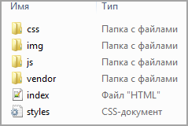
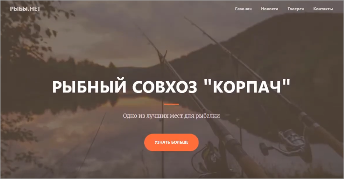

# Подготовка к работе

**Навигация**
- [← Оглавление курса](index.md)
- [← Предыдущий: 3537 — Work Area и разные шаблоны](lesson_3537.md)
- [Следующий: 12776 — Разделение шаблона на header, footer и work_area →](lesson_12776.md)

Официальная страница урока: https://dev.1c-bitrix.ru/learning/course/index.php?COURSE_ID=43&LESSON_ID=12774

Итак, нам необходимо внедрить заранее подготовленный  макет сайта с

			блочной вёрсткой.

**Блочная верстка** — это подход, при котором сайт строят на основе блоков,

в качестве которых выступают теги `div`.

**Особенности тегов `div`:**

**-** это блочный элемент, и если у него не задана ширина, то

растягивается на всю ширину окна браузера;

**-** высота блока равна содержимому, если она не задана. Высота пустого

блока 0 px, поэтому он не виден;

**-** не имеет оформления. Нужно задать ему стили в CSS, чтобы увидеть его;

**-** не несет смысловой нагрузки, это просто способ структурировать сайт;

**-** может содержать любое количество вложенных элементов (можно

вкладывать другие блоки `div`, заголовки, параграфы,

изображения и многие другие элементы).

Скачать [тестовые материалы](https://dev.1c-bitrix.ru/docs/chm_files/doc.zip).

В архиве  макета сайта

			содержатся:

- папки со стилями шаблона;
- папка с js-файлами;
- папка с картинками;
- html-макет индексной страницы сайта (**index.html**);
- файл с главными стилями шаблона (**styles.css**);
- csv-файл с демоданными для импорта (**demo.csv**).

Разархивируйте скачанный архив с тестовыми материалами (**doc.zip**).

Откройте в браузере файл **index.html** из папки со скачанным архивом шаблона. В окне браузера откроется тестовый дизайн.

Это дизайн главной страницы

			сайта-лендинга.

**Целевая страница** (англ. landing page, также «посадочная страница») — веб-страница, основной задачей которой является сбор контактных данных целевой аудитории. Используется для усиления эффективности рекламы, увеличения аудитории. Целевая страница обычно содержит информацию о товаре или услуге.

[Подробнее](https://ru.wikipedia.org/wiki/%D0%A6%D0%B5%D0%BB%D0%B5%D0%B2%D0%B0%D1%8F_%D1%81%D1%82%D1%80%D0%B0%D0%BD%D0%B8%D1%86%D0%B0)...

		 Она состоит из основной заставки с названием сайта, навигации по странице (верхнее горизонтальное меню, кнопки **РЫБЫ.НЕТ** и **Узнать больше**), фотогалереи, блока новостей, контактной информации и копирайта.

Пропишем требования, которым должен соответствовать сайт с внедрённым шаблоном.

#### Техническое задание:

- Основная заставка и навигация должны располагаться в шапке сайта (header).
- Копирайт должен располагаться в подвале сайта (footer).
- Новости сайта нужно выводить из инфоблока новостей с помощью компонентов. Для страницы детального вывода новости создать упрощенный шаблон.
- Остальную информацию считать статической и разместить на индексной странице (тогда контент-менеджер сможет её изменять в публичном разделе, включив режим **Правки**).
- В качестве дополнительного задания: создать нижнее меню.
