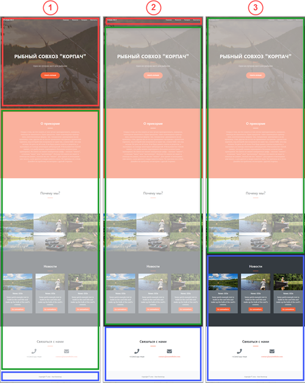

# Разделение шаблона на header, footer и work_area

**Навигация**
- [← Оглавление курса](index.md)
- [← Предыдущий: 12774 — Подготовка к работе](lesson_12774.md)
- [Следующий: 12720 — Шаблон сайта (создание папки шаблона) →](lesson_12720.md)

Официальная страница урока: https://dev.1c-bitrix.ru/learning/course/index.php?COURSE_ID=43&LESSON_ID=12776

Первым делом обычно определяют, какие части вёрстки главной страницы могут присутствовать и на других страницах сайта. Другими словами, разбивают страницу на три части:

1. **header** (шапка, хедер, пролог) - верхняя часть дизайна; хранится в файле **header.php** шаблона сайта (Контент &gt; Структура сайта &gt; Файлы и папки &gt; bitrix &gt; templates &gt; [ваш шаблон] );
2. **WORK_AREA** - рабочая область, содержащая основной контент; при создании страниц заполняется как раз эта область (например, Контент &gt; Структура сайта &gt; Файлы и папки &gt; index.php );
3. **footer** (подвал, футер, эпилог) - нижняя часть дизайна; хранится в файле  **footer.php** шаблона сайта  (Контент &gt; Структура сайта &gt; Файлы и папки &gt; bitrix &gt; templates &gt; [ваш шаблон] ).

Границы зон определяются субъективно - нет чёткого требования, какая именно часть сайта должна находиться в каждой из частей (и даже не обязательно заполнять все три зоны). Главное - соблюсти последовательность этих зон.

Рассмотрим часть возможных вариантов разделения сайта на зоны, обозначенные цветами:

- **красный** - header (шапка сайта)
- **зелёный** - WORK_AREA (рабочая зона, т.е. основной контент)
- **синий** - footer (подвал сайта)

#### Описание приведённых вариантов:

| 1 | - в шапке - основная заставка с названием сайта и навигация по странице (верхнее горизонтальное меню, кнопки **РЫБЫ.НЕТ** и **Узнать больше**) - в подвале - копирайт |
| --- | --- |
| 2 | - в шапке - горизонтальное верхнее меню и кнопка **РЫБЫ.НЕТ** - в подвале - блок с контактами и копирайт |
| 3 | - в шапке сайта нет видимой части кода (то есть в файле **header.php** есть только служебный код) - в подвале - блок новостей, контакты и копирайт |

В примере будем использовать разбивку 1.
