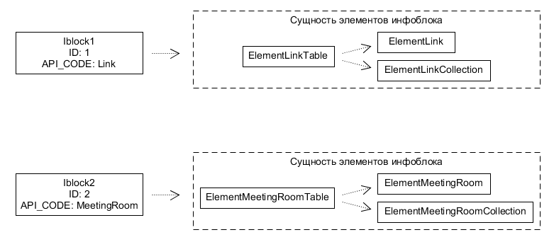
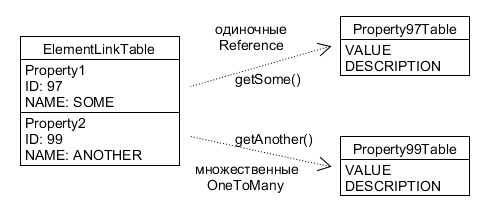
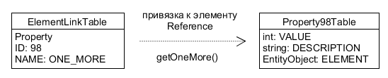

# Концепция и архитектура

**Навигация**
- [← Оглавление курса](index.md)
- [← Предыдущий: 2741 — Постраничная навигация](lesson_2741.md)
- [Следующий: 12868 — Чтение и запись →](lesson_12868.md)

Официальная страница урока: https://dev.1c-bitrix.ru/learning/course/index.php?COURSE_ID=43&LESSON_ID=12866

Каждый инфоблок является самостоятельным типом данных со своим собственным набором свойств. В ORM он представляется **отдельной сущностью**:



Имя классов сущности включает в себя значение нового поля из настроек инфоблока **Символьный код API**. За счет этого кода обеспечивается уникальность классов вне зависимости от ID и среды окружения.

**Важно**! Чтобы начать использовать ORM для конкретного инфоблока, ему необходимо задать через административный интерфейс **Символьный код API** (поле API_CODE). Это строка от **1** до **50** символов, начинающаяся с буквы и состоящая из латинских букв и цифр.

**Свойства** - это не просто скалярные значения, а отношения с отдельными мини-сущностями с двумя ключевыми полями: **VALUE** и **DESCRIPTION**. Единичные свойства представляются в элементе инфоблока полем **Reference**, множественные - **OneToMany**:



В сущности некоторых типов свойств могут быть добавлены дополнительные поля, например ссылка на привязанный элемент инфоблока:



## Подробнее о базовых типах свойств

В обычном случае сущность свойства состоит из двух полей - **VALUE** (тип зависит от свойства) и, если определено настройками свойства, **DESCRIPTION** (StringField).


| Сущность | VALUE | DESCRIPTION | Дополнительное поле |
| --- | --- | --- | --- |
| Строка | StringField | StringField | Нет дополнительных полей. |
| Число | IntegerField | StringField | Нет дополнительных полей. |
| Список | IntegerField | StringField | ITEM Reference (\Bitrix\Iblock\PropertyEnumerationTable) |
| Файл | IntegerField | StringField | FILE Reference (\Bitrix\Main\FileTable) |
| Привязка к элементу | IntegerField | StringField | ELEMENT Reference (сущность элемента инфоблока) |
| Привязка к разделу | IntegerField | StringField | SECTION Reference (\Bitrix\Iblock\SectionTable) |

Ориентироваться среди большого количества свойств поможет

			механизм аннотаций

                    Большая часть методов Объекта и Коллекции - виртуальные, обрабатываются через magic вызов __call. В то же время они сделаны для интуитивно понятных и говорящих именованных методов, и без автокомплита в IDE их ценность резко снижается.

Чтобы IDE все же знала об их существовании и помогала ориентироваться в большом количестве классов и методов, мы сделали для нее специальный служебный файл с аннотациями всех сущностей.

[Подробнее ...](lesson_11733.md)

		. При индексации модуля iblock все инфоблоки будут описаны в виде сущностей ORM. Для получения подсказок в коде необходимо явно обозначить класс инфоблока:

```

// подключение модуля инфоблоков
\Bitrix\Main\Loader::includeModule('iblock');

// вводные данные
$iblockId = 32;
$iblockElementId = 678;

// объект инфоблока
$iblock = \Bitrix\Iblock\Iblock::wakeUp($iblockId);

// объект элемента
/** @var \Bitrix\Iblock\Elements\EO_ElementLink $element */
$element = $iblock->getEntityDataClass()::getByPrimary($iblockElementId)
	->fetchObject();

// получение свойства SOME_STRING
$element->getSomeString();
```

Автолоадинг классов автоматически обработает вызов `getEntityDataClass()`, т.е. вам не придется предварительно компилировать сущность инфоблока.

Если вы хотите использовать подсказки IDE по типизации элемента инфоблока, необходимо явно задать его класс аннотацией вида:

- для элемента;
  ```
  /** @var \Bitrix\Iblock\Elements\EO_ElementLink $element */
  ```
- для коллекции,
  ```
  /** @var \Bitrix\Iblock\Elements\EO_ElementLink_Collection $element */
  ```

 где **Link** в имени класса - **символьный код API** инфоблока.

**Внимание!** Символьный код свойства не должен совпадать с названием поля элемента инфоблока. В противном случае будет невозможно работать со свойством  в объектном ORM по имени (символьному коду).
