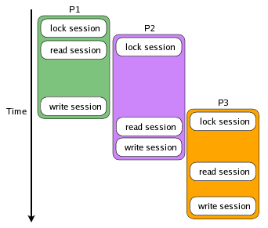

# Сессия разделенный режим (hot&cold)

**Навигация**
- [← Оглавление курса](index.md)
- [← Предыдущий: 14018 — Сессионный кеш (Local Session)](lesson_14018.md)
- [Следующий: 14026 — Настройка хранения данных сессии →](lesson_14026.md)

Официальная страница урока: https://dev.1c-bitrix.ru/learning/course/index.php?COURSE_ID=43&LESSON_ID=14024

Тему урока можно изучить в новом формате — [в документации по Bitrix Framework](https://docs.1c-bitrix.ru/pages/performance/hot-and-cold-session.html). В ней улучшена структура, описание, примеры.

#### Введение

По умолчанию [сессия](https://www.php.net/manual/en/book.session.php) в PHP поддерживает последовательный доступ. Это означает, что параллельные хиты, которые используют сессию, блокируются и выстраиваются в очередь.

Это удобно для разработчиков, но не всегда хорошо для пользователей, так как интерфейс и отклик приложения может быть с задержками. Встаёт задача уменьшить количество блокировок сессий.

#### Общий принцип

Один из вариантов решения как избежать блокировки - это написать [SessionHandlerInterface](https://www.php.net/manual/en/class.sessionhandlerinterface.php) и не делать там просто блокировку. Но этот вариант не подходит, так как есть большое количество существующих использований в коде Bitrix Framework и партнеров.

Выбран другой путь:

1. Данные, которые используются на каждом хите выделены в **KernelSession**-сессию (hot данные). Это данные для аутентификации, авторизации и другие связанные с ядром.
2. Всё остальное, что хранится в сессии -- это cold-данные.
3. KernelSession-сессия неблокирующая и работает по принципу "кто последний, того и тапки".
4. Всё остальное -- это обычная блокирующая сессия.
5. Блокирующая сессия стартует только при первом обращении к cold-данным.

#### Разделение хранения cold&hot

Хранилище для KernelSession-сессии -- это шифрованные cookies.

Хранилище для cold-сессии -- это [обычная сессия](https://dev.1c-bitrix.ru/learning/course/index.php?COURSE_ID=43&CHAPTER_ID=014028), принцип работы, как и раньше, поэтому данные могут храниться в Redis, Memcache, БД.

#### Настройка хранения

Чтобы включить разделенный режим сессии, нужно в `bitrix/.settings.php` изменить `session[mode]` на **separated**. И добавить `'kernel' => 'encrypted_cookies'`, и `'lifetime' => 14400,`.

Примеры можно посмотреть [здесь](lesson_14026.md).
