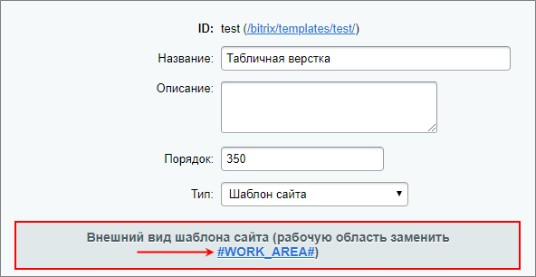

# Добавление кода тестового дизайна в шаблон

**Навигация**
- [← Оглавление курса](index.md)
- [← Предыдущий: 2525 — Приёмы верстки](lesson_2525.md)
- [Следующий: 1923 — Добавление графики и стилей →](lesson_1923.md)

Официальная страница урока: https://dev.1c-bitrix.ru/learning/course/index.php?COURSE_ID=43&LESSON_ID=1906

### Служебная часть

Задание внешнего вида шаблона происходит в поле **Внешний вид шаблона сайта**.


Вставьте в поле следующий служебный код для шаблона:

- Верхняя часть:
  ```
  <?if(!defined("B_PROLOG_INCLUDED") || B_PROLOG_INCLUDED!==true)die();
  ?><!DOCTYPE html PUBLIC "-//W3C//DTD HTML 4.01 Transitional//EN">
  <html>
  <head>
  <meta http-equiv="Content-Type" content="text/html; charset=<?echo LANG_CHARSET;?>">
  <?$APPLICATION->ShowMeta("keywords");?>
  <?$APPLICATION->ShowMeta("description");?>
  <title><?$APPLICATION->ShowTitle()?></title>
  <?$APPLICATION->ShowHead()?>
  </head>
  <body>
  ```
- Нижняя часть:
  ```
  </body>
  </html>
  ```
- Для того, чтобы в шаблоне подключалась Административная панель, введите код административной панели после открывающего тега `body`:
  ```
  <?$APPLICATION->ShowPanel();?>
  ```

### Добавление кода шаблона

Код шаблона добавляем в то же поле - **Внешний вид шаблона сайта.**

- Откройте в браузере файл **index.html** из папки с ранее скачанным архивом шаблона. В окне браузера откроется тестовый дизайн:
  

Теперь перенесём html-код дизайна в поле **Внешний вид шаблона сайта**.

- Откройте исходный код страницы, выделите весь код расположенный между тегами`<body> </body>` (без самих тегов) и скопируйте его в буфер.
- Вставьте код в поле **Внешний вид шаблона сайта** перед закрывающим тегом `</body>` (аккуратно, не удалите служебный код показа административной панели)
- В коде `<body>` шаблона нет заданных дизайнером параметров. Вставьте в этот тег параметры из аналогичного тега файла **index.html**: `BGCOLOR="#FFFFFF" TEXT="#000000" leftmargin="0" topmargin="0" marginwidth="0" marginheight="0"`.

### Задание разделителя

Установите разделитель `#WORK_AREA#` нажав на

			кнопку с соответствующим названием

                    

		. Он должен стоять строго перед меткой ``.

**Примечание**: Найти тот или иной нужный участок кода на большой странице бывает достаточно сложно, но в исходном коде страницы нашего тестового шаблона расставлены специальные метки для облегчения поиска. Их общий вид:

```
<!-- #Begin******** -->
<!-- #End******** -->
```

где под звездочками будет стоять название функции, которую имитирует данный код. В нашем конкретном случае это будет название `_Article`. То есть метка в данном случае будут иметь вид:

```
<!-- #Begin_Article -->
```

Теперь можно сохранять созданный шаблон. До сих пор это было невозможно, так как был не задан разделитель `#WORK_AREA#`.
