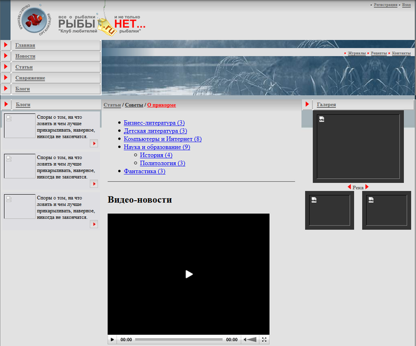
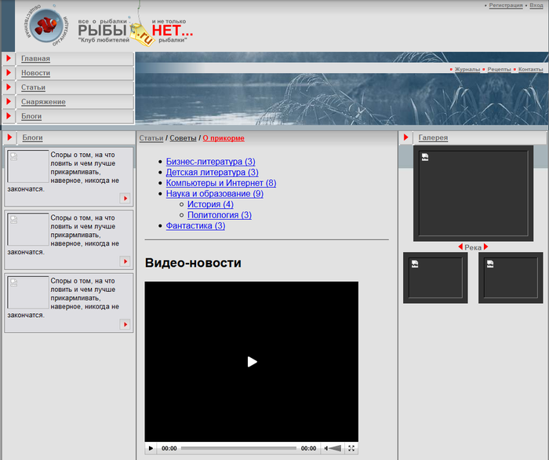

# Добавление графики и стилей

**Навигация**
- [← Оглавление курса](index.md)
- [← Предыдущий: 1906 — Добавление кода тестового дизайна в шаблон](lesson_1906.md)
- [Следующий: 2748 — #WORK_AREA# – Рабочая область →](lesson_2748.md)

Официальная страница урока: https://dev.1c-bitrix.ru/learning/course/index.php?COURSE_ID=43&LESSON_ID=1923

Для полного и правильного отображения дизайна нужно добавить графику и стили.

### Графика

Теоретически картинки можно хранить в любой папке системы. Однако лучше размещать их в специальной папке самого шаблона.

- Откройте папку, где расположен шаблон (`/bitrix/templates/test`).
- Создайте в ней папку `/images`.
  **Примечание**: Поместить картинки можно и в корневой папке `/images`. Но размещение изображений по предлагаемому нами варианту имеет одно преимущество. При копировании (или экспорте) шаблона вам не придется заново импортировать картинки в новый шаблон. Копия создастся сразу с папкой с картинками.
- [Загрузите](http://dev.1c-bitrix.ru/learning/course/index.php?COURSE_ID=35&LESSON_ID=1932) графические файлы из архива дизайна. Файлы размещены в папке `Сайт\izo\`

Теперь нам осталось только изменить пути до картинок в кодах шаблона. В исходном дизайне пути до картинок прописаны как `izo/`. Поменяйте их на `/bitrix/templates/test/images/`.

**Примечание**: Ручная замена утомительна. Произведите такую замену в текстовом редакторе с функцией автоматической замены (Bred2, AkelPad и подобных, но не в MS Word), либо в используемой вам среде разработки типа **PHP storm**.

- Сохраните изменения.
- Откройте сайт с помощью кнопки **Предпросмотр**.

Вы увидите, что теперь все картинки, кроме картинок в колонках Блоги и Галерея, а так же картинки в теле статьи «О прикорме», отображаются. При этом не прорисованы границы, и на сайте отображен текст (перечисление разделов), видео и картинки не предусмотренные в дизайне.

Картинки в колонках Блоги и Галерея, а так же картинка в теле статьи «О прикроме» не отображаются потому, что они не загружены на сайт. (Они были расположены не в папке izo.) На это можно не обращать внимание, так как все равно нам удалять участки кода с этими картинками и заменять их на компоненты «1С-Битрикс: Управление сайтом».

К ненужному тексту, видео и картинкам мы еще вернемся [позже](lesson_2748.md). (Кстати, появившийся «самостоятельно» текст может быть совсем не таким, как на нашей иллюстрации – это зависит от того какому сайту с каким содержанием вы применили шаблон.)

### Стили

- Откройте на редактирование шаблон сайта на закладке **Стили шаблона**.
  Вы увидите, что поле **Файл стилей шаблона (template_styles.css)** пустое, то есть не задано никаких стилей. Стили применяемые в проекте указаны в файле `Сайт\izo\code.css`.
- Перенесите стили из файла в это поле.
- Сохраните изменения.

Результат:

