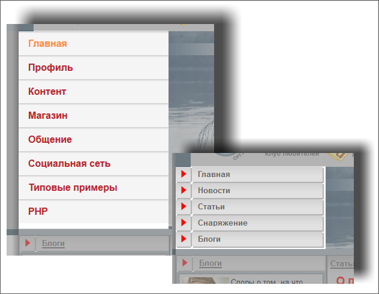
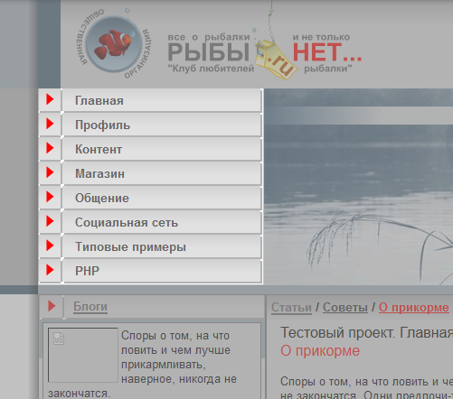

# Левое меню

**Навигация**
- [← Оглавление курса](index.md)
- [← Предыдущий: 4962 — Кастомизация шаблона компонента](lesson_4962.md)
- [Следующий: 2094 — Нижнее горизонтальное меню →](lesson_2094.md)

Официальная страница урока: https://dev.1c-bitrix.ru/learning/course/index.php?COURSE_ID=43&LESSON_ID=2069

Откройте для редактирования шаблон сайта. Первым делом нужно определить часть html-кода, отвечающего за один элемент меню. В нашем тестовом дизайне код, отвечающий за меню расположен между:

```
<!-- #Begin_Left_Menu -->
<!-- #End_Left_Menu -->
```

#### Добавление компонента

- Скопируйте код, имитирующий меню в отдельный текстовый файлик. Он нам понадобится.
- Удалите из кода шаблона код меню.
- Откройте страницу документации с описанием компонента
  			Меню
                      Компонент выводит меню указанного типа. Компонент является стандартным и входит в дистрибутив модуля.
  						[Описание компонента «Меню» в пользовательской документации.](http://dev.1c-bitrix.ru/user_help/detail.php?ID=133381)
  		  (bitrix:menu).
- Перенесите код вызова компонента в шаблон сайта между указанными метками.
- Сохраните внесенные изменения.

При просмотре с публичной части вы увидите, что изменилось оформление меню (стало таким же как и в демосайте) и пункты меню (компонент автоматически вывел пункты меню из демосайта). При необходимости [настройте пункты меню](https://dev.1c-bitrix.ru/learning/course/index.php?COURSE_ID=34&LESSON_ID=10247#stat).

Меню совершенно не подходит по оформлению. Слева что получилось, справа - что должно быть:



#### Кастомизация шаблона

- [Скопируйте шаблон](lesson_2829.md#tamplate_edit) компонента Меню в папку тестового шаблона. Откроется форма для редактирования шаблона
- В шаблоне компонента само меню строится через применение списка с помощью тегов `<ul> <li>элемент маркированного списка</li> </ul>`. Мы от списка откажемся, у нас само меню будет строиться через таблицы с помощью тегов таблиц. Поэтому удалите теги `<ul>`, `</ul>`. Позже в шаблоне компонента мы заменим и теги `<li>`, `</li>`.
  Удалите атрибут с указанием на стиль `class="left-menu"`, так как мы его применять не будем.
  Откройте текстовый файл, где вы сохраняли вырезанный html-код таблиц меню оригинального дизайна. Каждый пункт меню - это отдельная таблица. Посмотрим код оформления пункта меню **Главная**:
  ```
  <table width="99%" cellspacing="0" cellpadding="0" border="0">
  	<tbody>
  		<tr>
  			<td width="25" height="25" background="/bitrix/templates/test/images/fot_tabl_centr.jpg"></td>
  			<td width="1" valign="top" height="25" background="/bitrix/templates/test/images/fot_tabl_c.gif"></td>
  			<td height="25" background="/bitrix/templates/test/images/fot_tabl_centr.jpg"><b><a href="#" class="text" ><font size="2" color="#666666">Главная</font></a></b></td>
  			<td width="1" valign="top" height="25" background="/bitrix/templates/test/images/fot_tabl_c.gif"></td>
  		</tr>
  		<tr>
  			<td height="1" background="/bitrix/templates/test/images/fot_tabl_c.gif"></td>
  			<td width="1" height="1"></td>
  			<td height="1" background="/bitrix/templates/test/images/fot_tabl_c.gif"></td>
  			<td width="1" height="1"></td>
  		</tr>
  	</tbody>
  </table>
  ```
  HTML-код представляет собой таблицу с двумя строками. Вторая строка – декоративная. Сама ссылка должна формироваться в первой строке, если быть точным в третьей ячейке первой строки.
  В эту ячейку и надо нам отредактировать.
  Удалите из третьей ячейки из строки `<b><a href="#" class="text"><font size="2" color="#666666">Главная</font></a></b>` теги `<b></b>`; а также часть кода `<font size="2" color="#666666">Главная</font>`. Мы удалили параметры форматирования текста, которые будут определяться теперь не шаблоном, а стилями.
  Замените параметр **class="text"** на **class="left-menu"**. Этим мы указали название стиля, который должен применяться для названий разделов в меню. Теперь нам нужно заменить **#** - символ адреса ссылки на php-код, объясняющий системе, где искать название раздела и ссылку на него.
  ## Структура шаблона
  Чтобы вам было легче понимать, как построен шаблон меню, необходимо рассмотреть его структуру. В колонке слева – действие, в колонке справа обозначены теги, которые задают данное действие.
  | \| **Действие** \| **код** \|<br>\| --- \| --- \|<br>\| Проверка включения \| &lt;?if (!defined("B_PROLOG_INCLUDED") \\|\\| B_PROLOG_INCLUDED!==true)die();?&gt; \|<br>\| Старт скрипта \| &lt;?if (!empty($arResult)):?&gt; \|<br>\| Открытие тега UL - ненумерованный список \| &lt;ul class="…."&gt; \|<br>\| Старт цикла поиска \| &lt;?foreach ($arResult as $arItem):?&gt; \|<br>\| Вывод ссылки \| &lt;?if($arItem["SELECTED"]):?&gt; \|<br>\| Ссылка активная \| &lt;li&gt;&lt;a href="&lt;?=$arItem["LINK"]?&gt;" class="selected"&gt;&lt;?=$arItem["TEXT"]?&gt;&lt;/a&gt;&lt;/li&gt; \|<br>\| Проверка на продолжение цикла \| &lt;?else:?&gt; \|<br>\| Ссылка неактивная \| &lt;li&gt;&lt;a href="&lt;?=$arItem["LINK"]?&gt;"&gt;&lt;?=$arItem["TEXT"]?&gt;&lt;/a&gt;&lt;/li&gt; \|<br>\| Завершение вывода ссылки \| &lt;?endif?&gt; \|<br>\| Завершение цикла поиска \| &lt;?endforeach?&gt; \|<br>\| Закрытие тега UL - ненумерованный список \| &lt;/ul&gt; \|<br>\| Завершение скрипта \| &lt;?endif?&gt; \| |
  | --- |
  Просматривая структуру шаблона можно увидеть, как отображаются в php-коде шаблона ссылки, на которые происходит переход при выборе пункта меню. Они располагаются между html-тегами `<LI>`, которые определяют отдельный элемент списка. Элементов списка – два, так как в шаблоне предусмотрено выделение активной ссылки. В исходном дизайне такое выделение не предусмотрено. Это значит, что мы должны объединить представление выбранной и простой ссылки в php-коде.
  То есть, вместо
  ```
  <?if($arItem["SELECTED"]):?>
  <li><a href="<?=$arItem["LINK"]?>" class="selected"><?=$arItem["TEXT"]?></a></li>
  	<?else:?>
  <li><a href="<?=$arItem["LINK"]?>"><?=$arItem["TEXT"]?></a></li>
  	<?endif?>
  ```
  php-код, вызывающий ссылку и текст должен стать таким:
  ```
  <?=$arItem["LINK"]?>"<?if($arItem["SELECTED"]):?><?else:?><?endif?>"><?=$arItem["TEXT"]?>
  ```
  В коде исходного дизайна вместо **#** поставьте указанный php-код.

Теперь можно переходить к переносу html-кодов, определяющих внешний вид строки меню. PHP-код и html-код не должны пересекаться между собой, а должны быть включены друг в друга. Потому нам нужно сейчас очень внимательно подходить к размещению тегов в шаблоне. Прежде всего, разместим теги таблицы.  Так как меню должно формироваться внутри таблицы, значит php-код, запускающий цикл, должен лежать внутри таблицы.

- Вставьте открывающий тег `<table width="99%" cellspacing="0" cellpadding="0" border="0">` перед php функцией *foreach*, задающей цикл.
- Вставьте тег `</table>`, закрывающий таблицу сразу за функцией *endforeach*, завершающей php-цикл.

Теперь цикл у нас формируется в рамках таблицы, заданной дизайном.

Так как мы уже интегрировали код собственно php-цикла в html-код, то нам осталось только вставить полученную html-конструкция его между тегами начала и конца php-цикла.

- Выделите в исходном html-коде дизайна меню теги строк таблицы:
  ```
  <tr>
  	<td width="25" height="25" background="/bitrix/templates/test/images/fot_tabl_centr.jpg"></td>
  	<td width="1" valign="top" height="25" background="/bitrix/templates/test/images/fot_tabl_c.gif"></td>
  	<td height="25" background="/bitrix/templates/test/images/fot_tabl_centr.jpg"><a class="left-menu" href="<?=$arItem["LINK"]?>"<?if($arItem["SELECTED"]):?><?else:?> <?endif?>"> <?=$arItem["TEXT"]?> </a></td>
  	<td width="1" valign="top" height="25" background="/bitrix/templates/test/images/fot_tabl_c.gif"></td>
  </tr>
  <tr>
  	<td height="1" background="/bitrix/templates/test/images/fot_tabl_c.gif"></td>
  	<td width="1" height="1"></td>
  	<td height="1" background="/bitrix/templates/test/images/fot_tabl_c.gif"></td>
  	<td width="1" height="1"></td>
  </tr>
  ```
- Замените этим кодом следующий код:
  ```
  <?if($arItem["SELECTED"]):?>
  <li><a href="<?=$arItem["LINK"]?>" class="selected"><?=$arItem["TEXT"]?></a></li>
  <?else:?>
  <li><a href="<?=$arItem["LINK"]?>"><?=$arItem["TEXT"]?></a></li>
  <?endif?>
  ```
- Сохраните внесенные изменения.

#### Задание стилей

- Откройте для редактирования файл с CSS стилями шаблона. В этом файле видно для вывода текста используется стиль **left-menu**.
- Переименуйте стиль **ul.left-menu** в просто **.left-menu**.
- Вставьте в параметры стиля left-menu следующие строки:
  ```
  font-size:80%;
  color:#666666;
  font-weight:bold;
  text-decoration:none;
  ```
- Так как у нас по дизайну не предусмотрены другие стили оформления (активной ссылки, посещенной ссылки, подсветки ссылки), то все остальные стили просто удалите.
- Сохраните внесенные изменения.

Результат работы:


