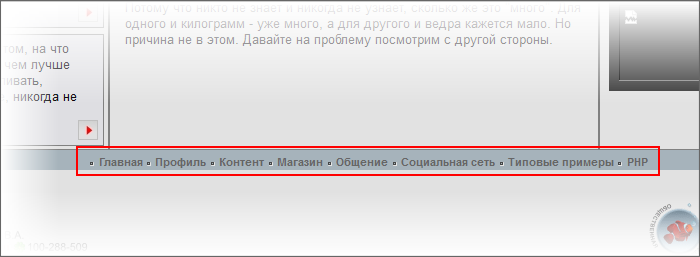

# Нижнее горизонтальное меню

**Навигация**
- [← Оглавление курса](index.md)
- [← Предыдущий: 2069 — Левое меню](lesson_2069.md)
- [Следующий: 4961 — Верхнее частичное меню →](lesson_4961.md)

Официальная страница урока: https://dev.1c-bitrix.ru/learning/course/index.php?COURSE_ID=43&LESSON_ID=2094

Левое вертикальное меню у нас будет меняться в зависимости от открытого раздела. Но для упрощения перемещения между разделами заказчик пожелал сохранить возможность доступа к любому разделу с любой страницы сайта. С этой целью нужно иметь одно меню, где-нибудь в не очень мешающемся месте, в котором будут выводиться ссылки на все основные разделы сайта. Таким у нас будет нижнее горизонтальное меню.

#### Добавление компонента

- Откройте для редактирования шаблон тестового сайта.
- Скопируйте в отдельный текстовый файл а затем удалите код таблицы, расположенной между метками:
  ```
  <!-- #Begin_down_Menu -->
  <!-- #End_down_Menu -->
  ```
- Перейдите в режим визуального редактирования.
- Добавьте на то место, где находилась эта таблица компонент **Меню** так, как мы это уже делали с левым меню.
- Откройте для редактирования диалог настроек параметров компонента. В отличие от левого меню здесь нам нужно их настроить.
- В поле **Тип меню** для первого уровня выберите **down** (Нижнее).
  **Примечание**: Такого [типа меню](https://dev.1c-bitrix.ru/learning/course/index.php?COURSE_ID=34&LESSON_ID=10239#type) в дистрибутиве по умолчанию нет. Мы предполагаем что вы его создали заранее.
- Сохраните внесенные изменения.

- Скопируйте в место между этими тегами код вызова компонента **Меню**, так же как и в случае с левым меню.
- Параметру **ROOT_MENU_TYPE** установите значение `down`. Этим мы назначили новый тип меню для этого компонента.
- Сохраните внесенные изменения.

#### Создание меню

[Создайте](https://dev.1c-bitrix.ru/learning/course/index.php?COURSE_ID=34&LESSON_ID=10247) нижнее меню. Оно должно повторять разделы левого.

После этого вы увидите на месте нижнего горизонтального меню то же самое системное меню по умолчанию. Нам надо его модифицировать. Но опять же, системный шаблон лучше не трогать.

#### Кастомизация шаблона компонента


- Скопируйте шаблон компонента по умолчанию в текущий шаблон сайта, как мы это делали с левым меню.
- Откройте для редактирования шаблон компонента.
- Из скопированного исходного кода вставьте в шаблон вместо кода `<ul class="left-menu">` открывающий код таблицы:
  ```
  <table width="1024" height="10" cellspacing="0" cellpadding="0" border="0" class="text">
  ```
- Установите закрывающий тег таблицы вместо кода `</ul>`
- Замените `class="text"` на  `class="down-menu"`. (Пусть такое имя будет у стилей для нижнего меню).
- Перенесите этот параметр `class="down-menu"` в строку
  ```
  <a href="<?=$arItem["LINK"]?>"><?=$arItem["TEXT"]?></a>
  ```
  	после открывающего тега `<a>`/
- Повторите последние действия для строки
  ```
  <a href="<?=$arItem["LINK"]?>" class="selected"><?=$arItem["TEXT"]?></a>
  ```
- В параметре `class="down-menu"` этой строки добавьте букву **а** для стиля активной ссылки.
- Задайте открывающий тег строки таблицы сразу за открывающим тегом таблицы и закрывающий тег строки перед закрывающим тегом таблицы.
- Задайте открывающий тег ячейки с параметром `align="center"` на месте открывающего тега `<li>` отдельного элемента списка.  И задайте закрывающий тег ячейки на место закрывающего тега отдельного элемента списка.
- Удалите лишнюю пару тегов отдельного элемента списка
- Добавьте код картинки из текстового файла с исходным кодом (``) в код шаблона после тега `<td align="center">`.
- Сохраните внесенные изменения.


#### Кастомизация стилей

- Откройте для редактирования стили шаблона компонента.
- Отредактируйте файл стилей по аналогии с тем, как это делалось в левом меню.

Результат работы:


