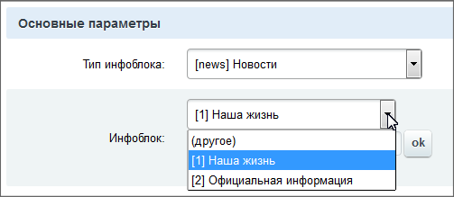
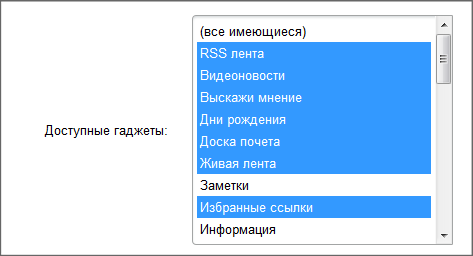

# Параметры компонента

**Навигация**
- [← Оглавление курса](index.md)
- [← Предыдущий: 2828 — Описание компонента](lesson_2828.md)
- [Следующий: 2829 — Шаблоны компонента →](lesson_2829.md)

Официальная страница урока: https://dev.1c-bitrix.ru/learning/course/index.php?COURSE_ID=43&LESSON_ID=2132

В файле **.parameters.php** содержится описание входных параметров компонента. Данные файла нужны исключительно для создания формы ввода свойств компонента в среде *Bitrix Framework* (например, в визуальном редакторе). Это описание применяется для работы с компонентом, а также при работе в режиме редактирования сайта. При работе самого компонента (при обращении к странице, на которой расположен компонент) описание не используется и указанный файл не подключается. Для комплексного компонента в этом файле задаются параметры простых компонентов, входящих в состав комплексного. Также здесь будут задаваться и настройки ЧПУ.


Файл **.parameters.php** должен находиться в папке компонента. Языковой файл подключается автоматически (должен лежать в папке `/lang/<язык>/.parameters.php`, относительно папки компонента).

## Подсказка по параметрам

К параметрам можно писать подсказки, достаточно в языковой файл добавить сообщение с постфиксом "_TIP":

```
$MESS["SORT_BY1_TIP"] = "Это подсказка для первой сортировки";
```

В файле определяется массив `$arComponentParameters`, который описывает входные параметры компонента. Если необходимо, производится выборка каких-либо дополнительных данных. Например, для формирования выпадающего списка типов информационных блоков (входной параметр `IBLOCK_TYPE_ID`) выбираются все активные типы.

Структура типичного файла **.parameters.php** (на примере компонентов, работающих с модулем **Информационные блоки**):


```
<?
CModule::IncludeModule("iblock");

$dbIBlockType = CIBlockType::GetList(
	array("sort" => "asc"),
	array("ACTIVE" => "Y")
);
while ($arIBlockType = $dbIBlockType->Fetch())
{
	if ($arIBlockTypeLang = CIBlockType::GetByIDLang($arIBlockType["ID"], LANGUAGE_ID))
		$arIblockType[$arIBlockType["ID"]] = "[".$arIBlockType["ID"]."] ".$arIBlockTypeLang["NAME"];
}

$arComponentParameters = array(
	"GROUPS" => array(
		"SETTINGS" => array(
			"NAME" => GetMessage("SETTINGS_PHR")
		),
	"PARAMS" => array(
		"NAME" => GetMessage("PARAMS_PHR")
		),
	),
	"PARAMETERS" => array(
		"IBLOCK_TYPE_ID" => array(
			"PARENT" => "SETTINGS",
			"NAME" => GetMessage("INFOBLOCK_TYPE_PHR"),
			"TYPE" => "LIST",
			"ADDITIONAL_VALUES" => "Y",
			"VALUES" => $arIblockType,
			"REFRESH" => "Y"
	),
	"BASKET_PAGE_TEMPLATE" => array(
		"PARENT" => "PARAMS",
		"NAME" => GetMessage("BASKET_LINK_PHR"),
		"TYPE" => "STRING",
		"MULTIPLE" => "N",
		"DEFAULT" => "/personal/basket.php",
		"COLS" => 25
	),
	"SET_TITLE" => array(),
	"CACHE_TIME" => array(),
	"VARIABLE_ALIASES" => array(
		"IBLOCK_ID" => array(
			"NAME" => GetMessage("CATALOG_ID_VARIABLE_PHR"),
		),
		"SECTION_ID" => array(
			"NAME" => GetMessage("SECTION_ID_VARIABLE_PHR"),
		),
	),
	"SEF_MODE" => array(
		"list" => array(
			"NAME" => GetMessage("CATALOG_LIST_PATH_TEMPLATE_PHR"),
			"DEFAULT" => "index.php",
			"VARIABLES" => array()
		),
		"section1" => array(
			"NAME" => GetMessage("SECTION_LIST_PATH_TEMPLATE_PHR"),
			"DEFAULT" => "#IBLOCK_ID#",
			"VARIABLES" => array("IBLOCK_ID")
			),
		"section2" => array(
			"NAME" => GetMessage("SUB_SECTION_LIST_PATH_TEMPLATE_PHR"),
			"DEFAULT" => "#IBLOCK_ID#/#SECTION_ID#",
			"VARIABLES" => array("IBLOCK_ID", "SECTION_ID")
			),
		),
	)
);
?>
```


Опишем ключи массива  $arComponentParameters подробнее.

#### GROUPS

Значением этого ключа является массив групп параметров компонента. Параметры в визуальных средствах среды *Bitrix Framework* (например, в визуальном редакторе) группируются. Группы в среде *Bitrix Framework* располагаются в том порядке, в котором заданы в файле. Массив групп параметров компонента состоит из элементов следующего вида:

```
"код группы" => array(
    "NAME" => "название группы на текущем языке",
    "SORT" => "сортировка",
    )
```

Перечень стандартных групп:

| \| **код** \| **Сортировка** \| **Название** \| **Описание** \|<br>\| --- \| --- \| --- \| --- \|<br>\| BASE \| 100 \| Основные параметры \| Базовые параметры для работы компонента \|<br>\| DATA_SOURCE \| 200 \| Источник данных \| Параметры, указывающие, откуда выбирать данные для компонента (к примеру, для компонент модуля Инфоблоки это тип и ID инфоблока). \|<br>\| VISUAL \| 300 \| Настройки внешнего вида \| Сюда предполагается размещать параметры, отвечающие за внешний вид. \|<br>\| USER_CONSENT \| 350 \| Согласие пользователя \| Настройка параметров на получение согласия пользователя, согласно законодательству РФ,. \|<br>\| URL_TEMPLATES \| 400 \| Шаблоны ссылок \| Служебная \|<br>\| SEF_MODE \| 500 \| Управление адресами страниц \| Группа для всех параметров, связанных с использованием ЧПУ. \|<br>\| AJAX_SETTINGS \| 550 \| Управление режимом AJAX \| Все, что касается ajax. \|<br>\| CACHE_SETTINGS \| 600 \| Настройки кеширования \| Появляется при указании параметра `CACHE_TIME`. \|<br>\| ADDITIONAL_SETTINGS \| 700 \| Дополнительные настройки \| Эта группа появляется, например, при указании параметра `SET_TITLE`. \| |
| --- |

#### PARAMETERS

Значением этого ключа является массив параметров компонента. В каждой группе параметров параметры располагаются в том порядке, в котором заданы в файле. Массив обычных параметров компонента состоит из элементов следующего вида:

```
"код параметра" => array(
	"PARENT" => "код группы",  // если нет - ставится ADDITIONAL_SETTINGS
	"NAME" => "название параметра на текущем языке",
	"TYPE" => "тип элемента управления, в котором будет устанавливаться параметр",
	"REFRESH" => "перегружать настройки или нет после выбора (N/Y)",
	"MULTIPLE" => "одиночное/множественное значение (N/Y)",
	"VALUES" => "массив значений для списка (TYPE = LIST)",
	"ADDITIONAL_VALUES" => "показывать поле для значений, вводимых вручную (Y/N)",
	"SIZE" => "число строк для списка (если нужен не выпадающий список)",
	"DEFAULT" => "значение по умолчанию",
	"COLS" => "ширина поля в символах",
),
```

Для типа элемента управления `TYPE` есть значения:

- `LIST` - выбор из списка значений. Для типа LIST ключ `VALUES` содержит массив значений следующего вида:
  ```
  VALUES => array(
  	"ID или код, сохраняемый в настройках компонента" => "языкозависимое описание",
  ),
  ```
  Если в списке значений используются строковые ключи (RUB, 'TRIPLEX' и так далее), то массив выводится в том порядке, как
  			сформирован
                      То есть строковые ключи массива автоматически JS-ом преобразуются при формировании данных из PHP в js. Если важен и критичен порядок, то лучше использовать ключи строки.
  		. Если же ключи могут быть приведены к числовым - массив значений выводится отсортированный по ключам.
- `STRING` - текстовое поле ввода.
- `CHECKBOX` - да/нет.
- `CUSTOM` - позволяет создавать [кастомные элементы управления](lesson_4880.md).
- `FILE` - выбор файла.
  ## Пример реализации
  Пример реализации в компоненте **bitrix:player**:
  ```
  $ext = 'wmv,wma,flv,vp6,mp3,mp4,aac,jpg,jpeg,gif,png';
  Array(
  	"PARENT" => "BASE_SETTINGS",
  	"NAME" => 'Выберите файл:',
  	"TYPE" => "FILE",
  	"FD_TARGET" => "F",
  	"FD_EXT" => $ext,
  	"FD_UPLOAD" => true,
  	"FD_USE_MEDIALIB" => true,
  	"FD_MEDIALIB_TYPES" => Array('video', 'sound')
  );
  ```
  В данном случае можно будет выбрать файл из медиабиблиотеки или из файловой структуры. Результатом будет строка - путь к файлу от корня сайта.
  `COLORPICKER` - указание цвета:
  ```
  $arComponentParameters["PARAMETERS"]["COLOR"]  = Array(
  	"PARENT" => "BASE",
  	"NAME" => 'Выбор цвета',
  	"TYPE" => "COLORPICKER",
  	"DEFAULT" => 'FFFF00'
  );
  ```

Внешний вид списка меняется в зависимости от наличия/отсутствия ключей `MULTIPLE` и `ADDITIONAL_VALUES`:

- Если `MULTIPLE` и `ADDITIONAL_VALUES` отсутствуют или равны "N", то выводится просто список, никаких значений в список не добавляется.
- Если `ADDITIONAL_VALUES` = "Y", `MULTIPLE` = "N", то в список добавляется значение "другое" и рядом доп.поле для ввода значения вручную:
  
- Если `ADDITIONAL_VALUES` = "N", `MULTIPLE` = "Y", то в список ничего не добавляется, просто появляется возможность выбрать несколько элементов:
  
- Если `ADDITIONAL_VALUES` = "Y", `MULTIPLE` = "Y", то в список добавляется значение **не выбрано** и рядом множественное дополнительное поле для ввода значения вручную.

Параметр `REFRESH` позволяет после выбора значения перегрузить всю форму с параметрами. Делается это, например, для выбора инфоблока конкретного типа. То есть имеем два параметра - тип инфоблока и код инфоблока. Исходное положение - в первом список всех типов инфоблоков, во втором - список всех инфоблоков данного сайта, а после выбора нужного типа инфоблока параметры компонента перегружаются и мы видим только инфоблоки нужного типа.

Внешне для параметров типа `LIST` этот ключ проявляется как кнопка с надписью `ОК` возле параметра (см. скриншоты выше).

Если нужно, чтобы некий параметр появлялся или нет в зависимости от другого, делается это так. Пусть нам необходимо показать список свойств инфоблока. Предположим, что ID инфоблока содержится в параметре компонента `IBLOCK_ID`, а параметр, где будет список свойств назовем `PROP_LIST`. У параметра `IBLOCK_ID` должен быть выставлен ключ `REFRESH` = 'Y'. Код:

```
if (0 < intval($arCurrentValues['IBLOCK_ID']))
{
	$arPropList = array();
	$rsProps = CIBlockProperty::GetList(array(),array('IBLOCK_ID' => $arCurrentValues['IBLOCK_ID']));
	while ($arProp = $rsProps->Fetch())
	{
		$arPropList[$arProp['ID']] = $arProp['NAME'];
	}
	$arComponentParameters['PARAMETERS']['PROP_LIST'] = array(
		'NAME' => 'название параметра',
		'TYPE' => 'LIST',
		'VALUES' => $arPropList,
	);
}
```

Существуют особые параметры, которые стандартизованы и которые нет необходимости описывать полностью. Достаточно указать, что они есть. Например,

```
"SET_TITLE" => array(),
"CACHE_TIME" => array(),
```


Первый из указанных параметров указывает, следует ли компоненту установить заголовок страницы, а второй - все настройки, связанные с кешированием.


Только комплексные компоненты могут работать в режиме ЧПУ или переопределять переменные, которые приходят из HTTP запроса. В этом случае необходимо среди параметров указать ещё два особых параметра:

- "`VARIABLE_ALIASES`" - массив, описывающий переменные, которые компонент может получать из HTTP запроса. Каждый элемент массива имеет вид:
  ```
  "внутреннее название переменной" => array(
  	"NAME" => "название переменной на текущем языке",
  )
  ```
- "`SEF_MODE`" - массив, описывающий шаблоны путей в режиме ЧПУ. Каждый элемент массива имеет вид:
  ```
  "код шаблона пути" => array(
  	"NAME" => "название шаблона пути на текущем языке",
  	"DEFAULT" => "шаблон пути по-умолчанию",
  	"VARIABLES" => "массив внутренних названий переменных, которые могут использоваться в шаблоне"
  )
  ```

**Важно**! Наиболее правильный вариант кастомизации компонента - скопировать его в отдельное пространство имен и работать уже с копией компонента. При этом нужно учитывать последствия:

- Увеличивается общее количество компонентов, соответственно растет и количество выделяемых на их поддержку ресурсов.
- Сложность в освоении новым разработчиком: сначала ему нужно будет найти в чем отличие от уже существующего стандартного компонента.
