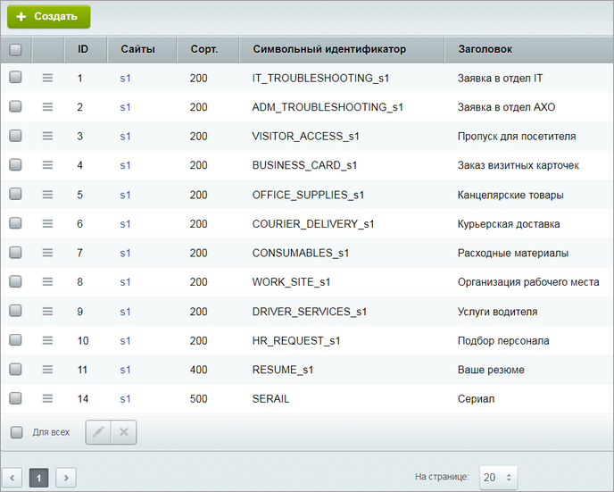

# Страница со списком элементов

**Навигация**
- [← Оглавление курса](index.md)
- [← Предыдущий: 3852 — Toolbar компонента](lesson_3852.md)
- [Следующий: 3853 — Контекстное меню элементов списка →](lesson_3853.md)

Официальная страница урока: https://dev.1c-bitrix.ru/learning/course/index.php?COURSE_ID=43&LESSON_ID=22638

С версии 21.600.0 **Главного модуля** доступны новые методы объекта грида. Цель их внедрения - упростить и уменьшить объем кода, требующийся для создания своей админской страницы со списком элементов.

### Классы для работы со списками элементов

Для работы со списками элементов в main есть два класса:

- CAdminList
                      
  		 - предназначен исключительно для страниц Административного раздела.
- CAdminUiList
                      
  		 (наследник CAdminList) - используется, если административный список выводится в магазине Б24.

В коде страниц, использующих эти классы, имеется множество обращений к $_REQUEST для получения текущего режима страницы, текущего группового действия, измененных данных и т.п. Например, таких:

```

$bExcel = isset($_REQUEST["mode"]) && ($_REQUEST["mode"] == "excel"); // режим выгрузки в Excel
```

```

!isset($_REQUEST["mode"]) || $_REQUEST["mode"]=='list' || $_REQUEST["mode"]=='frame'
// все, кроме Excel и окна настроек
```

```

switch($_REQUEST['action']) // получение идентификатора групповой операции
```

Ниже приводится список новых методов, предназначенных для упрощения разработки новых страниц и правки уже существующих.


### Режим работы грида

Грид может работать в нескольких режимах:

- Простой вывод списка элементов (открытие страницы).
- Обработка быстрого редактирования элементов.
- Обновление грида без перезагрузки страницы (например, сортировка).
- Выгрузка в формат для Excel.
- Показ формы настроек грида.

Ранее получение текущего режима сводилось к анализу ключа `mode` в `$_REQUEST`. Вместо этого предлагается использовать методы объекта грида:

- Метод
  ```
  public function getCurrentMode(): string // получение режима работы
  ```
  вернет одну из констант класса:

  - `public const MODE_PAGE = 'normal';` - обычный вывод страницы;
  - `public const MODE_LIST = 'list';` - обновление содержимого грида без полной перезагрузки;
  - `public const MODE_ACTION = 'frame';` - обработка результатов быстрого редактирования;
  - `public const MODE_EXPORT = 'excel';` - выгрузка в псевдо-Excel;
  - `public const MODE_CONFIG = 'settings';` - показ формы настроек.

Режим определяется в момент инициализации объекта грида.

Старый код:

```

$sTableID = "tbl_user";
$lAdmin = new CAdminUiList($sTableID);
$excelMode = ($_REQUEST["mode"] == "excel");
```

Новый:

```

$sTableID = "tbl_user";
$lAdmin = new CAdminUiList($sTableID);
$excelMode = $lAdmin->getCurrentMode() === \CAdminList::MODE_EXPORT;
```

Чтобы каждый раз не писать большой объем кода для сравнения с константой, добавлены вспомогательные методы:

| \| **Метод** \| **Описание** \|<br>\| --- \| --- \|<br>\| `public function isPageMode(): bool` \| Вернет **true**, если страница с гридом просто открывается в браузере. \|<br>\| `public function isExportMode(): bool` \| Режим выгрузки (Excel). \|<br>\| `public function isAjaxMode(): bool` \| Работа в режиме **ajax** (как обновление грида, так и обработка быстрого редактирования). \|<br>\| `public function isConfigMode(): bool` \| Показ окна настроек. \|<br>\| `public function isActionMode(): bool` \| Результаты inline-редактирования. \|<br>\| `public function isListMode(): bool` \| Обновления блока грида без обновления страницы. \| |
| --- |

Таким образом, предыдущий пример превращается в такой код:

```

$sTableID = "tbl_user";
$lAdmin = new CAdminUiList($sTableID);
$excelMode = $lAdmin->isExportMode();
```


### Обработка inline-редактирования элементов

Типичный код обработки на странице

```

if ($lAdmin->EditAction())
{
	if (is_array($_REQUEST['FIELDS']))
	{
		foreach($_REQUEST['FIELDS'] as $ID=>$arFields)
	{
		$ID = (int)$ID;
		if ($ID <= 0)
			continue;
		if (!$lAdmin->IsUpdated($ID))
			continue;
		// дальше код, сохраняющий данные одной строки
		}
	}
}
```

можно заменить на такой:

```

if ($lAdmin->EditAction())
{
	foreach ($lAdmin->getEditFields() as $ID=>$arFields)
	{
		//код, сохраняющий данные одной строки
	}
}
```

- Метод
  ```
  public function getEditFields(): array
  ```
  возвращает массив записей, которые были изменены (с предварительной проверкой, что ключи непустые).
- Дополнительно (если в гриде используется вывод и редактирование файлов) есть метод:
  ```
  public function convertFilesToEditFields(): void
  ```
  для копирования присланных файлов в общий массив полей. Т.е. предыдущий код слегка расширяем:
  ```
  if ($lAdmin->EditAction())
  {
  	$lAdmin->convertFilesToEditFields();
  	foreach ($lAdmin->getEditFields() as $ID=>$arFields)
  	{
  		//код, сохраняющий данные одной строки
  	}
  }
  ```


### Работа с групповыми операциями

Типичный код обработки групповых операций:

```

if ($arID = $lAdmin->GroupAction()
{
	if ($_REQUEST['action_target']=='selected')
	{
		// в $arID выбираем идентификаторы всех строки
	}
	foreach ($arID as $ID)
	{
		switch ($_REQUEST['action']) // получение ID действия
		{
		...
		}
	}
}
```

можно упростить так:

```

if ($arID = $lAdmin->GroupAction()
{
	$actionId = $lAdmin->getAction();
	if ($actionId === null)
	{
		continue;
	}
	if ($lAdmin-> isGroupActionToAll())
	{
		// в $arID выбираем все идентификаторы строк
	}
	foreach ($arID as $ID)
	{
		switch ($actionId) // действия
		{
		...
		}
	}
}
```

| \| **Метод** \| **Описание** \|<br>\| --- \| --- \|<br>\| `public function getAction(): ?string` \| Вернет идентификатор группового действия или **null**, если ничего не передано. \|<br>\| `public function isGroupActionToAll(): bool` \| Вернет **true**, если в гриде для действий был выбран пункт "Для всех". \| |
| --- |
